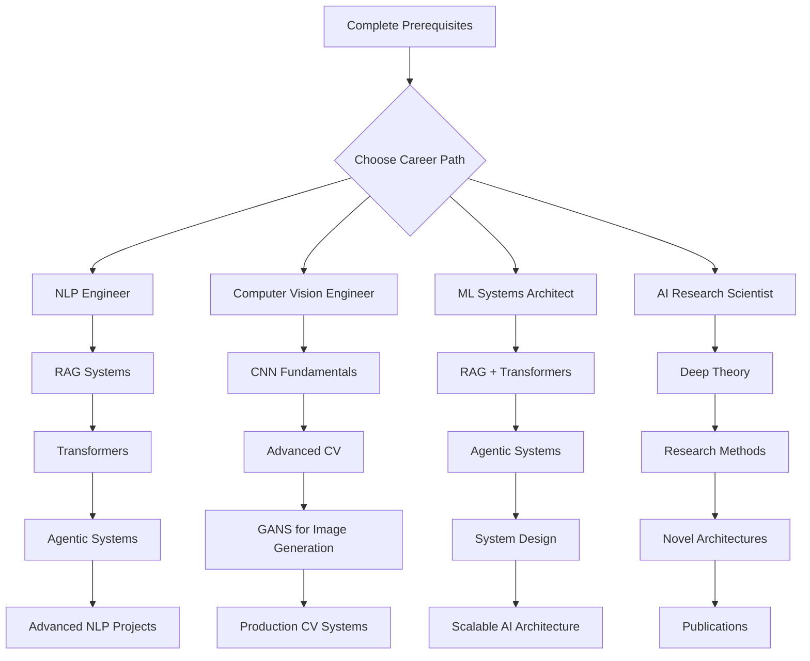
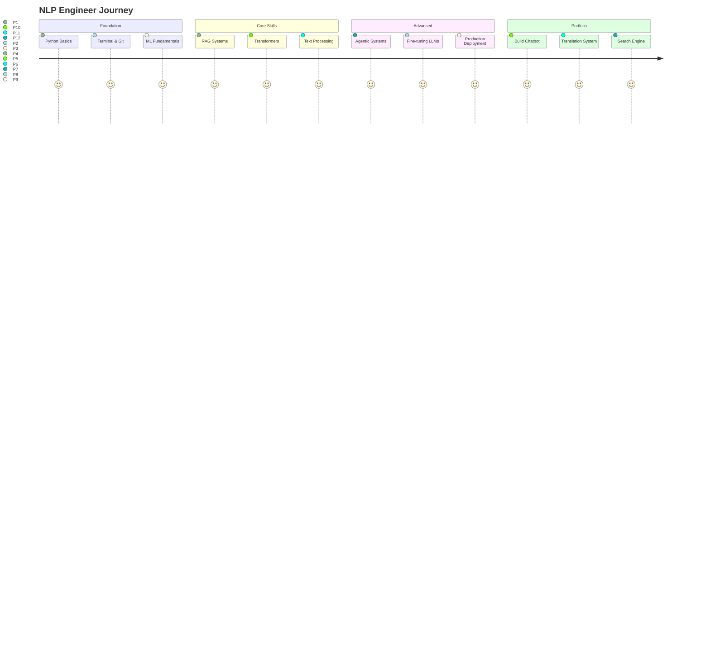
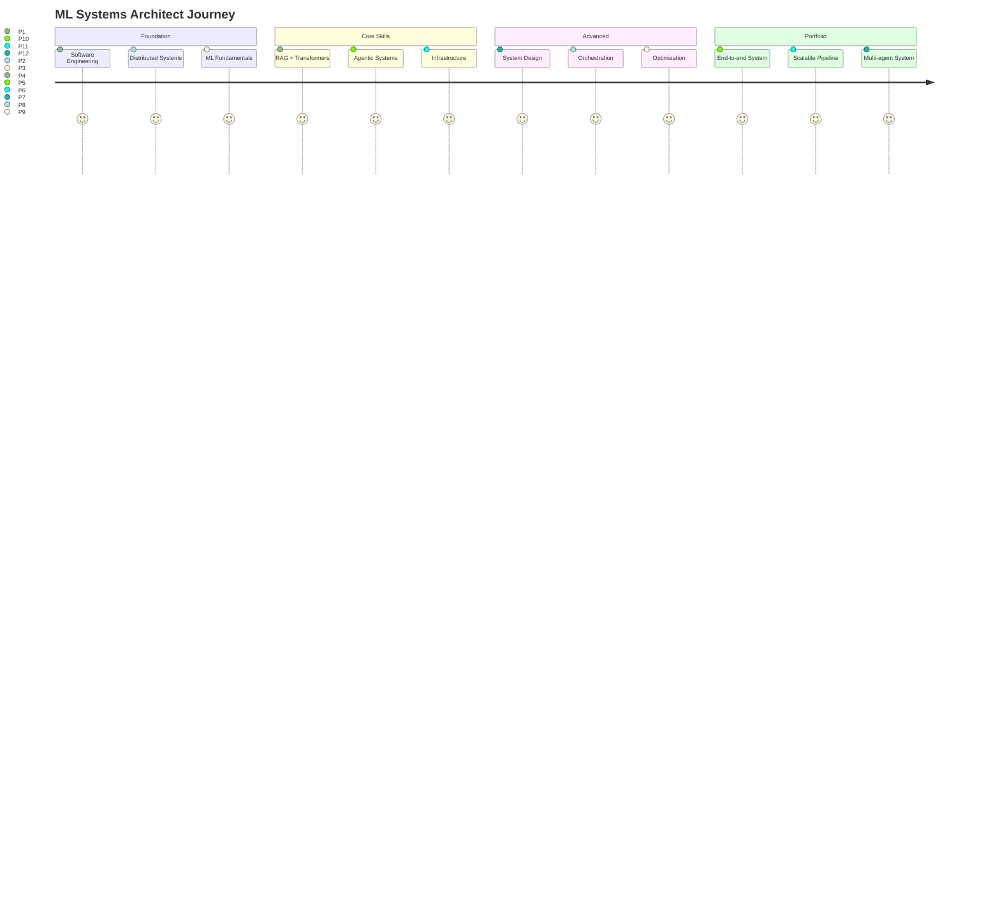

# 🗺️ Learning Progression Maps

Your roadmap from beginner to AI professional. Choose your path based on career goals and interests.

---

## 🎯 Quick Start: Choose Your Path



---

## 📊 Detailed Learning Paths

### Path 1: NLP Engineer 💬

**Goal**: Build language-based AI systems (chatbots, translators, search engines)



#### Step-by-Step Curriculum

| Order | Topic | Resource | Time | Project |
|-------|-------|----------|------|---------|
| 1 | Python Basics | [prerequisites/python_basics.md](../prerequisites/python_basics.md) | 2h | Hello World |
| 2 | Terminal & Git | [prerequisites/](../prerequisites/) | 3h | Clone repo |
| 3 | RAG Fundamentals | [guides/RAG/](../guides/RAG/) | 8h | [RAG Chatbot](../projects/rag-chatbot/) |
| 4 | Transformers | [guides/Transformers/](../guides/Transformers/) | 12h | Sentiment Analyzer |
| 5 | Advanced RAG | [guides/RAG/](../guides/RAG/) Ch 4-5 | 10h | Document Q&A System |
| 6 | Agentic Systems | [guides/Agentic_Systems/](../guides/Agentic_Systems/) | 10h | Auto-research Agent |
| 7 | Fine-tuning | [guides/Transformers/](../guides/Transformers/) | 15h | Custom Domain Model |
| 8 | Deployment | Infrastructure Guide | 8h | Deploy to Cloud |

**Total Time**: ~68 hours (2-3 weeks full-time)

#### Job Roles This Prepares For
- NLP Engineer
- Conversational AI Developer
- Search Engineer
- Language Model Engineer

**Average Salary**: $120K - $180K (US)

---

### Path 2: Computer Vision Engineer 👁️

**Goal**: Build systems that understand images and video


#### Step-by-Step Curriculum

| Order | Topic | Resource | Time | Project |
|-------|-------|----------|------|---------|
| 1 | Python & Linear Algebra | [prerequisites/](../prerequisites/) | 5h | Matrix operations |
| 2 | Neural Network Basics | Infrastructure Guide | 8h | Simple NN |
| 3 | CNN Fundamentals | [guides/CNNs/](../guides/CNNs/) | 12h | Image Classifier |
| 4 | Transfer Learning | [guides/CNNs/](../guides/CNNs/) | 8h | Custom Dataset |
| 5 | Object Detection | [guides/CNNs/](../guides/CNNs/) | 10h | Object Detector |
| 6 | GANs | [guides/GANs/](../guides/GANs/) | 15h | Image Generator |
| 7 | Video Analysis | Advanced CV Guide | 12h | Action Recognition |
| 8 | Deployment | Infrastructure Guide | 10h | Real-time Pipeline |

**Total Time**: ~80 hours (3-4 weeks full-time)

#### Job Roles This Prepares For
- Computer Vision Engineer
- Image Processing Engineer
- Autonomous Vehicle Engineer
- Medical Imaging Specialist

**Average Salary**: $130K - $190K (US)

---

### Path 3: ML Systems Architect 🏗️

**Goal**: Design and build large-scale AI systems



#### Step-by-Step Curriculum

| Order | Topic | Resource | Time | Project |
|-------|-------|----------|------|---------|
| 1 | System Design Basics | Online resources | 10h | Design doc |
| 2 | RAG Systems | [guides/RAG/](../guides/RAG/) | 10h | RAG Chatbot |
| 3 | Transformers | [guides/Transformers/](../guides/Transformers/) | 12h | API Service |
| 4 | Agentic Systems | [guides/Agentic_Systems/](../guides/Agentic_Systems/) | 12h | Multi-agent |
| 5 | Orchestration | [guides/Orchestration_Patterns/](../guides/Orchestration_Patterns/) | 10h | Workflow Engine |
| 6 | Infrastructure | [guides/Infrastructure_Layers/](../guides/Infrastructure_Layers/) | 15h | Deploy Cluster |
| 7 | MoE Systems | [guides/MoE/](../guides/MoE/) | 12h | Scalable Model |
| 8 | Production Patterns | Case Studies | 10h | Full System |

**Total Time**: ~91 hours (4-5 weeks full-time)

#### Job Roles This Prepares For
- ML Systems Architect
- AI Infrastructure Engineer
- Staff ML Engineer
- Technical Lead, AI

**Average Salary**: $160K - $250K (US)

---

### Path 4: AI Research Scientist 🔬

**Goal**: Push the boundaries of AI knowledge


#### Step-by-Step Curriculum

| Order | Topic | Resource | Time | Milestone |
|-------|-------|----------|------|-----------|
| 1 | Advanced Math (Calc, LA, Stats) | Textbooks | 50h | Problem sets |
| 2 | Read 50+ Papers | arXiv, conferences | 40h | Lit review |
| 3 | Deep Theory | All guides (deep dive) | 60h | Understanding |
| 4 | Reproduce Papers | Open-source code | 40h | Reproductions |
| 5 | Identify Gap | Literature + intuition | 20h | Research question |
| 6 | Run Experiments | Compute resources | 80h | Results |
| 7 | Write Paper | Academic writing | 30h | Manuscript |
| 8 | Submit & Revise | Conference/Journal | 40h | Publication |

**Total Time**: ~360 hours (3-6 months)

#### Job Roles This Prepares For
- AI Research Scientist
- PhD Researcher
- Research Engineer
- University Professor

**Average Salary**: $140K - $300K+ (varies widely)

---

## 🔄 Alternative Routes

### The "Career Switcher" Fast Track (12 weeks)

For professionals switching from software engineering:

```
Week 1-2:  Python refresher + ML basics
Week 3-4:  RAG + Transformers (build 2 projects)
Week 5-6:  Deep dive into specialty (NLP or CV)
Week 7-8:  Advanced topics + agentic systems
Week 9-10: Capstone project (production-quality)
Week 11-12: Portfolio polish + job prep
```

### The "Student" Route (6-12 months)

For university students learning alongside studies:

```
Semester 1: Foundations (Python, math, basic ML)
Semester 2: Core AI (RAG, Transformers, CNNs)
Summer:    Internship + personal projects
Semester 3: Advanced topics + research
Semester 4: Capstone + job search
```

### The "Hobbyist" Route (self-paced)

For curious learners without career pressure:

```
→ Pick topics that interest you
→ Build fun projects
→ Join communities
→ Learn at your own pace
→ No pressure!
```

---

## 📈 Skill Progression Checklist

Use this to track your progress:

### Beginner (0-3 months)
- [ ] Complete all prerequisites
- [ ] Build RAG chatbot
- [ ] Understand transformers conceptually
- [ ] Run pre-trained models
- [ ] Debug common errors

### Intermediate (3-6 months)
- [ ] Fine-tune models on custom data
- [ ] Build agentic systems
- [ ] Deploy to production
- [ ] Optimize for performance
- [ ] Contribute to open source

### Advanced (6-12 months)
- [ ] Design novel architectures
- [ ] Scale to millions of users
- [ ] Mentor others
- [ ] Speak at meetups/conferences
- [ ] Publish tutorials or papers

### Expert (1-2 years)
- [ ] Lead AI initiatives
- [ ] Make original contributions
- [ ] Build teams
- [ ] Shape industry best practices
- [ ] Innovate new approaches

---

## 🎓 Certification & Validation

While this course doesn't issue certificates, you can validate your learning:

1. **GitHub Portfolio**: Share your projects publicly
2. **Blog Posts**: Write about what you learned
3. **Kaggle Competitions**: Test skills against others
4. **Open Source Contributions**: Contribute to AI libraries
5. **Freelance Projects**: Build for real clients

---

## 🔗 Related Resources

- **[Prerequisites](../prerequisites/)** - Start here if you're new
- **[Projects](../projects/)** - Hands-on learning
- **[Case Studies](../case_studies/)** - Real-world examples
- **[Skills Library](../skills/)** - Specific skill development
- **[Guides](../guides/)** - Deep theoretical knowledge

---

<div align="center">

**Remember**: The best path is the one you actually follow! 🚀

Start small, build consistently, and adjust as you learn.

[Start Learning](../prerequisites/) | [View Projects](../projects/) | [Read Guides](../guides/)

</div>
