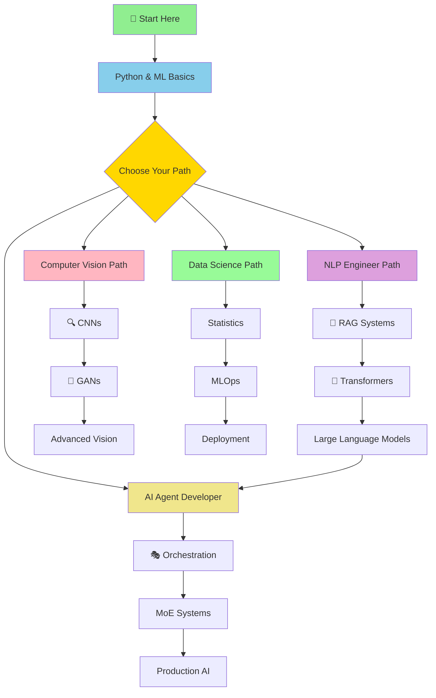
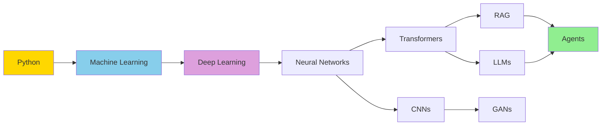

# 🗺️ AI Learning Progression Map

This guide shows you multiple paths through the AI curriculum, aligned with career goals.

## 📊 Interactive Progression Map

## 🎯 Career Path Details

### 1. NLP Engineer Path 📝

**Ideal for:** Building chatbots, search systems, text analysis tools

| Step | Topic | Guide | Project | Time |
|------|-------|-------|---------|------|
| 1 | Python Basics | [Prerequisites](../prerequisites/) | Hello World | 1 week |
| 2 | ML Fundamentals | [Infrastructure Layers](./Infrastructure_Layers/) | Simple Classifier | 2 weeks |
| 3 | **RAG Systems** | [RAG Guide](./RAG/) | [RAG Project](../projects/rag_simple/) | 2 weeks |
| 4 | **Transformers** | [Transformers Guide](./Transformers/) | Text Classification | 3 weeks |
| 5 | LLM Fine-tuning | [Transformers Guide](./Transformers/) Chapter 4 | Custom Chatbot | 3 weeks |
| 6 | Production NLP | [Orchestration](./Orchestration_Patterns/) | Deployed API | 2 weeks |

**Total Time:** ~13 weeks (3 months)

**Job Roles:**
- NLP Engineer
- Search Engineer
- Conversational AI Developer
- Text Analytics Specialist

---

### 2. Computer Vision Engineer Path 👁️

**Ideal for:** Image recognition, object detection, visual AI applications

| Step | Topic | Guide | Project | Time |
|------|-------|-------|---------|------|
| 1 | Python & NumPy | [Prerequisites](../prerequisites/) | Image Manipulation | 1 week |
| 2 | Deep Learning Basics | [Infrastructure Layers](./Infrastructure_Layers/) | Neural Network | 2 weeks |
| 3 | **CNNs** | [CNNs Guide](./CNNs/) | [CNN Project](../projects/cnn_basics/) | 3 weeks |
| 4 | **GANs** | [GANs Guide](./GANs/) | Image Generation | 3 weeks |
| 5 | Object Detection | [Object Detection Guide](./Object_Detection/) | YOLO Implementation | 3 weeks |
| 6 | Vision Deployment | [Orchestration](./Orchestration_Patterns/) | Mobile Vision App | 2 weeks |

**Total Time:** ~14 weeks (3.5 months)

**Job Roles:**
- Computer Vision Engineer
- Image Processing Engineer
- Autonomous Vehicles Engineer
- Medical Imaging Specialist

---

### 3. AI Agent Developer Path 🤖

**Ideal for:** Building autonomous agents, multi-agent systems, AI assistants

| Step | Topic | Guide | Project | Time |
|------|-------|-------|---------|------|
| 1 | Python Programming | [Prerequisites](../prerequisites/) | Basic Scripts | 1 week |
| 2 | **RAG Systems** | [RAG Guide](./RAG/) | Knowledge Bot | 2 weeks |
| 3 | **Agentic Systems** | [Agentic Systems Guide](./Agentic_Systems/) | Simple Agent | 3 weeks |
| 4 | **Orchestration** | [Orchestration Guide](./Orchestration_Patterns/) | Multi-Agent System | 3 weeks |
| 5 | **MoE** | [MoE Guide](./MoE/) | Specialized Agents | 3 weeks |
| 6 | Production Agents | [Infrastructure](./Infrastructure_Layers/) | Deployed Agent Platform | 3 weeks |

**Total Time:** ~15 weeks (4 months)

**Job Roles:**
- AI Agent Developer
- Autonomous Systems Engineer
- AI Platform Engineer
- Conversational AI Architect

---

### 4. Data Science → AI Path 📊

**Ideal for:** Analysts transitioning to AI, ML engineers, research roles

| Step | Topic | Guide | Project | Time |
|------|-------|-------|---------|------|
| 1 | Statistics & Python | [Prerequisites](../prerequisites/) | Data Analysis | 2 weeks |
| 2 | Classical ML | [Infrastructure Layers](./Infrastructure_Layers/) | Prediction Model | 3 weeks |
| 3 | Deep Learning | [CNNs Guide](./CNNs/) | Image Classifier | 3 weeks |
| 4 | **Transformers** | [Transformers Guide](./Transformers/) | Text Analysis | 3 weeks |
| 5 | MLOps | [MLOps Guide](./MLOps/) | Model Pipeline | 3 weeks |
| 6 | Advanced Topics | Choose specialization | Capstone Project | 4 weeks |

**Total Time:** ~18 weeks (4.5 months)

**Job Roles:**
- Machine Learning Engineer
- Data Scientist (AI focus)
- ML Ops Engineer
- AI Research Engineer

---

## 🔄 Flexible Learning Options

### ⚡ Fast Track (8-10 weeks)
For those with prior programming experience:
1. Skip Python basics if already comfortable
2. Focus on 1-2 core technologies deeply
3. Build portfolio projects immediately
4. Learn theory alongside practice

### 🐢 Self-Paced (6+ months)
For complete beginners or part-time learners:
1. Master fundamentals before advancing
2. Complete all exercises and quizzes
3. Build multiple small projects
4. Join study groups for accountability

### 🎓 Academic Route
For students or researchers:
1. Follow the full curriculum sequentially
2. Complete all theoretical readings
3. Implement papers from scratch
4. Contribute to open-source projects

---

## 📈 Skill Dependencies

**Key Insights:**
- ✅ Python is foundational - don't skip it!
- ✅ Understanding neural networks unlocks both CNNs and Transformers
- ✅ RAG requires Transformer knowledge
- ✅ Agentic systems build on RAG + LLMs

---

## 🎓 Learning Milestones

### After Month 1
- [ ] Comfortable with Python basics
- [ ] Understand ML vs Deep Learning
- [ ] Built first neural network
- [ ] Completed first project

### After Month 2
- [ ] Implemented RAG system
- [ ] Understand attention mechanism
- [ ] Fine-tuned a pre-trained model
- [ ] Have portfolio project #1

### After Month 3
- [ ] Built end-to-end AI application
- [ ] Understand deployment considerations
- [ ] Contributed to open source or wrote blog post
- [ ] Ready for junior AI roles

### After Month 4+
- [ ] Specialized in chosen path
- [ ] Multiple portfolio projects
- [ ] Can read and implement research papers
- [ ] Ready for mid-level AI roles

---

## 💼 Job Role Mapping

| Role | Required Skills | Recommended Path | Salary Range (US) |
|------|----------------|------------------|-------------------|
| Junior NLP Engineer | RAG, Transformers, Python | NLP Path | $80k-$120k |
| CV Engineer | CNNs, GANs, PyTorch | CV Path | $90k-$130k |
| AI Agent Developer | RAG, Orchestration, APIs | Agent Path | $100k-$150k |
| ML Engineer | Full stack ML, MLOps | Data Science Path | $110k-$160k |
| Research Engineer | Deep theory, Paper implementation | Any + Advanced | $120k-$180k |

---

## 🚀 Getting Started

1. **Assess your current level** using [Prerequisites Quiz](../prerequisites/)
2. **Choose your path** based on career goals
3. **Set realistic timeline** (fast track vs self-paced)
4. **Start with first module** and commit to consistency
5. **Build projects** as you learn - theory alone isn't enough!

---

## 📞 Need Help?

- Stuck on a concept? Check [Common Errors](../errors/)
- Want to discuss career paths? Join our community
- Need mentorship? Look for study groups

**Remember:** The best path is the one you actually complete! 🎉

---

*Last updated: July 2026*
