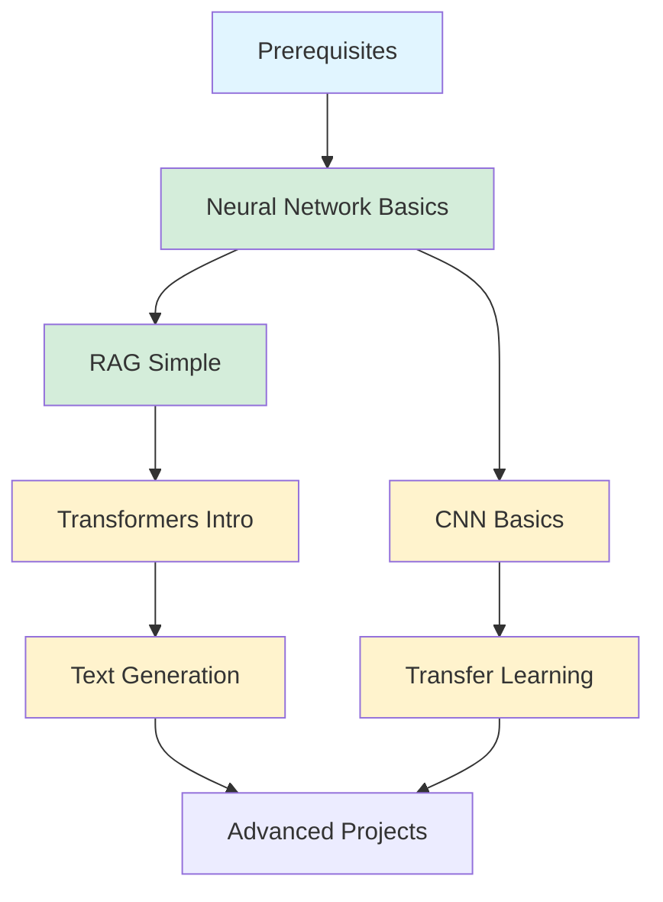

# Runnable Projects

Hands-on, minimal implementations for each major AI topic. Each project is:
- ✅ Under 200-300 lines (heavily commented)
- ✅ Ready to run on Google Colab free tier
- ✅ Includes `requirements.txt` and clear instructions
- ✅ Designed for beginners with zero prior experience

---

## 📁 Available Projects

### 1. Neural Network Basics
**What it does:** Build a simple feedforward neural network from scratch for classification.

**Concepts covered:**
- Neurons, layers, and activation functions
- Forward pass and backpropagation
- Training loops and optimization
- Data normalization
- Decision boundary visualization

**Files:**
- [`neural_network_basics/`](neural_network_basics/) - Complete neural network implementation
- [README](neural_network_basics/README.md) - Full documentation
- [main.py](neural_network_basics/main.py) - Heavily commented code (~200 lines)

**Quick start:**
```bash
cd guides/projects/neural_network_basics
pip install -r requirements.txt
python main.py
```

**Run on Colab:** [](https://colab.research.google.com/github/YOUR_USERNAME/AI-Model-Training-Essentials/blob/main/guides/projects/neural_network_basics/neural_network_basics.ipynb)

*Note: To use this Colab link, fork the repository and replace `YOUR_USERNAME` with your GitHub username, or upload the notebook manually to Colab.*

---

### 2. Simple RAG System
**What it does:** Build a question-answering system that retrieves information from documents and generates answers.

**Concepts covered:**
- Text embeddings
- Similarity search
- Retrieval-augmented generation
- Language model pipelines

**Files:**
- [`rag_simple/`](rag_simple/) - Complete RAG implementation
- [README](rag_simple/README.md) - Full documentation
- [main.py](rag_simple/main.py) - Heavily commented code (~150 lines)

**Quick start:**
```bash
cd guides/projects/rag_simple
pip install -r requirements.txt
python main.py
```

**Run on Colab:** [](https://colab.research.google.com/github/YOUR_USERNAME/AI-Model-Training-Essentials/blob/main/guides/projects/rag_simple/rag_simple.ipynb)

*Note: To use this Colab link, fork the repository and replace `YOUR_USERNAME` with your GitHub username, or upload the notebook manually to Colab.*

---

### 3. Transformers Introduction
**What it does:** Load and use pre-trained transformer models for text classification.

**Concepts covered:**
- Transformer architecture basics
- Loading pre-trained models
- Tokenization
- Fine-tuning fundamentals

**Files:**
- [`transformers_intro/`](transformers_intro/) - Complete transformer implementation
- [README](transformers_intro/README.md) - Full documentation
- [main.py](transformers_intro/main.py) - Heavily commented code (~180 lines)

**Quick start:**
```bash
cd guides/projects/transformers_intro
pip install -r requirements.txt
python main.py
```

**Run on Colab:** [](https://colab.research.google.com/github/YOUR_USERNAME/AI-Model-Training-Essentials/blob/main/guides/projects/transformers_intro/transformers_intro.ipynb)

*Note: To use this Colab link, fork the repository and replace `YOUR_USERNAME` with your GitHub username, or upload the notebook manually to Colab.*

---

### 4. CNN Basics
**What it does:** Build a simple convolutional neural network for image classification.

**Concepts covered:**
- Convolutional layers
- Pooling operations
- Training loops
- Image preprocessing

**Files:**
- [`cnn_basics/`](cnn_basics/) - Complete CNN implementation
- [README](cnn_basics/README.md) - Full documentation
- [main.py](cnn_basics/main.py) - Heavily commented code (~250 lines)

**Quick start:**
```bash
cd guides/projects/cnn_basics
pip install -r requirements.txt
python main.py
```

**Run on Colab:** [](https://colab.research.google.com/github/YOUR_USERNAME/AI-Model-Training-Essentials/blob/main/guides/projects/cnn_basics/cnn_basics.ipynb)

*Note: To use this Colab link, fork the repository and replace `YOUR_USERNAME` with your GitHub username, or upload the notebook manually to Colab.*

---

### 5. Text Generation
**What it does:** Generate coherent text using a pre-trained GPT-2 language model.

**Concepts covered:**
- Language models and next-token prediction
- Text generation with pre-trained models
- Tokenization (text to numbers)
- Generation parameters (temperature, top-p)
- Controlling creativity and randomness

**Files:**
- [`text_generation/`](text_generation/) - Complete text generation implementation
- [README](text_generation/README.md) - Full documentation
- [main.py](text_generation/main.py) - Heavily commented code (~180 lines)

**Quick start:**
```bash
cd guides/projects/text_generation
pip install -r requirements.txt
python main.py
```

**Run on Colab:** [](https://colab.research.google.com/github/YOUR_USERNAME/AI-Model-Training-Essentials/blob/main/guides/projects/text_generation/text_generation.ipynb)

*Note: To use this Colab link, fork the repository and replace `YOUR_USERNAME` with your GitHub username, or upload the notebook manually to Colab.*

---

### 6. Transfer Learning
**What it does:** Use a pre-trained ResNet18 model for image classification on a new dataset.

**Concepts covered:**
- Transfer learning fundamentals
- Pre-trained models (ImageNet)
- Feature extraction vs fine-tuning
- Freezing and unfreezing layers
- Adapting models for new tasks

**Files:**
- [`transfer_learning/`](transfer_learning/) - Complete transfer learning implementation
- [README](transfer_learning/README.md) - Full documentation
- [main.py](transfer_learning/main.py) - Heavily commented code (~200 lines)

**Quick start:**
```bash
cd guides/projects/transfer_learning
pip install -r requirements.txt
python main.py
```

**Run on Colab:** [](https://colab.research.google.com/github/YOUR_USERNAME/AI-Model-Training-Essentials/blob/main/guides/projects/transfer_learning/transfer_learning.ipynb)

*Note: To use this Colab link, fork the repository and replace `YOUR_USERNAME` with your GitHub username, or upload the notebook manually to Colab.*

---

### 7. RAG Chatbot
**What it does:** A complete RAG system that reads your documents, retrieves relevant information, and generates accurate answers.

**Concepts covered:**
- Document loading and chunking
- Text embeddings and vector databases
- Retrieval-augmented generation
- Language model pipelines
- Interactive chat interface

**Files:**
- [`rag-chatbot/`](rag-chatbot/) - Complete RAG chatbot implementation
- [README](rag-chatbot/README.md) - Full documentation
- [rag_chatbot.py](rag-chatbot/rag_chatbot.py) - Heavily commented code (~200 lines)

**Quick start:**
```bash
cd guides/projects/rag-chatbot
pip install -r requirements.txt
python rag_chatbot.py
```

---

## 🎯 How to Use These Projects

### For Complete Beginners:

1. **Start with prerequisites:**
   - [Terminal Basics](../User%20Questions/prerequisites/terminal_basics.md)
   - [Python Basics](../User%20Questions/prerequisites/python_basics.md)
   - [Git Basics](../User%20Questions/prerequisites/git_basics.md)
   - [Mathematics for ML](../prerequisites/mathematics_for_ml.md)
   - [ML Fundamentals](../prerequisites/ml_fundamentals.md)

2. **Pick your first project:** Start with RAG Simple

3. **Follow the steps:**
   - Read the README first
   - Run the code as-is
   - Read the comments in the code
   - Modify something small
   - Run it again

4. **Get help if stuck:**
   - Check [Common Errors](../errors/README.md)
   - Read the guide in `/guides/`
   - Ask in community forums

### For Intermediate Learners:

1. **Run the baseline:** Get the project working first

2. **Experiment:**
   - Change hyperparameters
   - Add your own data
   - Try different models

3. **Extend:**
   - Add new features
   - Improve performance
   - Build a UI

---

## 📊 Project Difficulty & Requirements

| Project | Lines of Code | Time Needed | GPU Required | Difficulty |
|---------|--------------|-------------|--------------|------------|
| Neural Network Basics | ~200 | 10-15 min | No | ⭐☆☆ Beginner |
| RAG Simple | ~150 | 10-15 min | No | ⭐☆☆ Beginner |
| Transformers Intro | ~180 | 15-20 min | Optional | ⭐⭐☆ Easy |
| CNN Basics | ~250 | 20-30 min | Recommended | ⭐⭐☆ Easy |
| Text Generation | ~180 | 15-20 min | Optional | ⭐⭐☆ Easy |
| Transfer Learning | ~200 | 15-20 min | Recommended | ⭐⭐☆ Easy |
| RAG Chatbot | ~200 | 30 min | Optional | ⭐⭐☆ Easy |

*All projects work on Google Colab Free tier!*

---

## 🔧 Setup Instructions

### Option 1: Google Colab (Recommended)

1. Create a free account at [colab.research.google.com](https://colab.research.google.com)
2. Upload the `.ipynb` file from any project (or create a new notebook and copy the code from `main.py`)
3. Click **Runtime → Change runtime type**
4. Select **GPU** (optional but faster)
5. Run cells one by one

**Benefits:**
- No setup required
- Free GPU access
- Pre-installed libraries
- Easy to share

### Option 2: Local Installation

```bash
# Clone the repository
git clone https://github.com/YOUR_USERNAME/AI-Model-Training-Essentials.git
cd AI-Model-Training-Essentials/guides/projects

# Note: Replace YOUR_USERNAME with the actual GitHub username/organization

# Choose a project
cd rag_simple

# Create virtual environment
python -m venv venv

# Activate environment
# On Linux/Mac:
source venv/bin/activate
# On Windows:
venv\Scripts\activate

# Install dependencies
pip install -r requirements.txt

# Run the project
python main.py
```

---

## 📚 Learning Path

Here's a suggested order to tackle the projects:



**After completing all projects:**
1. Read the corresponding guides in `/guides/`
2. Try building your own variation
3. Share your project with the community
4. Move to advanced topics

---

## 📁 Guide-Specific Projects

Each guide directory also contains a `projects/` folder with advanced, topic-specific implementations:

| Guide | Projects Folder | What's Inside |
|-------|----------------|---------------|
| **[CNNs](../CNNs/)** | [`CNNs/projects/`](../CNNs/projects/) | ResNet classification, YOLO detection, U-Net segmentation |
| **[GANs](../GANs/)** | [`GANs/projects/`](../GANs/projects/) | DCGAN generation, CycleGAN style transfer, SRGAN super-resolution |
| **[GNNs](../GNNs/)** | [`GNNs/projects/`](../GNNs/projects/) | GCN node classification, GraphSAGE link prediction, GAT graph classification |
| **[Agentic Systems](../Agentic_Systems/)** | [`Agentic_Systems/projects/`](../Agentic_Systems/projects/) | Agent with memory, multi-agent collaboration, tool-using agent |

These projects are more advanced than the starter projects above and are designed to be completed after reading the corresponding guide chapters.

---

## 💡 Tips for Success

1. **Don't skip the comments:** Every line is explained for a reason
2. **Break things intentionally:** Change values and see what happens
3. **Read error messages:** They tell you exactly what's wrong
4. **Start small:** Get the basic version working before adding features
5. **Use Colab:** Save time on setup and focus on learning

---

## 🆘 Troubleshooting

### Common Issues:

**"Module not found" errors:**
- Make sure virtual environment is activated
- Run `pip install -r requirements.txt`
- See [ImportError_Transformers.md](../errors/ImportError_Transformers.md)

**"CUDA out of memory":**
- Reduce batch size in the code
- Use CPU mode (slower but works)
- Try Google Colab instead
- See [CUDA_OOM.md](../errors/CUDA_OOM.md)

**Slow performance:**
- This is normal on CPU!
- Use Google Colab for free GPU
- Reduce dataset size for testing

### Getting Help:

1. Check the [Common Errors](../errors/README.md) directory
2. Read the relevant guide in `/guides/`
3. Search Stack Overflow
4. Ask in AI/ML Discord communities

---

## 🚀 Contributing

Want to add a project? Great! Here's what we need:

1. **Keep it minimal:** Under 300 lines
2. **Comment heavily:** Explain every concept
3. **Include tests:** Make sure it runs
4. **Write docs:** Clear README with examples
5. **Colab-ready:** Must work on free tier

See existing projects for templates!

---

## 📖 Related Resources

- [Prerequisites Tutorials](../prerequisites/README.md) - Learn mathematics and ML fundamentals
- [Terminal, Python, Git Basics](../User%20Questions/prerequisites/README.md) - Essential tools
- [Common Errors](../errors/README.md) - Debugging guide
- [Extended Error Guides](../User%20Questions/errors/README.md) - Detailed troubleshooting with diagnostic scripts
- [Guides](../README.md) - In-depth theory and concepts
- [Skills Library](../../skills/README.md) - Practice specific skills

---

**Happy Coding!** 🎉

Remember: The best way to learn is by doing. Run the code, break it, fix it, and make it your own!
