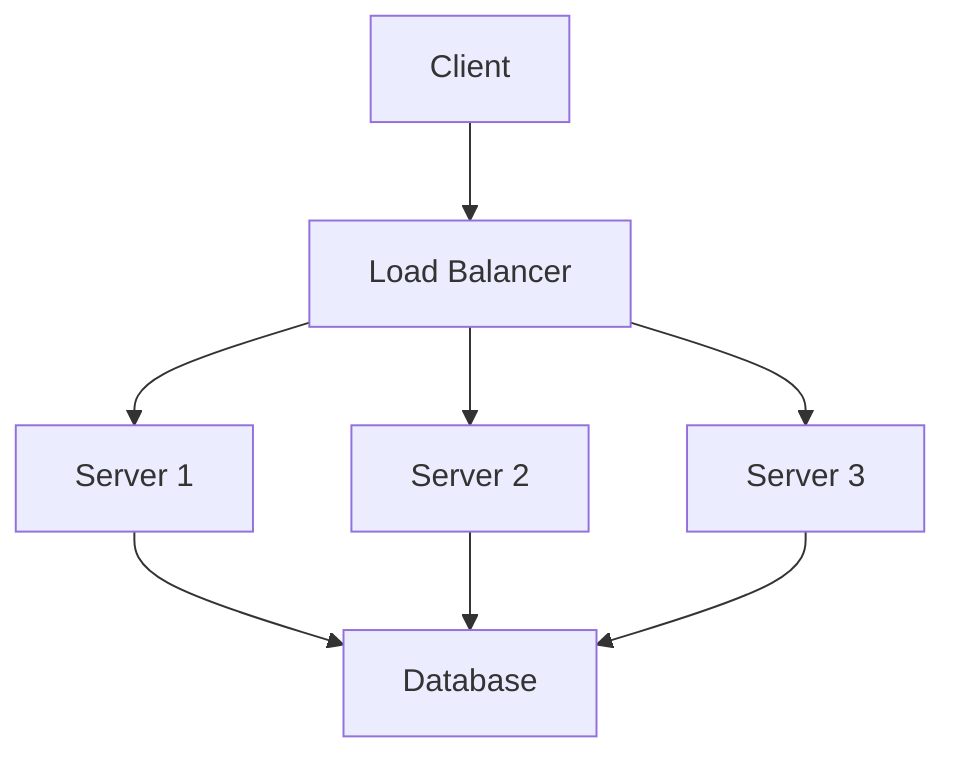

# Technical Writing

## Introduction

Technical writing communicates complex information clearly and effectively. This guide covers best practices for creating documentation, reports, API references, and other technical content.

## Table of Contents

- [Principles of Technical Writing](#principles-of-technical-writing)
- [Document Types](#document-types)
- [Structure and Organization](#structure-and-organization)
- [Writing Style](#writing-style)
- [Visual Elements](#visual-elements)
- [Code Documentation](#code-documentation)
- [Review and Editing](#review-and-editing)

## Principles of Technical Writing

### The 7 C's

| Principle | Description |
|-----------|-------------|
| Clear | Easy to understand, unambiguous |
| Concise | Brief, no unnecessary words |
| Concrete | Specific, vivid, definite |
| Correct | Accurate facts, proper grammar |
| Coherent | Logical flow, connected ideas |
| Complete | All necessary information included |
| Courteous | Respectful, reader-focused |

### Audience Analysis

Before writing, consider:
- **Who** will read this? (developers, managers, end-users)
- **What** do they already know? (expertise level)
- **Why** are they reading? (solve problem, learn, decide)
- **When** will they use it? (implementation, troubleshooting, planning)
- **How** will they access it? (online, print, mobile)

### Information Hierarchy

```
Most Important
    ↓
    • Key conclusions/recommendations
    • Critical instructions
    • Essential concepts
    ↓
    • Supporting details
    • Examples
    • Edge cases
    ↓
Least Important
    • Background information
    • Historical context
    • References
```

## Document Types

### User Guides

**Purpose**: Help users accomplish tasks

**Structure**:
1. Overview/Introduction
2. Prerequisites
3. Step-by-step instructions
4. Troubleshooting
5. FAQ

**Best Practices**:
- Use active voice ("Click the button")
- Number sequential steps
- Include screenshots when helpful
- Provide expected outcomes

### API Documentation

**Essential Components**:
- Endpoint URLs
- HTTP methods
- Request parameters
- Response formats
- Authentication requirements
- Error codes
- Rate limits

**Example Structure**:
```markdown
## GET /users/{id}

Retrieve a user by ID.

### Parameters
| Name | Type | Required | Description |
|------|------|----------|-------------|
| id | string | Yes | User identifier |

### Response
```json
{
  "id": "123",
  "name": "John Doe",
  "email": "john@example.com"
}
```

### Errors
- 404: User not found
- 401: Unauthorized
```

### Technical Reports

**Standard Structure**:
1. Executive Summary
2. Introduction
3. Methodology
4. Results
5. Discussion
6. Conclusion
7. Recommendations
8. Appendices

### README Files

**Essential Sections**:
```markdown
# Project Name

Brief description (1-2 sentences)

## Features

- Key feature 1
- Key feature 2

## Installation

Quick start commands

## Usage

Basic usage examples

## Configuration

Available options

## Contributing

How to contribute

## License

License information
```

### Architecture Decision Records (ADRs)

**Template**:
```markdown
# ADR-001: [Title]

## Status
[Proposed | Accepted | Deprecated | Superseded]

## Context
What is the issue we're addressing?

## Decision
What have we decided to do?

## Consequences
What are the results of this decision?
- Positive outcomes
- Negative outcomes
- Trade-offs made
```

## Structure and Organization

### Inverted Pyramid

Start with most important information:

```
┌─────────────────────────┐
│     Main Conclusion     │  ← Most important
│     Key Recommendation  │
├─────────────────────────┤
│   Supporting Evidence   │
│   Critical Details      │
├─────────────────────────┤
│   Background Info       │
│   Additional Context    │  ← Least important
└─────────────────────────┘
```

### Chunking Information

Break content into manageable pieces:
- One idea per paragraph
- Related topics grouped together
- Use headings to signal topic changes
- Keep sections 300-500 words maximum

### Progressive Disclosure

Reveal information gradually:
1. Summary/overview first
2. Expandable sections for details
3. Links to in-depth resources
4. Appendices for reference material

## Writing Style

### Voice and Tone

**Active vs. Passive Voice**:
- Active: "The system validates the input" ✓
- Passive: "The input is validated by the system" ✗

**Use active voice when**:
- Giving instructions
- Describing processes
- Assigning responsibility

**Passive voice acceptable when**:
- Actor is unknown/unimportant
- Emphasizing the action over actor
- Maintaining objectivity

### Sentence Structure

**Keep sentences concise**:
- Average 15-20 words
- One idea per sentence
- Avoid nested clauses

**Before**: 
"The system, which was designed to handle multiple concurrent requests from various clients that may be connecting from different geographical locations, implements a sophisticated load balancing algorithm."

**After**:
"The system handles concurrent requests from multiple clients. It uses a load balancing algorithm to distribute traffic across servers."

### Word Choice

**Prefer simple words**:
| Complex | Simple |
|---------|--------|
| utilize | use |
| implement | do/build |
| facilitate | help |
| subsequent | next/later |
| approximately | about |
| demonstrate | show |

**Avoid jargon** unless:
- Writing for expert audience
- Term is industry standard
- You define it on first use

### Consistency

Maintain consistency in:
- Terminology (pick one term per concept)
- Formatting (headings, lists, code blocks)
- Voice (second person "you" vs. third person)
- Tense (present tense for most documentation)

## Visual Elements

### Diagrams

**When to use diagrams**:
- Showing system architecture
- Illustrating data flow
- Explaining processes
- Comparing options

**Mermaid Example**:


### Tables

**Use tables for**:
- Comparisons
- Parameter lists
- Feature matrices
- Data summaries

**Best Practices**:
- Clear column headers
- Consistent formatting
- Sort logically
- Keep manageable size

### Lists

**Bulleted lists**: Items without order
**Numbered lists**: Sequential steps or ranked items

**Format consistently**:
- Parallel structure
- Same grammatical form
- Proper punctuation (none or periods for all)

## Code Documentation

### Inline Comments

**Good comments explain WHY**:
```python
# Bad: What the code does
x = x + 1  # Increment x

# Good: Why this is needed
x = x + 1  # Compensate for zero-based indexing
```

### Docstrings

**Python Example**:
```python
def calculate_compound_interest(principal: float, rate: float, time: int) -> float:
    """
    Calculate compound interest.
    
    Args:
        principal: Initial investment amount
        rate: Annual interest rate (as decimal)
        time: Investment period in years
    
    Returns:
        Final amount including interest
    
    Raises:
        ValueError: If any parameter is negative
    
    Example:
        >>> calculate_compound_interest(1000, 0.05, 10)
        1628.89
    """
```

### README Code Examples

**Include**:
- Installation commands
- Basic usage
- Common configurations
- Expected output

```bash
# Install the package
pip install mypackage

# Basic usage
from mypackage import Client
client = Client(api_key="your-key")
result = client.query("SELECT * FROM table")
```

## Review and Editing

### Self-Editing Checklist

- [ ] Is the purpose clear in the first paragraph?
- [ ] Is information organized logically?
- [ ] Are sentences concise and clear?
- [ ] Is terminology consistent?
- [ ] Are all steps/claims accurate?
- [ ] Are examples relevant and correct?
- [ ] Are links working?
- [ ] Is formatting consistent?

### Technical Accuracy Review

Have subject matter experts verify:
- Technical claims
- Code examples
- Configuration values
- API specifications

### Readability Testing

**Flesch Reading Ease**:
- 90-100: Very easy (5th grade)
- 60-70: Standard (8th-9th grade) ← Target for docs
- 0-30: Very difficult (college graduate)

**Tools**:
- Hemingway Editor
- Grammarly
- Readable.com

### Version Control for Docs

- Track changes like code
- Use meaningful commit messages
- Review documentation in PRs
- Maintain changelog

## Accessibility

### Writing for Accessibility

- Use plain language
- Define acronyms on first use
- Provide alt text for images
- Use descriptive link text ("API Reference" not "Click here")
- Ensure sufficient color contrast

### Screen Reader Considerations

- Use proper heading hierarchy (H1 → H2 → H3)
- Don't rely on color alone
- Provide text alternatives for visuals
- Use accessible table markup

## Summary

Effective technical writing:
- Knows and addresses the audience
- Organizes information logically
- Uses clear, concise language
- Includes appropriate visual elements
- Documents code thoroughly
- Goes through rigorous review

## Further Reading

- Google Developer Documentation Style Guide
- Microsoft Writing Style Guide
- Red Hat Documentation Style Guide
- "Docs Like Code" by Anne Gentle

## See Also

- [[Research Methods]](./research_methods.md)
- [[Presentation Skills]](./presentation_skills.md)
- [[API Design REST GraphQL]](../01_technology_and_computing/api_design_rest_graphql.md)

## References

- American Medical Association. (2020). *AMA Manual of Style*
- IEEE Professional Communication Society. (2023). *Technical Writing Standards*
