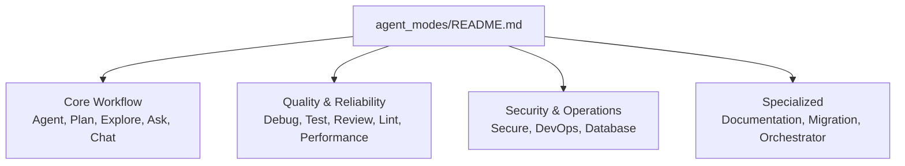
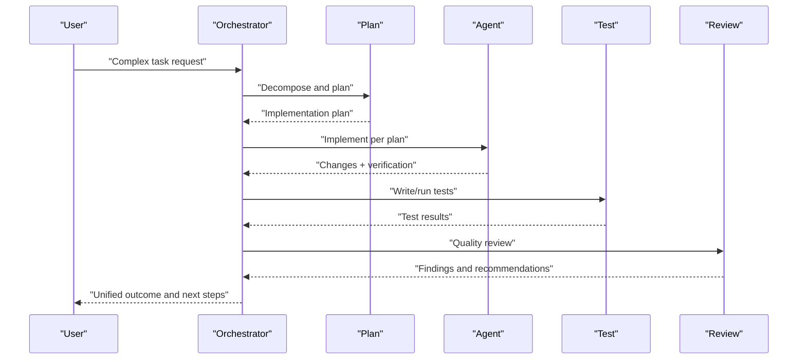
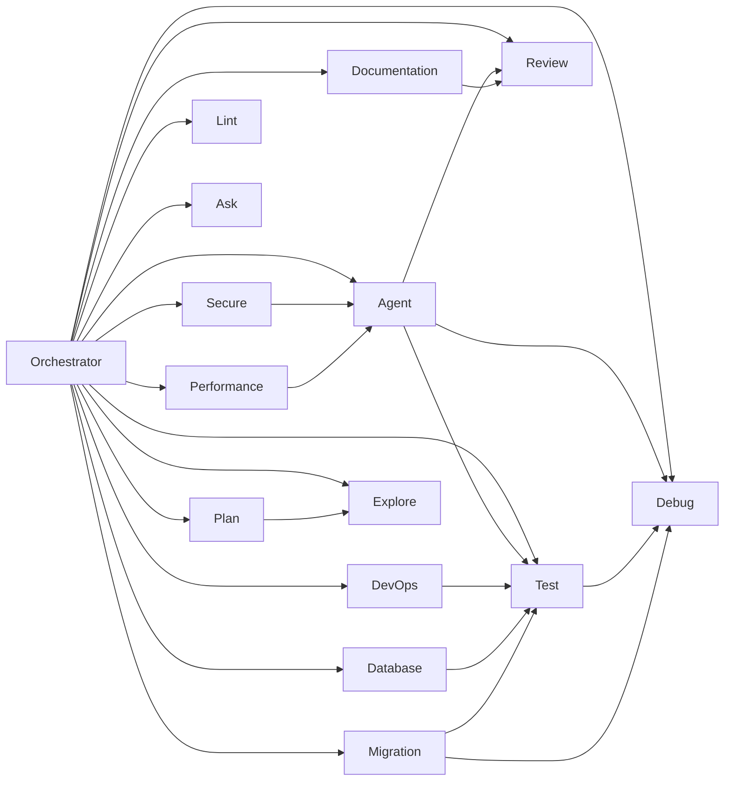

# Agent Modes System

## Introduction

The Agent Modes System provides 16 configurable AI agent behaviors tailored to common development workflows. Each mode is defined by a YAML front matter block that declares its name, description, tools, sub-agents, and handoffs, followed by behavioral rules, workflow steps, and optional diagrams. The system supports:

- **Core workflow agents** for planning, implementation, exploration, Q&A, and conversation
- **Quality and reliability agents** for debugging, testing, reviewing, linting, and performance
- **Security and operations agents** for security auditing, DevOps, and database work
- **Specialized agents** for documentation, migrations, and multi-agent orchestration

## Agent Categories

## YAML Configuration Format

Each agent mode file defines:
- **YAML front matter** with metadata (name, description, argument-hint, tools, agents, handoffs)
- **Behavioral rules** and constraints
- **A structured workflow** describing step-by-step execution
- **Optional handoffs** to other agents with prompts and flags

### Key Fields

| Field | Description |
|-------|-------------|
| `name` | Mode identifier |
| `description` | Purpose statement |
| `argument-hint` | Guidance for user input |
| `tools` | List of available tools |
| `agents` | Sub-agents this mode can spawn |
| `handoffs` | Named transitions to other agents |

### Tool Vocabulary

Modes use a shared tool vocabulary:
- `read`, `search`, `edit`, `create`, `delete` - Filesystem operations
- `web` - External research
- `memory` - Persistent state
- `github/*` - Issue and PR context
- `execute/*` - Terminal execution
- `render_mermaid_diagram` - Visualize flows
- `ask_questions` - Clarify requirements
- `agent` - Delegate to sub-agents

## Core Workflow Agents

### Agent
- **Role**: Primary implementer for changes, bug fixes, features, refactoring
- **Tools**: search, read, edit, create, delete, web, memory, github, execute, render_mermaid_diagram, ask_questions
- **Workflow**: Understand → Inspect → Plan → Implement → Verify → Report
- **Safety**: Avoid breaking changes, preserve functionality, do not commit unless asked
- **Handoffs**: Plan, Review, Test, Debug

### Plan
- **Role**: Research and produce executable plans without implementing
- **Tools**: search, read, web, memory, github, execute, ask_questions, agent
- **Sub-agents**: Explore
- **Output**: Structured plan saved to persistent memory
- **Handoffs**: Start Implementation (to Agent), Request Review (to Review)

### Explore
- **Role**: Read-only research assistant for deep investigation
- **Tools**: search, read, web, memory, ask_questions, execute
- **Output**: Structured findings with key files, behavior, patterns, risks, open questions
- **Handoffs**: Use Findings for Planning (to Plan), Ask More Questions (to Ask)

### Ask
- **Role**: Read-only advisor for understanding, architecture analysis, debugging insights
- **Tools**: search, read, web, memory, github, execute, render_mermaid_diagram, ask_questions
- **Handoffs**: Plan This (to Plan), Implement This (to Agent)

### Chat
- **Role**: Conversational AI with no tool access
- **Tools**: none
- **Handoffs**: none

## Quality and Reliability Agents

### Debug
- **Role**: Diagnose root causes from errors, logs, and terminal output
- **Handoffs**: Fix This Bug (to Agent), Write Tests for Fix (to Test)

### Test
- **Role**: Write unit, integration, and end-to-end tests; verify coverage
- **Handoffs**: Fix Failing Tests (to Agent), Debug Test Failures (to Debug)

### Review
- **Role**: Evaluate code, plans, and implementations; identify risks and improvements
- **Handoffs**: Fix Issues (to Agent), Re-review (to Review)

### Lint
- **Role**: Enforce formatting, style guides, naming conventions; manage linters
- **Handoffs**: Review Code Quality (to Review), Test After Linting (to Test)

### Performance
- **Role**: Profile, identify bottlenecks, recommend optimizations
- **Handoffs**: Optimize Code (to Agent), Review Optimizations (to Review)

## Security and Operations Agents

### Secure
- **Role**: Security auditor; scan for vulnerabilities and anti-patterns
- **Handoffs**: Fix Security Issues (to Agent), Write Security Tests (to Test)

### DevOps
- **Role**: CI/CD, Docker, Kubernetes, IaC, deployment strategies
- **Handoffs**: Review Infrastructure (to Review), Test Deployments (to Test)

### Database
- **Role**: Schema design, query optimization, migrations, data integrity
- **Handoffs**: Review Schema (to Review), Write Migration Tests (to Test)

## Specialized Agents

### Documentation
- **Role**: Generate and maintain READMEs, API docs, inline docs, changelogs, ADRs
- **Handoffs**: Review Documentation (to Review), Implement Missing Docs (to Agent)

### Migration
- **Role**: Large-scale transformations, dependency upgrades, API migrations
- **Handoffs**: Review Migration (to Review), Test Migration (to Test), Debug Issues (to Debug)

### Orchestrator
- **Role**: Multi-agent coordinator for complex tasks
- **Tools**: read, search, memory, github, ask_questions, agent, render_mermaid_diagram
- **Sub-agents**: All core, quality, security/ops, and specialized agents
- **Patterns**: Sequential pipeline, parallel execution, iterative refinement, layered approach

## Orchestration Architecture

The system composes specialized agents into end-to-end workflows via explicit handoffs and optional sub-agent delegation:

## Dependency Graph

## Practical Workflows

| Scenario | Workflow |
|----------|----------|
| New feature | Explore → Plan → Agent → Test → Review |
| Bug fix | Debug → Agent → Test |
| Security concern | Secure → Agent → Review |
| Performance issue | Performance → Debug → Agent |
| Database design | Database → Plan → Agent → Test |
| CI/CD setup | DevOps → Agent → Test |
| Code quality cleanup | Lint → Agent → Review |
| Dependency upgrade | Migration → Agent → Test → Review |
| Documentation sprint | Documentation → Review |
| Complex multi-part task | Orchestrator → delegates to specialized modes |

## Relationship to Skills Library

- Agent modes define high-level behaviors and orchestration patterns
- Skills library provides reusable behaviors and techniques that can be composed into custom agent behaviors
- When creating custom behaviors, combine mode definitions (tools, handoffs, rules) with relevant skills to tailor agent actions to project needs

## Related Resources

- [Core Workflow Agents](core_workflow_agents.md) - Detailed guide for Agent, Plan, Explore, Ask, Chat
- [Quality & Reliability Agents](quality_reliability_agents.md) - Detailed guide for Debug, Test, Review, Lint, Performance
- [Agent Modes Source Files](../../agent_modes/) - The actual mode definition files
- [Skills Library](../skills/skills_library.md) - Reusable capabilities for agents
