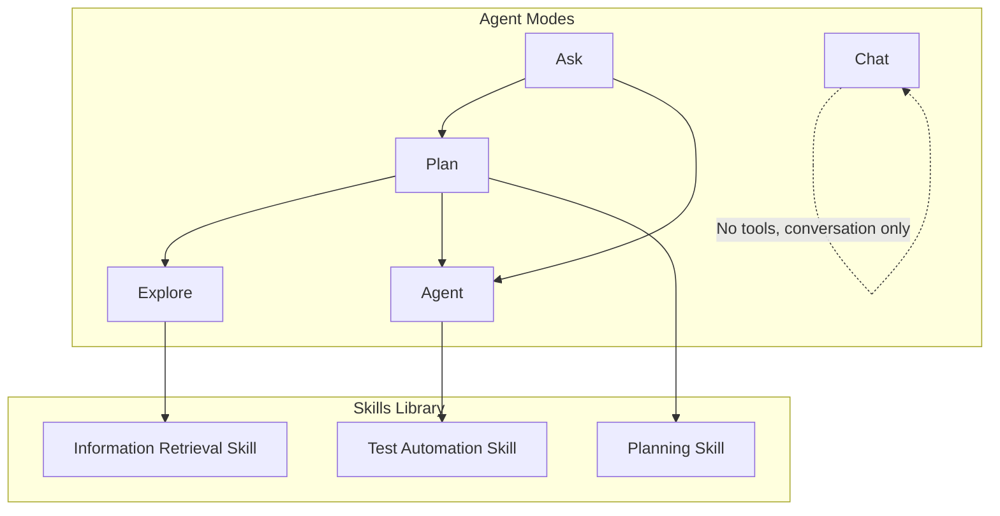
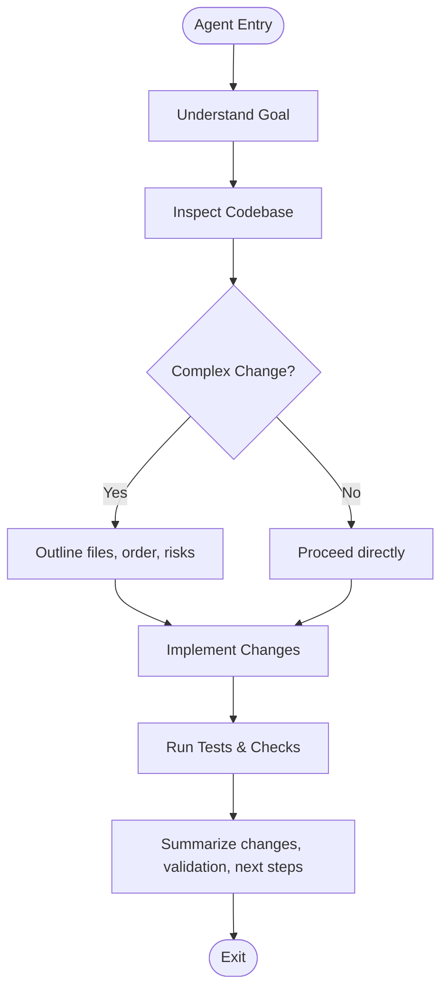
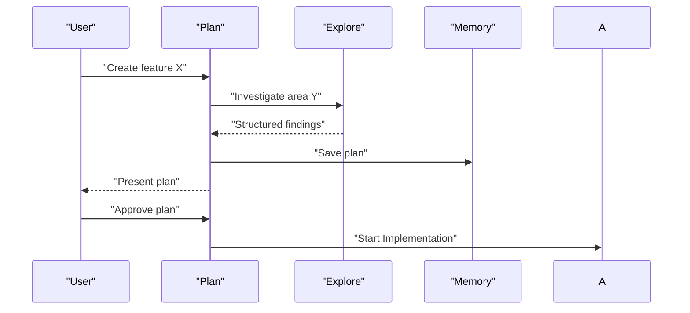
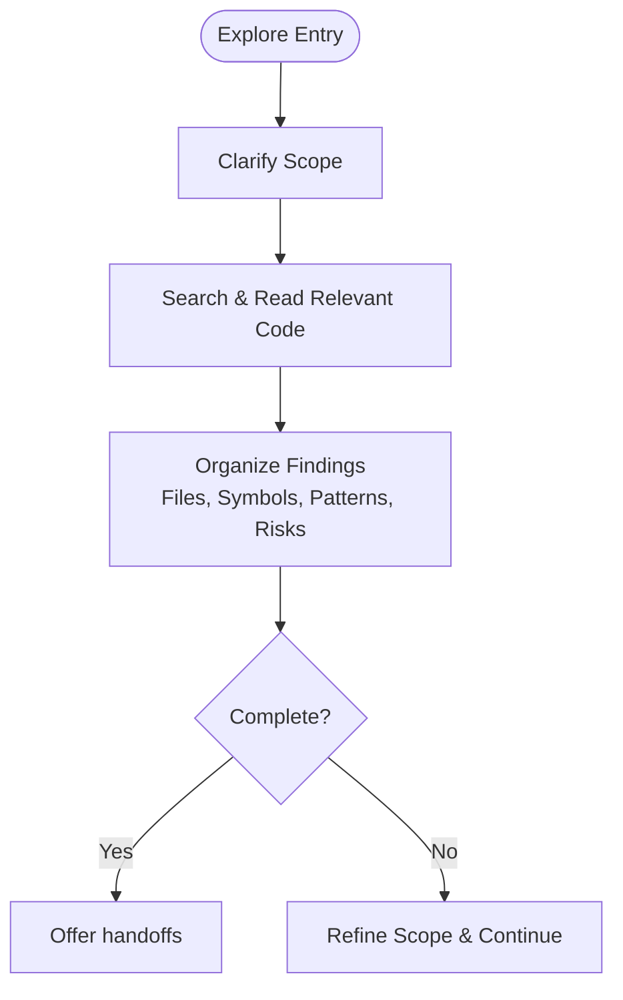
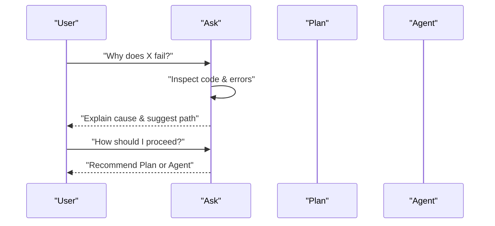
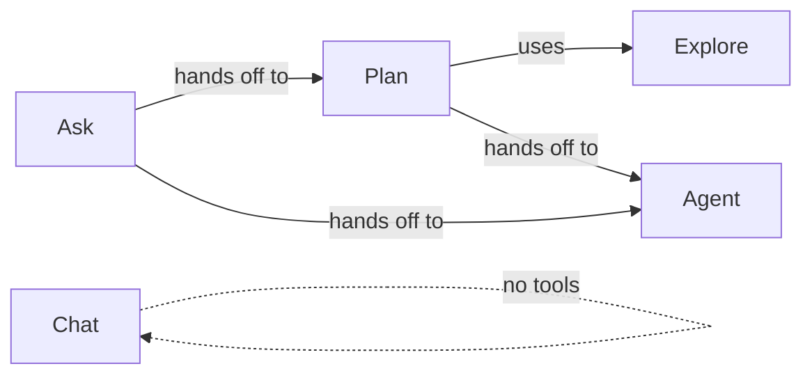

# Core Workflow Agents

## Introduction

This document explains the core workflow agents that handle fundamental development tasks: Agent (research, plan, edit, test), Plan (task decomposition and project structuring), Explore (codebase exploration and analysis), Ask (knowledge retrieval and Q&A), and Chat (conversational interactions). It covers their YAML configuration formats, tool integrations, handoff mechanisms, and how they collaborate in development pipelines.

## Overview

## Agent Mode

### Purpose
Implement, improve, and maintain code based on user instructions.

### Tools
search, read, edit, create, delete, web, memory, GitHub issue/PR tools, terminal execution, test failure inspection, Mermaid rendering, ask_questions.

### Workflow

### Behavior
Understand goal → inspect codebase → plan minimal change → implement → verify → report. Enforces safety, error handling, anti-pattern avoidance, and clear communication.

### Handoffs
- Recommend Plan for large/unclear scope
- Review after significant changes
- Test for comprehensive coverage
- Debug for complex diagnostics

### Practical Usage Patterns
- **Bug fix**: Provide context and expected behavior; Agent will locate relevant code, apply minimal fixes, run tests, and report outcomes
- **Feature addition**: Describe requirements; Agent may recommend starting with Plan if multi-file or cross-cutting
- **Refactor**: Specify target structure and constraints; Agent preserves behavior while improving organization

### Integration with Skills
Use testing skill guidance when implementing or verifying changes to ensure robust coverage and CI integration.

## Plan Agent

### Purpose
Research problems, analyze codebase, and produce detailed, executable implementation plans before changes.

### Tools
search, read, web, memory, GitHub tools, terminal output, test failure inspection, ask_questions, agent.

### Sub-agents
Can launch Explore agents for deep investigation; supports parallel exploration across independent areas.

### Persistence
Saves plans to `/memories/session/plan.md` using memory tool.

### Workflow

### Handoffs
- Start Implementation (to Agent)
- Request Review (to Review)
- Open in Editor (create untitled plan file)

### Practical Usage Patterns
- **New feature**: Provide goal and constraints; Plan will discover architecture, reuse patterns, and produce phased steps with dependencies and verification criteria
- **Large refactor**: Use Plan to map affected modules, define incremental rollout, and identify risks and mitigations

### Integration with Skills
Planning skill complements Plan's approach to decompose tasks, prioritize work, and track progress.

## Explore Agent

### Purpose
Deeply investigate specific areas of the codebase without making changes; return structured findings for planning.

### Tools
search, read, web, memory, ask_questions, terminal output, test failure inspection.

### Workflow

### Handoffs
- Use Findings for Planning (to Plan)
- Ask More Questions (to Ask)

### Practical Usage Patterns
- **Module analysis**: Provide module name or feature; Explore returns entry points, data flow, existing patterns, tests, and constraints
- **Error investigation**: Provide error context; Explore traces logs and failing tests to identify root causes

### Integration with Skills
Information retrieval skill guides systematic search strategies, source evaluation, and synthesis of findings.

## Ask Agent

### Purpose
Answer questions about the codebase, explain systems, provide debugging insights, and offer best practice recommendations without modifying code.

### Tools
search, read, web, memory, GitHub tools, terminal output, test failure inspection, render_mermaid_diagram, ask_questions.

### Workflow

### Handoffs
- Plan This (to Plan)
- Implement This (to Agent)

### Practical Usage Patterns
- **Code understanding**: Ask "What does function X do?"; Expect trace of execution, inputs/outputs, side effects, and references
- **Debugging support**: Provide error messages; Ask interprets stack traces, identifies likely causes, and suggests next steps

## Chat Agent

### Purpose
Conversational AI with no tools or code access; ideal for brainstorming, casual discussion, and idea exploration.

### Tools
None.

### Behavior
Friendly, engaging, adaptive conversation; redirects technical requests to appropriate agents.

### Practical Usage Patterns
- **Brainstorming**: Discuss ideas and explore concepts without committing to implementation
- **Idea validation**: Use Chat to refine thinking before switching to Plan or Ask for technical grounding

## Dependencies Between Agents

## Performance Considerations

- **Parallel exploration**: Plan can launch multiple Explore agents across independent areas to reduce time-to-plan
- **Minimal changes**: Agent enforces small, focused diffs to reduce review and regression risk
- **Verification early**: Both Agent and Plan emphasize running tests and checks to catch issues promptly
- **Memory persistence**: Plan saves plans to memory to avoid rework and enable iterative refinement

## Troubleshooting

- **Ambiguity in requests**: Use ask_questions to clarify scope before implementation or planning
- **Broken builds or test failures**: Agent inspects full error output, identifies root causes, and fixes before proceeding
- **External blockers**: If blocked by missing dependencies or permissions, report clearly rather than working around silently
- **Over-engineering**: Avoid building abstractions for hypothetical needs; solve actual problem first

## YAML Configuration Reference

Each agent mode defines its capabilities via YAML frontmatter:

| Field | Description |
|-------|-------------|
| `name` | Human-readable identifier |
| `description` | One-line purpose |
| `argument-hint` | Guidance for user input |
| `tools` | List of available tools |
| `agents` | Subagents allowed |
| `handoffs` | Directed transitions with prompts and flags |

### Examples

- **Agent**: Full toolset including editing and execution; no subagents; handoffs to Plan, Review, Test, Debug
- **Plan**: Tools for research and execution inspection; subagent Explore; handoffs to Agent and Review
- **Explore**: Read-only tools; handoffs to Plan and Ask
- **Ask**: Read-only tools with diagram rendering; handoffs to Plan and Agent
- **Chat**: No tools, no agents, no handoffs

## Related Resources

- [Agent Modes System](agent_modes_system.md) - Overview of all 16 agents
- [Quality & Reliability Agents](quality_reliability_agents.md) - Debug, Test, Review, Lint, Performance
- [Skills Library](../skills/skills_library.md) - Reusable capabilities for agents
