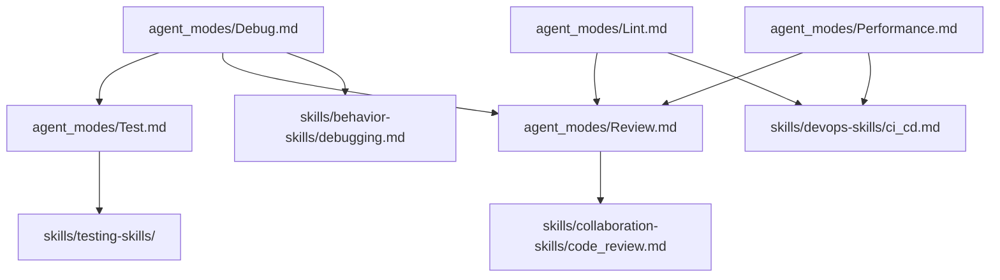
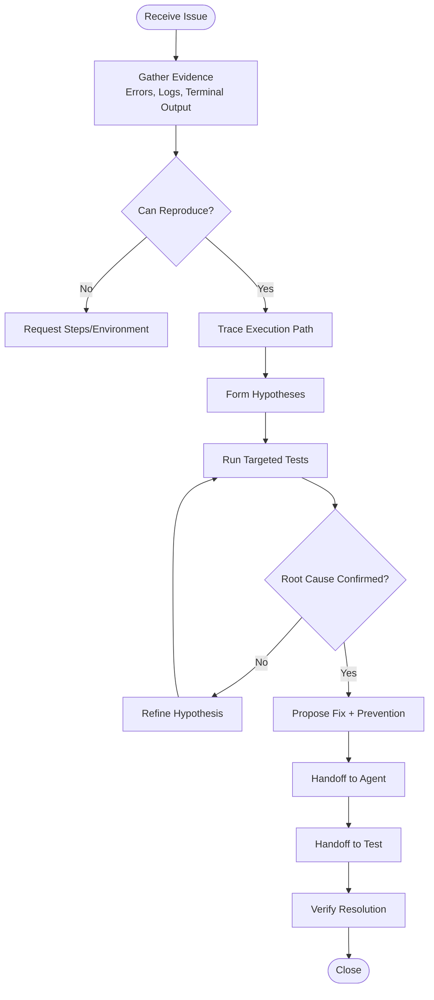
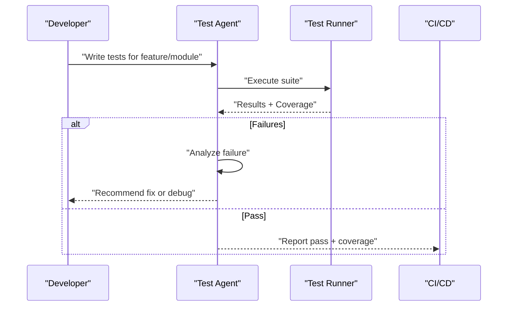
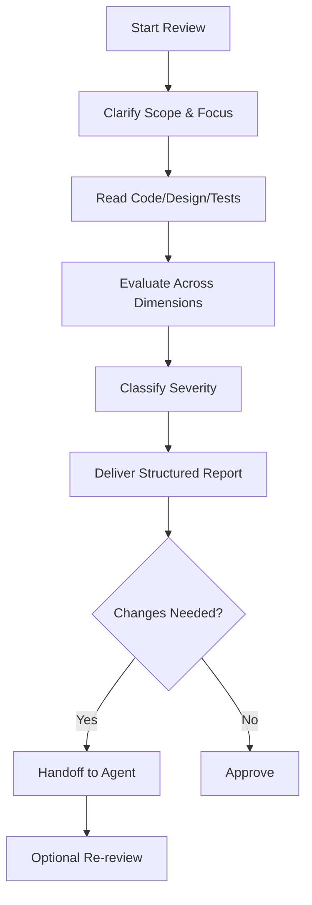
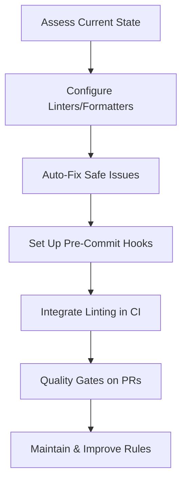
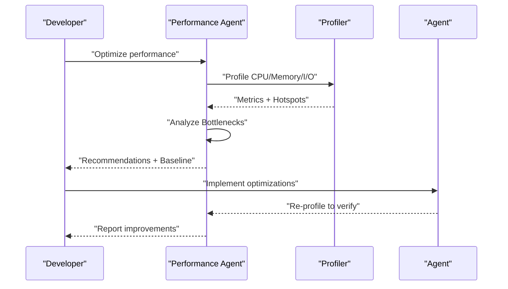
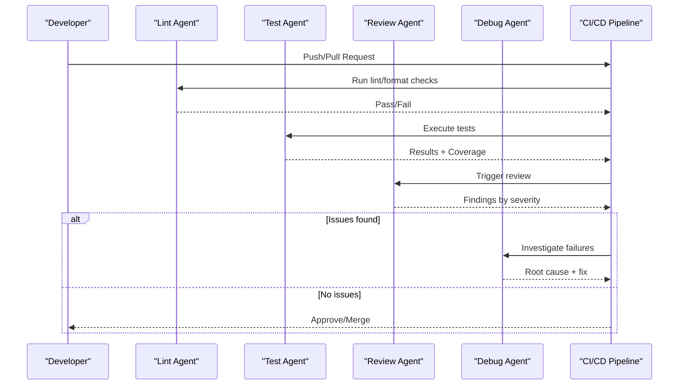

# Quality & Reliability Agents

## Introduction

This document explains the quality and reliability assurance agents: Debug, Test, Review, Lint, and Performance. It describes their responsibilities, methodologies, tooling integration, and how they fit into automated quality workflows and CI/CD pipelines.

## Overview

The agents form a cohesive quality loop: Lint ensures style and static checks early; Test validates behavior; Review inspects design and code quality; Debug resolves issues; Performance optimizes runtime characteristics.

## Debug Agent

### Purpose
Diagnose errors, analyze stack traces and logs, identify root causes, propose evidence-based solutions, and coordinate follow-ups.

### Methodology
Observe → Orient → Hypothesize → Test → Conclude → Recommend → Confirm resolution.

### Tools
Read/search code, execute commands, get terminal output, analyze test failures, fetch GitHub issues/PRs.

### Workflow

### Handoffs
- Fix bug → Agent
- Write regression tests → Test

## Test Agent

### Purpose
Ensure correctness through comprehensive, maintainable tests across the test pyramid.

### Framework Awareness
Adapts to project conventions (Jest, pytest, JUnit, etc.).

### Practices
Clear naming, focused assertions, deterministic tests, robust setup/teardown, coverage reporting, flaky test management.

### Workflow

### Handoffs
- Fix failing tests → Agent
- Debug test failures → Debug

## Review Agent

### Purpose
Evaluate code/design/plans across multiple dimensions without making changes; classify findings by severity; provide actionable recommendations.

### Dimensions
Correctness, reliability, security, performance, maintainability, testability, architecture, extensibility.

### Workflow

### Handoffs
- Fix issues → Agent
- Re-review → Review

## Lint Agent

### Purpose
Enforce formatting, style guides, naming conventions, and manage linter configuration; automate safe fixes; integrate with pre-commit and CI.

### Capabilities
Configure ESLint/Pylint/Stylelint/etc., set formatters, define `.editorconfig`, run auto-fixes safely, enforce quality gates in PRs.

### Progressive Strategy
Start with basics → add core rules → introduce project-specific rules → continuously improve.

### Workflow

### Handoffs
- Review code quality → Review
- Test after linting → Test

## Performance Agent

### Purpose
Measure performance, identify bottlenecks, recommend targeted optimizations, establish baselines/budgets, and verify improvements.

### Profiling Areas
CPU hot paths, memory leaks, I/O latency, concurrency issues.

### Methodology
Define problem → measure baseline → identify bottleneck → recommend fixes → implement (via Agent) → verify with repeatable measurements.

### Workflow

### Handoffs
- Optimize code → Agent
- Review optimizations → Review
- Write performance tests → Test

## CI/CD Integration

### Typical CI/CD Stages
1. Lint → Build → Unit Tests → Integration Tests → Security Scan → Package → Deploy Staging → E2E Tests → Deploy Production → Smoke Test

### Patterns
- Lint first for fast feedback
- Cache dependencies
- Parallelize tests
- Build once deploy many
- Gate checks before production

## Performance Considerations

- Keep test suites fast and deterministic; prefer unit tests for speed and reliability
- Cache dependencies in CI to reduce pipeline time
- Use parallel jobs where possible to shorten feedback loops
- Establish performance baselines and budgets; monitor regressions
- Avoid premature optimization; measure before changing code

## Troubleshooting

- **Debug Agent**: Use structured methodology to isolate symptoms vs. root causes; leverage terminal output and test failure analysis
- **Test Agent**: Manage flaky tests by isolating timing/order dependencies; quarantine unstable tests until fixed
- **Review Agent**: Provide severity-classified findings with specific locations and actionable recommendations
- **Lint Agent**: Start with essential rules; batch auto-fixes; enforce via pre-commit and CI
- **Performance Agent**: Compare before/after metrics; confirm no regressions; set up ongoing monitoring

## Related Resources

- [Agent Modes System](agent_modes_system.md) - Overview of all 16 agents
- [Core Workflow Agents](core_workflow_agents.md) - Agent, Plan, Explore, Ask, Chat
- [Skills Library](../skills/skills_library.md) - Reusable capabilities for agents
