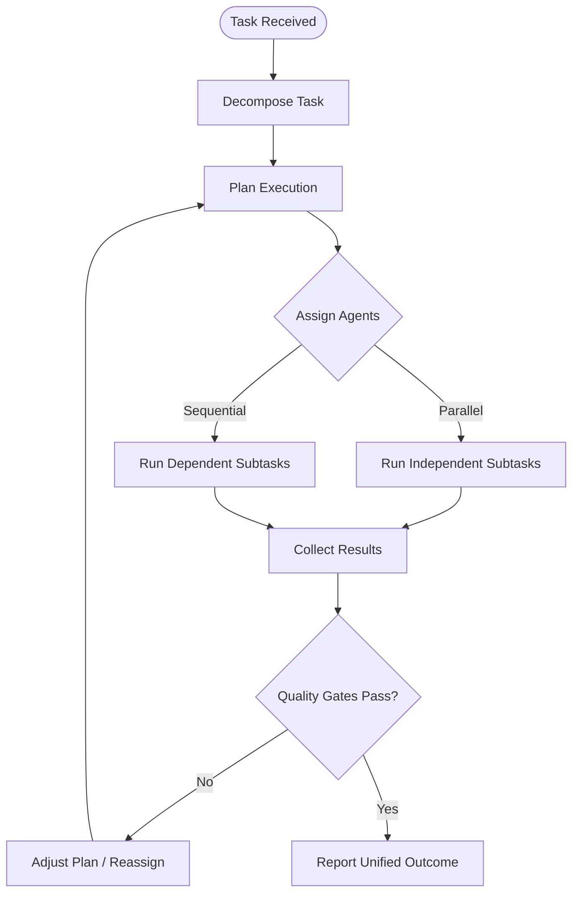
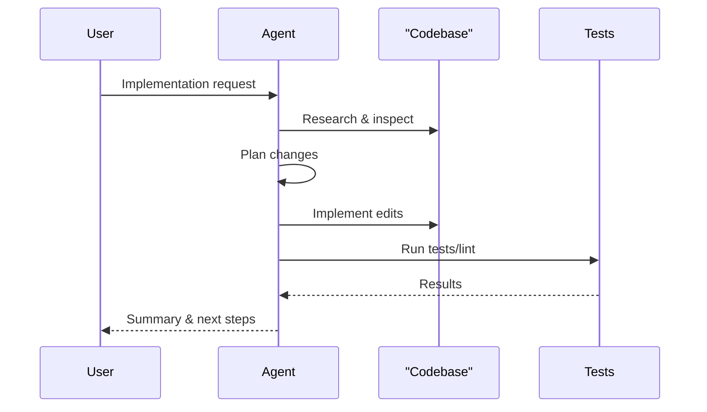
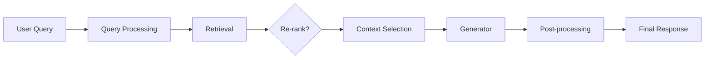
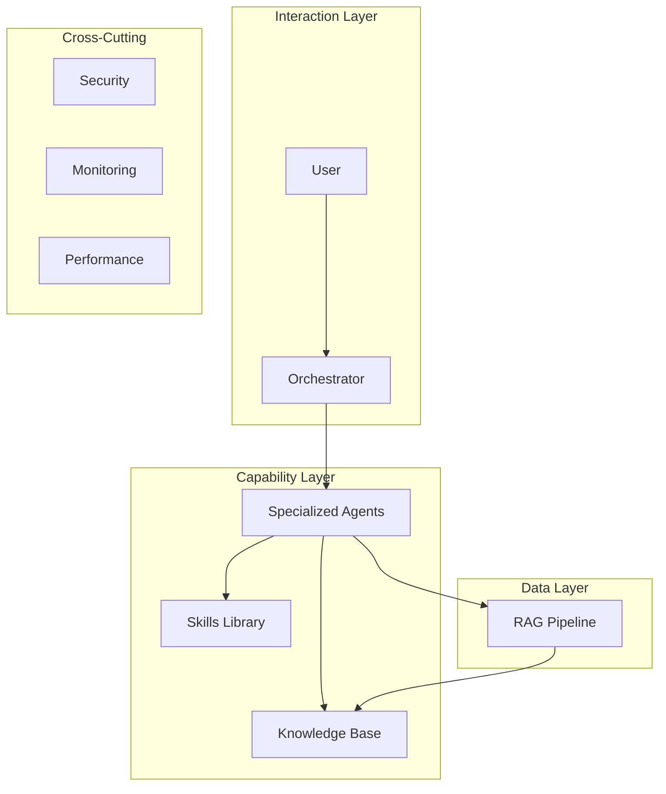

# Architecture Patterns

## Overview

This document covers common architecture patterns for building AI-powered applications and systems.

## Core Patterns

### 1. Model-as-a-Service (MaaS)

Centralized model serving with API access.

```
┌─────────────┐     ┌─────────────┐     ┌─────────────┐
│   Client    │────▶│   API GW    │────▶│   Model     │
│             │◀────│             │◀────│   Service   │
└─────────────┘     └─────────────┘     └─────────────┘
```

**Use Cases:**
- Multiple applications sharing the same model
- Centralized model updates and versioning
- Resource optimization

### 2. Pipeline Pattern

Sequential processing stages for data transformation and inference.

```
Input → Preprocessing → Feature Extraction → Inference → Post-processing → Output
```

**Use Cases:**
- Data preprocessing workflows
- Multi-stage ML pipelines
- ETL processes

### 3. Event-Driven Architecture

Asynchronous processing using message queues.

```
┌──────────┐    ┌──────────┐    ┌──────────┐
│ Producer │───▶│  Queue   │───▶│ Consumer │
└──────────┘    └──────────┘    └──────────┘
```

**Use Cases:**
- Real-time inference at scale
- Decoupled system components
- Batch processing jobs

### 4. Microservices for ML

Independent services for different ML capabilities.

```
┌─────────────────────────────────────────┐
│              API Gateway                │
└─────────────────────────────────────────┘
         │         │         │
         ▼         ▼         ▼
┌───────────┐ ┌───────────┐ ┌───────────┐
│ Training  │ │ Inference │ │ Monitoring│
│ Service   │ │ Service   │ │ Service   │
└───────────┘ └───────────┘ └───────────┘
```

**Use Cases:**
- Large-scale ML platforms
- Team autonomy
- Independent scaling

### 5. Lambda Architecture

Combines batch and stream processing.

```
                    ┌──────────────┐
           ┌───────▶│   Serving    │◀───────┐
           │        │    Layer     │        │
┌──────────┴───┐    └──────────────┘    ┌───┴──────────┐
│   Batch      │                        │   Speed      │
│   Layer      │                        │   Layer      │
└──────────────┘                        └──────────────┘
       ▲                                      ▲
       │                                      │
┌──────────────┐                        ┌──────────────┐
│  Batch Data  │                        │ Stream Data  │
└──────────────┘                        └──────────────┘
```

**Use Cases:**
- Real-time analytics with historical context
- Fault-tolerant systems
- Comprehensive data views

## Platform Architecture

The repository itself follows a layered platform architecture that connects agents, skills, knowledge bases, and learning materials.

### Multi-Agent Orchestration

The Orchestrator agent decomposes complex tasks into subtasks, assigns specialized agents, manages dependencies (parallel vs sequential), and synthesizes results with quality gates.



### Agent Implementation Pattern

The Agent mode follows a research-plan-implement-verify cycle: inspect the codebase, plan minimal changes, implement edits, run tests/lint, and report results.



### Modular Skill Composition

Skills are standardized documents with YAML frontmatter, categories, and reusable sections (competencies, frameworks, templates, pitfalls, best practices, tools, examples, success indicators). This enables consistent authoring and evolution across the library.

### RAG System Architecture

The RAG pipeline combines retriever, knowledge base, and generator:



Quality checks handle low-confidence or empty retrievals with fallback strategies (generator-only with warnings, query reformulation, hybrid retrieval).

### Agentic Architectures

The repository documents multiple agent architectures:

| Architecture | Description |
|--------------|-------------|
| **ReAct** | Interleaves reasoning and acting for improved accuracy |
| **Plan-and-Execute** | Creates complete strategy upfront, then executes with dependency tracking |
| **Multi-Agent Systems** | Specialized agents collaborating in teams, debate, or assembly-line patterns |

### Platform Layer Overview



## Design Considerations

### Scalability

- **Horizontal Scaling**: Add more instances behind load balancer
- **Vertical Scaling**: Increase resources per instance
- **Auto-scaling**: Dynamically adjust based on load

### Reliability

- **Redundancy**: Multiple instances across availability zones
- **Circuit Breakers**: Fail gracefully on service degradation
- **Retry Logic**: Exponential backoff for transient failures

### Performance

- **Caching**: Cache frequent predictions
- **Batching**: Process multiple requests together
- **Model Optimization**: Quantization, pruning, distillation

### Security

- **Authentication**: API keys, OAuth, JWT tokens
- **Authorization**: Role-based access control
- **Encryption**: TLS for data in transit, encryption at rest

## Implementation Examples

### FastAPI Model Service

```python
from contextlib import asynccontextmanager
from fastapi import FastAPI
from pydantic import BaseModel
import torch

model = None

@asynccontextmanager
async def lifespan(app: FastAPI):
    # Startup: load model safely
    global model
    model = torch.load("model.pth", map_location="cpu", weights_only=True)
    model.eval()
    yield
    # Shutdown: cleanup if needed

app = FastAPI(lifespan=lifespan)

class PredictionRequest(BaseModel):
    input_data: list[list[float]]  # batch of inputs

class PredictionResponse(BaseModel):
    predictions: list[float]
    confidence: list[float]

@app.post("/predict", response_model=PredictionResponse)
async def predict(request: PredictionRequest):
    with torch.no_grad():
        input_tensor = torch.tensor(request.input_data)
        output = model(input_tensor)
        # Compute actual confidence from softmax probabilities
        probs = torch.softmax(output, dim=-1)
        confidence, preds = probs.max(dim=-1)
        return PredictionResponse(
            predictions=preds.tolist(),
            confidence=confidence.tolist()
        )
```

## Related Resources

- [Agent Modes System](agent_modes/agent_modes_system.md) — All 16 agent behaviors
- [Agent Mode & Skills API](references/agent_mode_api.md) — YAML schema and orchestration patterns
- [Skills Library](skills/skills_library.md) — Skill categorization and composition
- [Knowledge Base Guide](knowledge_base/knowledge_base_guide.md) — Multilingual KB structure
- [RAG Systems Guide](technical_guides/rag_systems_guide.md) — Complete RAG learning path
- [Deployment Guide](deployment.md)
- [Monitoring Guide](monitoring.md)
- [Security Best Practices](security.md)

## References

- [Martin Fowler - BliTz Architecture](https://martinfowler.com/)
- [AWS ML Architecture Center](https://aws.amazon.com/architecture/machine-learning/)
- [Google Cloud AI Patterns](https://cloud.google.com/architecture/ai-ml)
