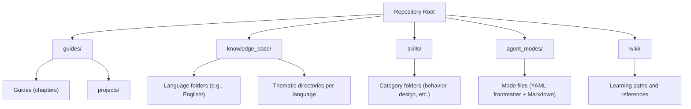
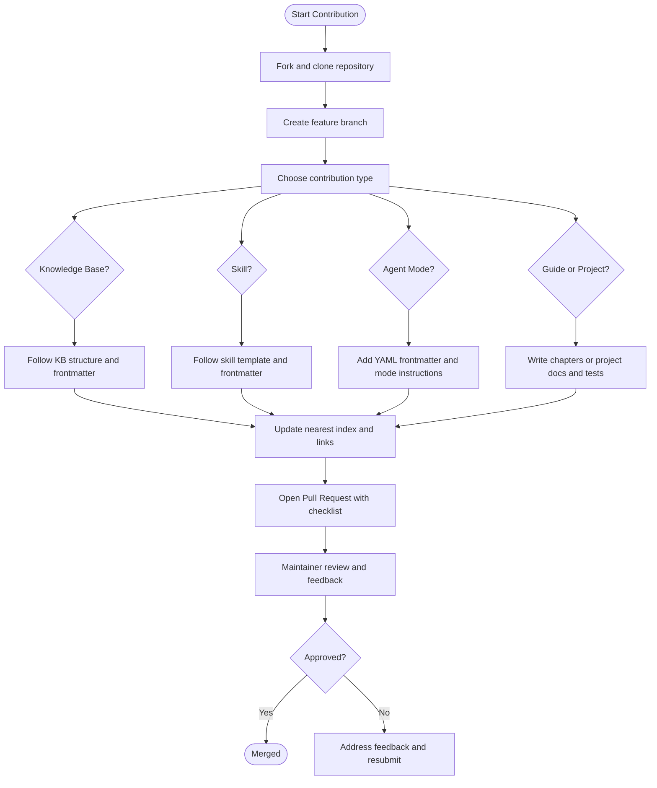
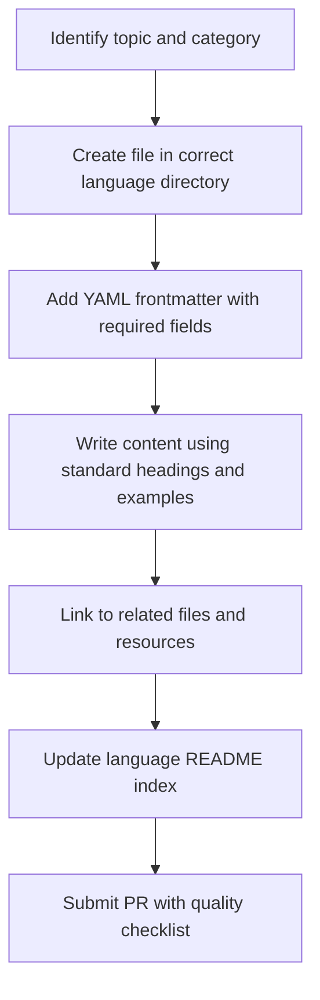
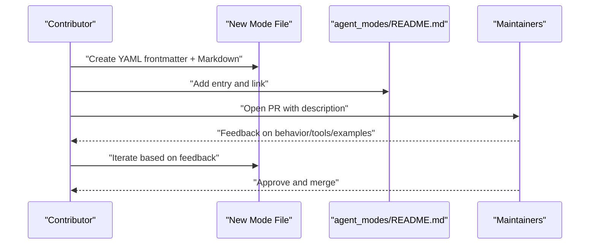
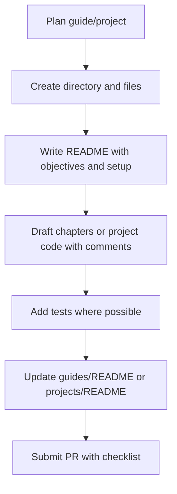

# Contributing Guide

## Introduction

This guide explains how to contribute effectively to the AI-Model-Training-Essentials repository. It covers contribution workflows, code and documentation standards, review processes, repository organization, file naming conventions, metadata requirements, and best practices for adding skills, agent modes, knowledge base content, and learning materials.

## Repository Structure

The repository is organized into clear areas that support learning, reference, reusable agent capabilities, and runnable projects:

## Contribution Workflow

Contributions flow through a consistent process:

## Adding Knowledge Base Content

**Where to add:** Place new files under the appropriate language directory and thematic folder (e.g., `knowledge_base/English/02_ai_and_machine_learning/`).

**Structure:**
- Use descriptive filenames (lowercase with underscores)
- Start with a single H1 heading
- Include overview, sections, examples, and related resources
- Maintain hierarchical headings throughout

**Metadata:** Every content file begins with a YAML frontmatter block containing:
- Metadata: title, description, category, version, status
- Contribution: authors, contributors, changelog
- Review: created, last_modified, review_date, reviewed_by, next_review
- Classification: tags, difficulty_level, prerequisites, estimated_reading_time
- Contribution guide: license, feedback_channel, how_to_contribute, review_process

**Editing rules:**
- Bump version following SemVer
- Append changelog entries (newest first)
- Update last_modified date
- Add yourself to contributors if it's your first edit

**Consistency:** Mirror the same thematic organization across languages; update the relevant language README to reflect new files; link to existing material instead of duplicating it.

## Extending Agent Modes

**Where to add:** Create a new mode file under `agent_modes/`.

**Structure:**
- Begin with YAML frontmatter including name, description, target audience, and tools
- Follow with Markdown instructions defining behavior, interaction patterns, tool usage, and examples

**Integration:**
- Add entry to the agent modes README
- Ensure the mode aligns with existing categories (Core Workflow, Quality & Reliability, Security & Operations, Specialized)

## Creating New Skills

**Where to add:** Place skills in the appropriate subdirectory under `skills/` (e.g., `behavior-skills/`, `designing-skills/`, etc.).

**Structure:** Follow the standard skill template defined in `skills/skill-creator.md`, including:
- YAML frontmatter with metadata
- Core competencies, framework/methodology
- Practical templates, common pitfalls, best practices
- Tools/resources, example application, success indicators, related skills

**Versioning:** Bump version following SemVer; add changelog entries; update last_modified; add yourself to contributors if first edit.

## Contributing Guides and Projects

**Guides:** Create a new directory under `guides/` with a README and chapter files. Each chapter should be substantial, include code examples, exercises, and links to related guides.

**Projects:** Place runnable projects under `guides/projects/`. Ensure each project has:
- README with description, prerequisites, installation, usage, explanation, challenges, next steps
- `requirements.txt` with minimal dependencies
- Main implementation file (`main.py`)
- Optional `src/` and `tests/` directories
- Clear setup and usage instructions
- Keep projects minimal and beginner-friendly

## Translation Contributions

**Process:**
- Choose high-impact files
- Create translations in the appropriate language directory
- Preserve formatting and structure
- Note translation status or reviewers

**Quality assurance:**
- Ensure technical accuracy
- Maintain terminology consistency
- Consider cultural context
- Seek native speaker review when possible

## Code Style and Standards

**Python:**
- Follow PEP 8
- Use type hints
- Include docstrings
- Keep functions focused and concise

**Documentation:**
- Clear language, examples, linked resources
- Consistent formatting
- Hierarchical headings

**Git commits:**
- Descriptive messages indicating change type and scope
- Prefix convention: `Add:`, `Fix:`, `Update:`, `Refactor:`

## Pull Request Process

**Before submitting:**
- Test changes locally
- Check broken links
- Verify formatting
- Review spelling and grammar
- Ensure naming conventions are followed

**PR description:** Use provided template indicating type of change, checklist, and related issues.

**Review:** Maintainers review, provide feedback, approve, and merge.

## Troubleshooting

Common issues and resolutions:
- **Broken links**: Verify relative paths and update indexes when moving files
- **Formatting inconsistencies**: Use hierarchical headings and consistent Markdown style
- **Frontmatter errors**: Validate YAML syntax and ensure all required fields are present
- **Project setup failures**: Check `requirements.txt`, environment activation, and dependency versions; consult error guides in `guides/errors/`

## Best Practices for Effective Collaboration

- Be respectful, collaborative, and patient during reviews
- Ask questions via issues; check existing documentation before opening new ones
- Keep changes small and focused; test locally when applicable
- Maintain consistency in naming, formatting, and metadata across contributions
- Link to existing material instead of duplicating content

## Related Resources

- [Repository Guide](repository_guide.md) - Directory layout and conventions
- [Skills Skill-Creator](../skills/skill-creator.md) - Skill template and quality checklist
- [Knowledge Base README](../knowledge_base/README.md) - KB structure and guidelines
- [Agent Modes README](../agent_modes/README.md) - Agent mode conventions
