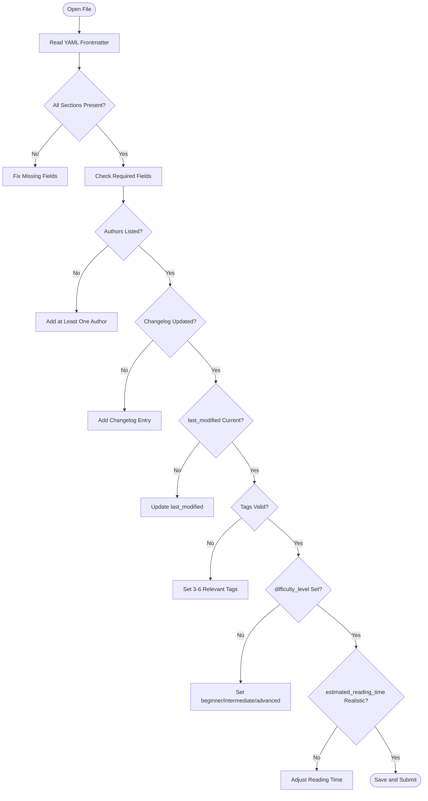
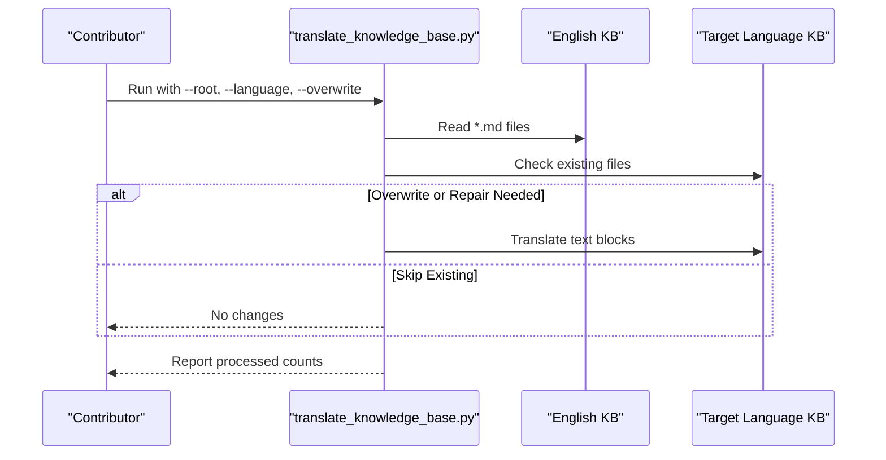
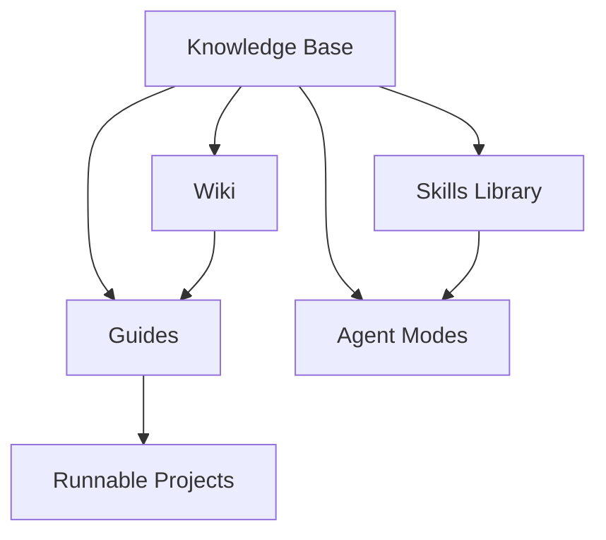
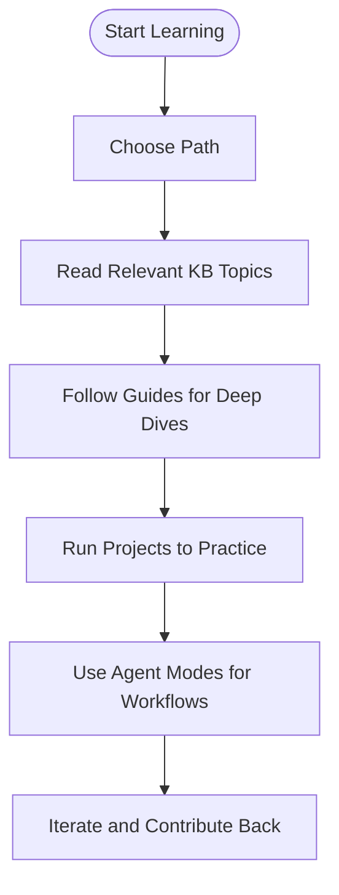

# Knowledge Base Guide

## Introduction

The multilingual Knowledge Base contains 103+ English documents across 23 languages, organized into 10 thematic categories. It uses a consistent file organization pattern, a YAML frontmatter metadata system, and an automated translation workflow for producing localized versions.

The Knowledge Base is designed for both human learning and AI training, with clear headings, structured tables, and cross-references to support readability and machine parsing.

## Structure

```mermaid
graph TB
KB["Knowledge Base Root"]
EN["English"]
AR["Arabic"]
BN["Bengali"]
FR["French"]
DE["German"]
HI["Hindi"]
ID["Indonesian"]
IT["Italian"]
JA["Japanese"]
KO["Korean"]
ZH_S["Mandarin Simplified"]
ZH_T["Mandarin Traditional"]
FA["Persian"]
PL["Polish"]
PT["Portuguese"]
RU["Russian"]
ES["Spanish"]
SW["Swahili"]
TH["Thai"]
TL["Filipino"]
TR["Turkish"]
UR["Urdu"]
VI["Vietnamese"]
KB --> EN
KB --> AR
KB --> BN
KB --> FR
KB --> DE
KB --> HI
KB --> ID
KB --> IT
KB --> JA
KB --> KO
KB --> ZH_S
KB --> ZH_T
KB --> FA
KB --> PL
KB --> PT
KB --> RU
KB --> ES
KB --> SW
KB --> TH
KB --> TL
KB --> TR
KB --> UR
KB --> VI
```

Each language mirrors the same 10 thematic directories:

| # | Directory | Topics |
|---|-----------|--------|
| 01 | `coding_and_technology` | Web dev, databases, cloud, networking, DevOps, security, APIs, testing, performance |
| 02 | `ai_and_machine_learning` | AI fundamentals, ML workflows, NLP, computer vision, MLOps, generative AI, GNNs |
| 03 | `data_science_and_analytics` | Statistics, big data, BI, visualization, experimentation, feature engineering |
| 04 | `natural_sciences` | Physics, chemistry, biology, medicine, environment, astronomy, genetics |
| 05 | `business_and_economics` | Business principles, finance, marketing, management, behavioral economics |
| 06 | `humanities_and_arts` | History, arts, psychology, language, philosophy, linguistics, music, religion |
| 07 | `general_reference` | Dictionaries, technology basics, learning science, research methodology, writing |
| 08 | `future_and_trends` | Emerging tech, future of work/healthcare, education, climate tech, AI in daily life |
| 09 | `lessons_from_failures` | AI/LLM failures, code quality issues, security vulnerabilities, system reliability |
| 10 | `quick_reference` | Cheat sheets for Python, Git, SQL, Linux, Docker, K8s, regex, cloud, CI/CD |

## Organizational Principles

- **Directory numbering**: Categories are prefixed with two-digit numbers (e.g., `01_coding_and_technology`) to enforce stable ordering
- **File names**: Lowercase with underscores, descriptive names indicating content (e.g., `web_development.md`)
- **Consistent structure**: Each language mirrors the same set of directories and files, enabling parallel updates and translations
- **Programming languages**: A dedicated subdirectory under `01_coding_and_technology` covers 34 programming languages

## File Organization

- **Naming**: Lowercase with underscores (e.g., `web_development.md`)
- **Headings**: Hierarchical (# title, ## sections, ### subsections)
- **Tables**: Used for structured comparisons throughout
- **Cross-references**: Relative Markdown links between related topics
- **Subfolders**: Directories with 10+ files and clear thematic groupings use nested subfolders (e.g., `02_ai_and_machine_learning/foundations/`, `01_coding_and_technology/programming_languages/`)

## YAML Frontmatter Metadata

Every content file begins with a YAML frontmatter block containing five sections:

### Metadata Section
- title, description, category, version, status

### Contribution Section
- authors, contributors, changelog

### Review Section
- created, last_modified, review_date, reviewed_by, next_review

### Classification Section
- tags, difficulty_level, prerequisites, estimated_reading_time

### Contribution Guide Section
- license, feedback_channel, how_to_contribute, review_process

### Editing Rules
- Bump version following SemVer
- Append changelog entries (newest first)
- Update last_modified date
- Add yourself to contributors if it's your first edit

## Translation Workflow

The repository includes a Python script (`scripts/translate_knowledge_base.py`) to translate Markdown files while preserving fenced code blocks, inline code, links, URLs, and HTML comments.

Key behaviors:
- **Resumable**: Existing files are left untouched unless overwritten or metadata needs repair
- **Protected placeholders**: Code blocks, inline code, links, and URLs are preserved
- **Metadata repair**: Aligns frontmatter between source and target
- **Parallel processing**: Supports concurrent processing across languages and files
- **Rate limiting**: Configurable delay and worker counts

## Integration with Other Components

- **Guides**: Provide sequenced explanations, exercises, and runnable implementations; the Knowledge Base offers focused reference material
- **Skills**: Define reusable capabilities for AI agents; Agent Modes combine task styles with tools and behavioral instructions
- **Wiki**: Curates engineering documentation and navigation, linking back to guides and repository directories
- **Projects**: Demonstrate practical implementation and can be run locally

## Learning Paths Through the Knowledge Base

## Content Maintenance

- **Versioning**: Use semantic versioning for each file; bump appropriately on edits
- **Changelog**: Append changes with version, date, author, and description (newest first)
- **Review cadence**: Track `review_date` and `next_review` to ensure timely updates
- **Tags and classification**: Maintain consistent tags and difficulty levels for discoverability
- **Cross-references**: Use relative markdown links to connect related topics; update when moving files

## Relationship Between Language Versions

- **Primary source**: English directory is the most complete and authoritative
- **Mirrored structure**: Other languages mirror the same directories and filenames
- **Progressive coverage**: Some languages may have fewer files, especially in newer or specialized categories
- **Automated translation**: The script maintains consistency while preserving code and links; manual review recommended for accuracy

## Troubleshooting

- **Broken or missing frontmatter**: Use the metadata repair function to align frontmatter between source and target files
- **Empty translation output**: Ensure input text contains alphabetic characters and non-empty paragraphs; check network connectivity
- **Metadata mismatch**: Use metadata-only repair mode to synchronize frontmatter without retranslating body content
- **Protected placeholders**: Verify that placeholders are not leaking into final output
- **Broken links**: Validate relative markdown links; update cross-references when moving files
- **Formatting inconsistencies**: Follow naming conventions and heading hierarchy; use tables for structured comparisons
- **Quality checklist failures**: Validate all required fields, update changelog entries, and confirm realistic reading times and tags

## Related Resources

- [Knowledge Base Source Files](../../knowledge_base/) - The actual multilingual reference documents
- [Contributing Guide](../contributing.md) - How to add knowledge base content
- [Translation Script](../../scripts/translate_knowledge_base.py) - Automated translation tool
