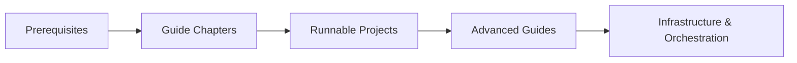
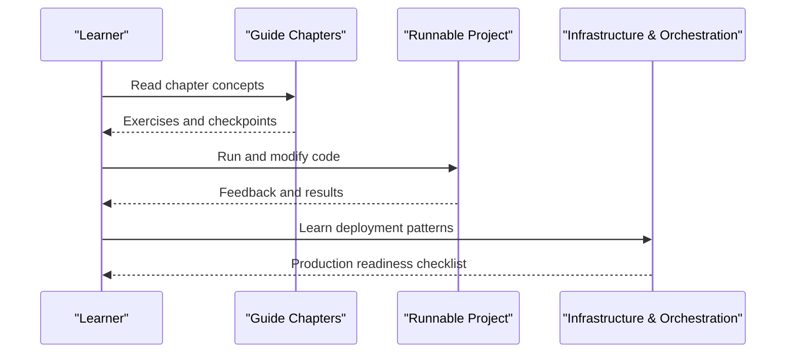
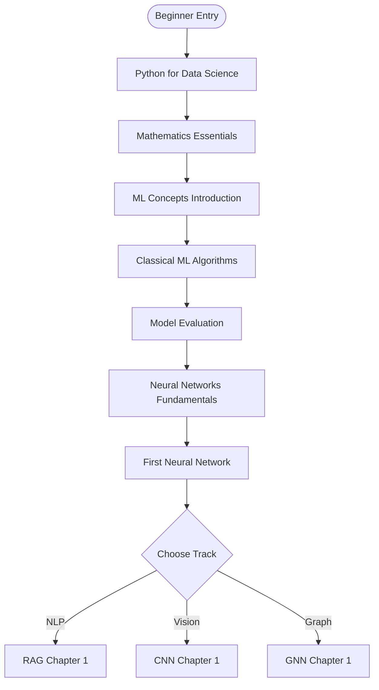
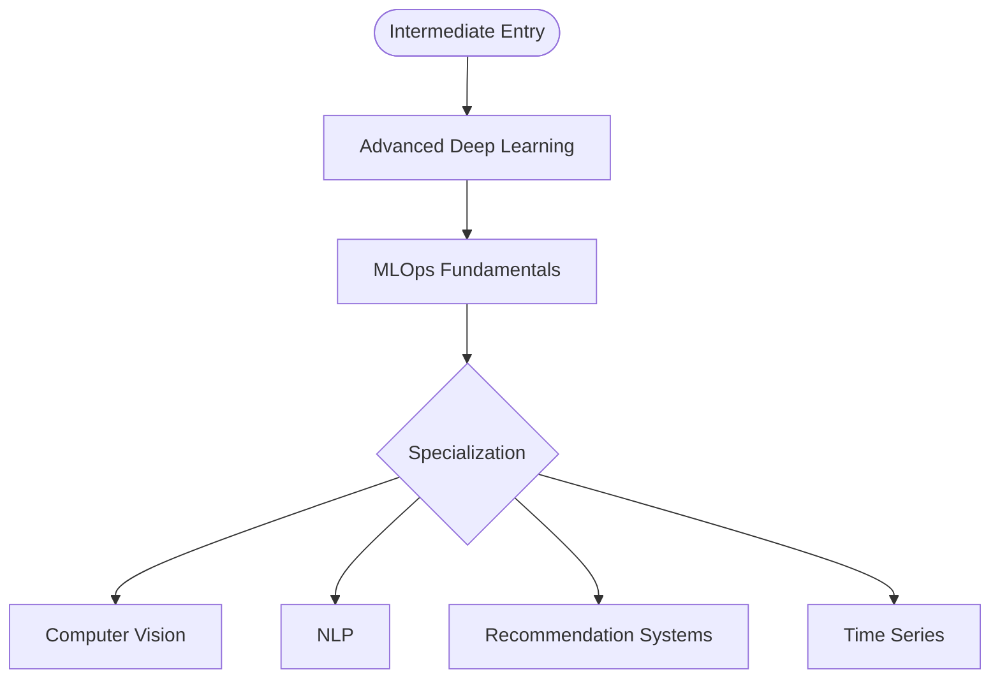
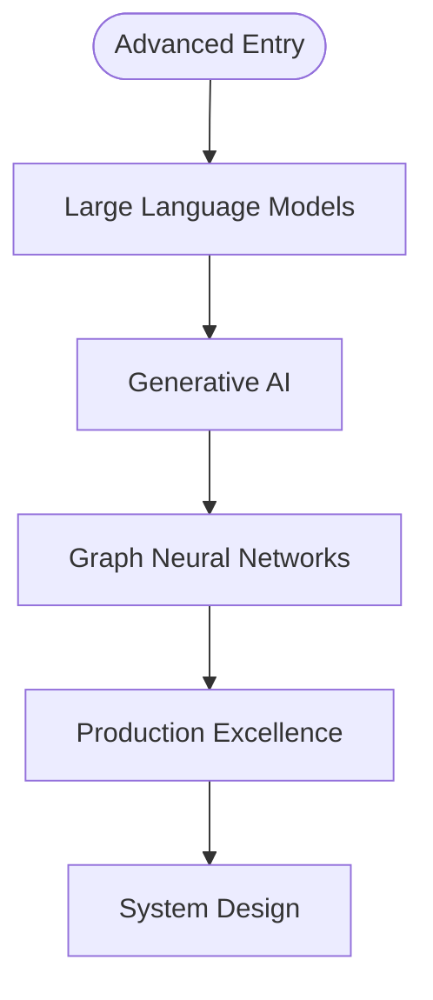
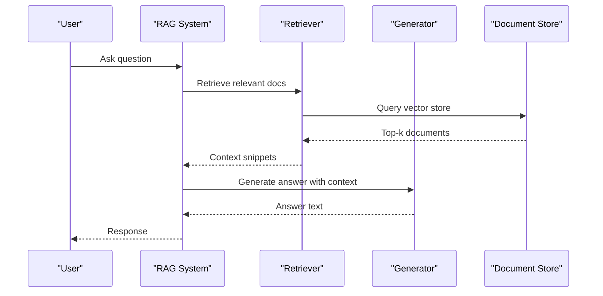
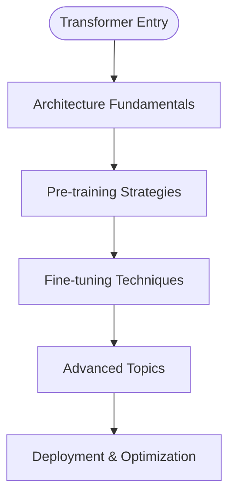
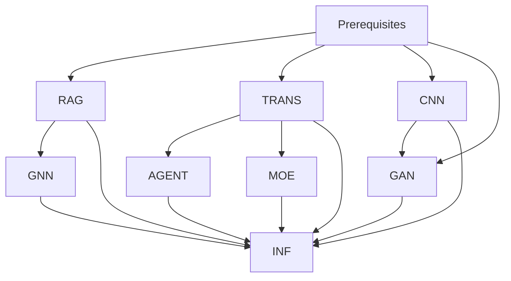
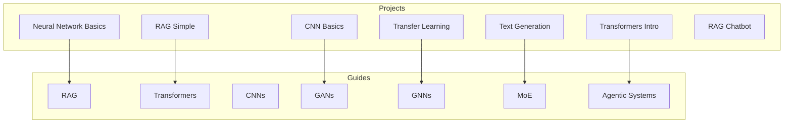

# Learning Paths Overview

## Introduction

The repository offers a structured, progressive education system that integrates theory, practice, and production readiness. This page maps the complete learning landscape: specialized tracks, prerequisite requirements, recommended study sequences, and how to integrate hands-on projects with theoretical guides.

## Learning Architecture

The learning architecture layers theory, practice, and deployment:

- **Theory**: Guides provide conceptual foundations, step-by-step chapters, and exercises
- **Practice**: Projects offer runnable code to apply concepts immediately
- **Deployment**: Infrastructure and orchestration guides prepare learners for production

## Level Paths

| Path | Target Audience | Link |
|------|-----------------|------|
| **Beginner** | New to AI/ML | [Start Here](beginner.md) |
| **Intermediate** | Some ML experience | [Continue Here](intermediate.md) |
| **Advanced** | Production AI engineers | [Deep Dive](advanced.md) |

### Beginner Path
- **Focus**: Python for data science, mathematics essentials, ML concepts, classical algorithms, neural networks fundamentals
- **Projects**: House price prediction, image classifier (MNIST/CIFAR-10), customer segmentation
- **Entry point**: If new to AI/ML, start with RAG Chapter 1 to build intuition quickly

### Intermediate Path
- **Focus**: Advanced deep learning (CNNs, sequence models, Transformers), MLOps fundamentals, specialization selection
- **Projects**: End-to-end ML pipeline, deployed model with API, fine-tuned transformer model

### Advanced Path
- **Focus**: LLMs, generative AI (GANs, diffusion, VAEs), GNNs, scalable inference, monitoring/observability, security/compliance, system design
- **Projects**: Multi-model production system, real-time inference platform, custom LLM application with RAG

## Specialized Tracks

### RAG Systems
- **Purpose**: Build AI that answers questions using documents via retrieval and generation
- **Chapters**: Fundamentals → Data Preparation → Training Retrievers → Complete RAG Systems → Training Generators
- **Projects**: [Simple RAG](../runnable_projects/runnable_projects.md#simple-rag-system), RAG Chatbot
- **Prerequisites**: Basic Python, ML fundamentals

### Transformers
- **Purpose**: Understand attention mechanisms, build Transformers from scratch, pre-train and fine-tune
- **Chapters**: Architecture Fundamentals → Pre-training Strategies → Fine-tuning Techniques → Advanced Topics
- **Projects**: [Transformers Intro](../runnable_projects/runnable_projects.md#transformers-integration), [Text Generation](../runnable_projects/runnable_projects.md#text-generation)
- **Prerequisites**: Basic neural network understanding

### CNNs
- **Purpose**: Train convolutional neural networks for computer vision tasks
- **Chapters**: Fundamentals → Advanced Architectures → Training Techniques → Specialized Applications
- **Projects**: [CNN Basics](../runnable_projects/runnable_projects.md#cnn-basics)
- **Prerequisites**: Math and ML fundamentals

### GANs
- **Purpose**: Train generative adversarial networks for image generation and beyond
- **Chapters**: Fundamentals → Advanced Variants → Stabilization Techniques
- **Prerequisites**: CNN knowledge, optimization understanding

### GNNs
- **Purpose**: Model relationships and networks using graph neural networks
- **Chapters**: Graph Fundamentals → Architectures → Training at Scale → Real-World Applications
- **Prerequisites**: RAG or CNN basics helpful

### MoE Architectures
- **Purpose**: Scale models efficiently using sparse mixture of experts with gating and load balancing
- **Chapters**: Fundamentals → Advanced Architectures → Production Deployment
- **Prerequisites**: Strong deep learning and Transformer knowledge

### Agentic Systems
- **Purpose**: Build autonomous AI agents with tool use, multi-agent coordination, planning, and reasoning
- **Chapters**: Agent Fundamentals → Tool Use → Multi-Agent Systems → Planning & Reasoning
- **Prerequisites**: Transformers understanding

## Prerequisites

Before starting any guide or project, ensure foundational skills:

| Prerequisite | Topics | Resources |
|-------------|--------|-----------|
| Python Basics | Variables, functions, OOP, file I/O, packages | [Python prerequisite guide](../../guides/prerequisites/) |
| Mathematics for ML | Linear algebra, calculus, probability, statistics | [Math prerequisite guide](../../guides/prerequisites/mathematics_for_ml.md) |
| ML Fundamentals | Supervised/unsupervised learning, evaluation, overfitting | [ML fundamentals guide](../../guides/prerequisites/ml_fundamentals.md) |
| Terminal & Git | Command line, version control, branching | [Git basics](../../guides/prerequisites/) |

## Dependency Map

## Recommended Study Sequences

| Learner Type | Sequence |
|-------------|----------|
| **Casual** | RAG Ch 1–2 → RAG Ch 3–4 → one more guide → capstone project |
| **Dedicated** | Complete RAG → Transformers or CNNs → third architecture + projects → specialize → deploy |
| **Intensive Bootcamp** | Multiple guides per week → orchestration + infrastructure → capstone project |

### Navigation by Goal

| Goal | Recommended Path |
|------|-----------------|
| NLP focus | RAG → Transformers → Agentic Systems → Orchestration |
| Vision focus | CNNs → GANs → Infrastructure Layers |
| Graph ML focus | RAG or CNN basics → GNNs → Orchestration → Infrastructure |
| Deployment focus | Any architecture → Infrastructure Layers → Orchestration Patterns |
| Autonomous AI | Transformers → Agentic Systems → Infrastructure Layers |

## Hands-On Project Integration

Projects reinforce guide concepts at every level:

- Start with minimal projects to validate setup and understand core concepts
- Progress to more complex projects as you advance through guides
- Use Colab for quick experimentation and local environments for deeper customization
- See [Runnable Projects](../runnable_projects/runnable_projects.md) for full details

## Troubleshooting

| Issue | Resolution |
|-------|-----------|
| ModuleNotFoundError | Ensure virtual environment is activated and dependencies installed |
| CUDA out of memory | Reduce batch size or sequence length; consider CPU mode or cloud GPU |
| Slow performance | Use Google Colab for free GPU access; reduce dataset size for testing |
| Installation failures | Use CPU-only modes for problematic environments |

## Related Resources

- [Beginner Path](beginner.md) — Full beginner curriculum
- [Intermediate Path](intermediate.md) — Full intermediate curriculum
- [Advanced Path](advanced.md) — Full advanced curriculum
- [Technical Guides Overview](../technical_guides/technical_guides_overview.md) — All guide series
- [Runnable Projects](../runnable_projects/runnable_projects.md) — Hands-on implementations
- [Hardware Reality Check](../../guides/hardware_reality_check.md) — Hardware requirements and options
