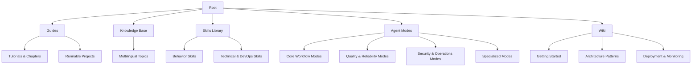
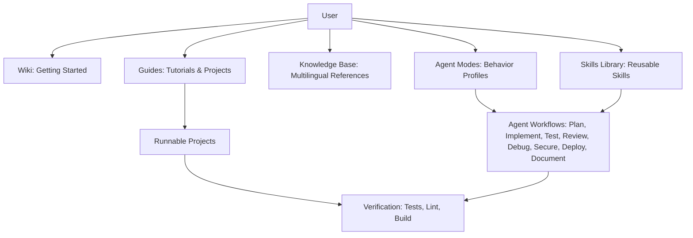
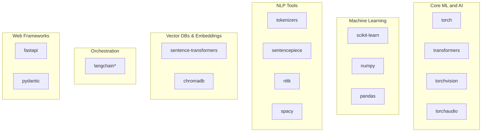

# Project Overview

## Introduction

AI-Model-Training-Essentials is a multilingual knowledge base and AI teaching repository focused on small local models. It brings together structured AI knowledge, learning guides, reusable agent skills, configurable agent modes, and runnable projects to support learning, experimentation, and building local AI systems. The content spans beginner-friendly tutorials through advanced topics such as Retrieval-Augmented Generation (RAG), Transformers, computer vision with CNNs and GANs, graph neural networks (GNNs), mixture-of-experts (MoE), agentic systems, orchestration patterns, and infrastructure layers for production.

The repository targets:
- **Beginners** who want an accessible path into AI/ML with hands-on projects and clear explanations
- **Intermediate developers** building NLP, vision, or data science applications
- **Advanced practitioners** designing agents, orchestration workflows, and production-ready local AI systems
- **Teams** seeking reusable skills, standardized agent behaviors, and multilingual reference material

Key features include:
- Structured AI knowledge across 23 languages
- Learning guides with progressive chapters and exercises
- Reusable agent skills for behavior, collaboration, design, DevOps, security, testing, and more
- Configurable agent modes for coding, research, debugging, review, testing, DevOps, database management, documentation, linting, migration, performance, security, and multi-agent orchestration
- Runnable projects that demonstrate core concepts end-to-end

## Project Structure

At a high level, the repository is organized into five main areas:

- **Guides**: Sequenced tutorials, prerequisites, errors, and runnable projects
- **Knowledge Base**: Structured reference content in multiple languages
- **Skills Library**: Reusable capabilities for AI agents
- **Agent Modes**: Pre-configured behavior profiles for common development workflows
- **Wiki**: Architecture, model development, deployment, monitoring, security, learning paths, and references

## Core Components

### Guides
The Guides provide a complete journey from zero to production-ready systems:
- Learning pathways tailored to different interests (NLP, computer vision, graphs, agents, MLOps)
- Chapter-based tutorials with analogies, visuals, math foundations, implementations, training walkthroughs, pitfalls, exercises, and real-world applications
- Hardware guidance and troubleshooting sections
- Runnable projects under `guides/projects/` with requirements files and step-by-step instructions

### Knowledge Base
Multilingual reference documents across 23 languages and 10 thematic directories:
- Coding and technology, AI and machine learning, data science and analytics, natural sciences, business and economics, humanities and arts, general reference, future and trends, lessons from failures, and quick references
- Each language mirrors the same thematic organization, enabling consistent navigation and cross-language learning

### Skills Library
Reusable capability modules for AI agents and developers:
- Categories include behavior, collaboration, design, research, speaking, technical, testing, DevOps, security, management, and data
- Each skill follows a standard template with core competencies, frameworks, templates, pitfalls, best practices, tools, examples, and success indicators

### Agent Modes
16 behavior configurations grouped into categories:
- **Core Workflow**: Agent, Plan, Explore, Ask, Chat
- **Quality & Reliability**: Debug, Test, Review, Lint, Performance
- **Security & Operations**: Secure, DevOps, Database
- **Specialized**: Documentation, Migration, Orchestrator

### Wiki
The detailed documentation hub covering:
- Getting started, architecture patterns, model development, deployment, monitoring, security
- Learning paths (beginner, intermediate, advanced)
- References (API reference, glossary, troubleshooting, checklist)

## Architecture Overview

Users typically start with the Wiki's getting started guide, choose a learning path, follow the Guides, run Projects, consult the Knowledge Base, and use Agent Modes and Skills to structure work.

## Suggested Workflows

| Scenario | Workflow |
|----------|----------|
| New feature | Explore → Plan → Agent → Test → Review |
| Bug report | Debug → Agent → Test |
| Security concern | Secure → Agent → Review |
| Performance issue | Performance → Debug → Agent |
| Database design | Database → Plan → Agent → Test |
| CI/CD setup | DevOps → Agent → Test |
| Code quality cleanup | Lint → Agent → Review |
| Dependency upgrade | Migration → Agent → Test → Review |
| Documentation sprint | Documentation → Review |
| Complex multi-part task | Orchestrator → delegates to specialized modes |

## Dependency Analysis

The repository includes a shared set of Python dependencies for ML, NLP, vector databases, orchestration, web frameworks, utilities, and testing:

## Performance Considerations

- Prefer cloud GPUs (Google Colab, Kaggle) for faster iteration when local hardware is limited
- Reduce batch sizes if encountering out-of-memory errors
- Use CPU mode for initial experiments; switch to GPU when scaling up
- Keep projects minimal and well-commented to improve readability and maintainability
- Leverage vector databases and embeddings efficiently by chunking and indexing documents appropriately
- Profile code using available tools and optimize bottlenecks before scaling

## Troubleshooting Guide

Common issues and resolutions:
- **Module not found errors**: Reinstall dependencies or verify virtual environment activation
- **CUDA out of memory**: Reduce batch size, use CPU mode, or switch to cloud GPUs
- **No GPU detected**: Verify drivers and environment; consider using Google Colab
- **Slow performance**: Enable GPU acceleration, use smaller datasets, or leverage cloud resources

See the [Troubleshooting Guide](troubleshooting/troubleshooting_guide.md) for detailed diagnostics.

## Related Resources

- [Getting Started](getting_started.md) - Setup and first steps
- [Contributing Guide](contributing.md) - How to contribute
- [Main README](../README.md) - Project overview
- [Guides](../guides/) - In-depth technical guides
- [Skills](../skills/) - Skill-based documentation
- [Knowledge Base](../knowledge_base/) - Organized knowledge repository
- [Agent Modes](../agent_modes/) - AI agent configurations
