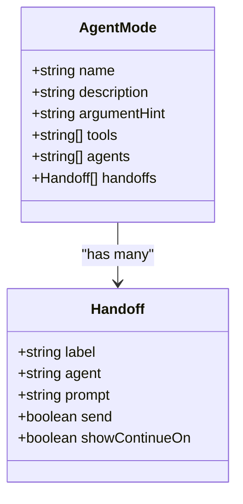
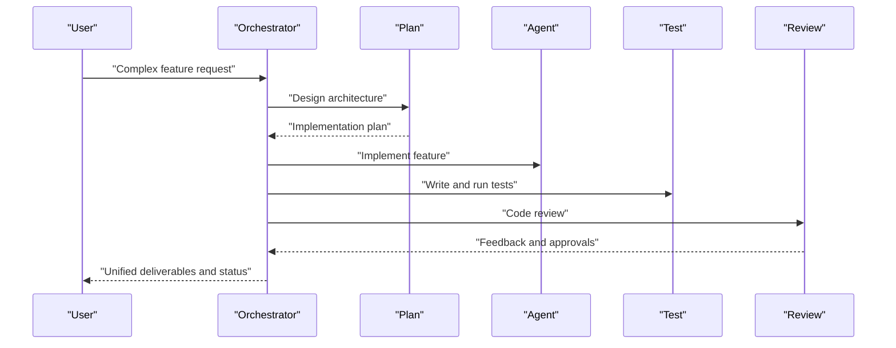
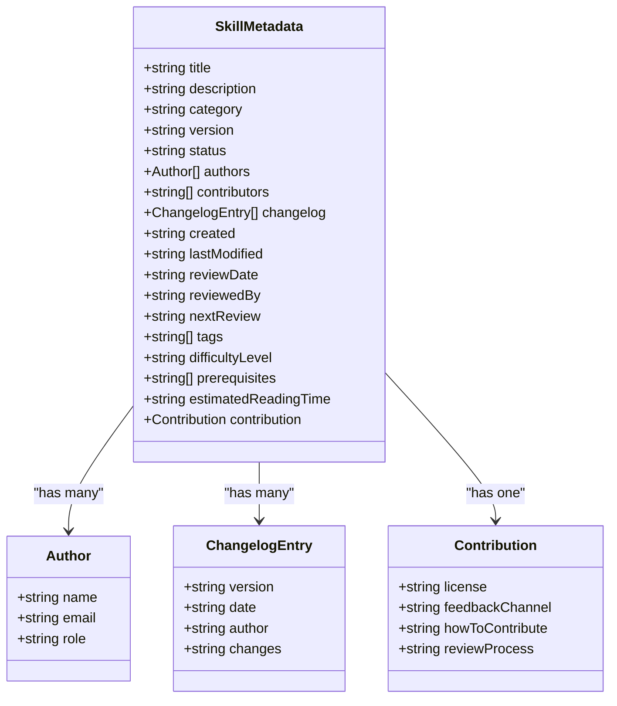

# Agent Mode & Skills API Reference

## Introduction

This page documents the declarative API surfaces used to configure agent modes and skills. Each agent mode is defined as a Markdown file with YAML frontmatter that declares its identity, tools, sub-agents, and handoffs. Skills follow a standardized template and metadata schema for versioning, classification, and contribution tracking.

## Agent Mode Configuration Schema

### YAML Frontmatter Fields

| Field | Type | Required | Description |
|-------|------|----------|-------------|
| `name` | string | Yes | Unique identifier for the mode |
| `description` | string | Yes | Purpose and scope statement |
| `argument-hint` | string | Yes | Guidance or example prompt for users |
| `tools` | string[] | Yes | Capabilities exposed to the agent at runtime |
| `agents` | string[] | No | Sub-agents this agent can delegate to |
| `handoffs` | object[] | No | Outbound transitions to other modes |

### Handoff Object Schema

| Field | Type | Required | Description |
|-------|------|----------|-------------|
| `label` | string | Yes | Display name for the handoff action |
| `agent` | string | Yes | Target agent identifier |
| `prompt` | string | Yes | Instruction passed to the target agent |
| `send` | boolean | No | Whether to forward context to the target |
| `showContinueOn` | boolean | No | Whether to present a continuation UI |

### Tool Vocabulary

Modes use a shared tool vocabulary:

| Tool | Description |
|------|-------------|
| `read` | Read file contents |
| `search` | Search codebase semantically or by pattern |
| `edit` | Modify existing files |
| `create` | Create new files |
| `delete` | Remove files |
| `web` | External research via web |
| `memory` | Persistent state across steps |
| `github/*` | Issue and PR context operations |
| `execute/*` | Terminal execution |
| `render_mermaid_diagram` | Visualize flows as diagrams |
| `ask_questions` | Clarify requirements from user |
| `agent` | Delegate to sub-agents |

### Validation Rules

- `name`, `description`, `argument-hint`, `tools`, and `agents` are required fields
- `tools` must be non-empty for operational modes; Chat has an empty list intentionally
- `agents` may be empty for leaf agents; Orchestrator lists many delegates
- `handoffs` may be empty when no outbound transitions are desired
- For handoffs: `agent` must match a known agent identifier, `prompt` must be provided
- `send` and `showContinueOn` are boolean flags

## Parameter Specifications by Agent Type

### Orchestrator
- **Purpose**: Multi-agent coordinator for complex tasks
- **Tools**: read, search, memory, github/*, ask_questions, agent, render_mermaid_diagram
- **Agents**: Broad set of specialized agents for delegation
- **Handoffs**: None (internal coordination)
- **Behavior**: Decomposes tasks, chooses agents, manages dependencies, synthesizes outcomes, reports status

### Agent
- **Purpose**: Implementation workhorse for code changes, bug fixes, features, refactoring
- **Tools**: search, read, edit, create, delete, web, memory, github/*, execute/*, render_mermaid_diagram, ask_questions
- **Agents**: None
- **Handoffs**: None
- **Behavior**: Inspect codebase, plan minimal changes, implement, verify, report

### Plan
- **Purpose**: Research and design executable plans grounded in codebase evidence
- **Tools**: search, read, web, memory, github/*, execute/*, ask_questions, agent
- **Agents**: Explore
- **Handoffs**: Start Implementation (→ Agent), Request Review (→ Review), Open in Editor (→ Agent)
- **Behavior**: Discovery, alignment, design, refinement, post-implementation checks

### Explore
- **Purpose**: Read-only deep investigation producing structured findings for planning
- **Tools**: search, read, web, memory, ask_questions, execute/*
- **Agents**: None
- **Handoffs**: Use Findings for Planning (→ Plan), Ask More Questions (→ Ask)
- **Behavior**: Clarify scope, investigate thoroughly, synthesize findings, deliver

### Ask
- **Purpose**: Read-only advisor for understanding code, architecture, debugging insights
- **Tools**: search, read, web, memory, github/*, execute/*, render_mermaid_diagram, ask_questions
- **Agents**: None
- **Handoffs**: Plan This (→ Plan), Implement This (→ Agent)
- **Behavior**: Understand question, inspect code, clarify, explain, guide forward

### Chat
- **Purpose**: Conversational AI without access to codebase or tools
- **Tools**: None
- **Agents**: None
- **Handoffs**: None
- **Behavior**: Engage conversationally, redirect technical requests to appropriate modes

### Debug
- **Purpose**: Diagnose root causes from errors, logs, and terminal output
- **Tools**: read, search, execute/*, memory, github/*, execute/*
- **Agents**: None
- **Handoffs**: Fix This Bug (→ Agent), Write Tests for Fix (→ Test)
- **Behavior**: Gather info, reproduce, investigate, hypothesize, diagnose, recommend

### Test
- **Purpose**: Write unit, integration, and end-to-end tests; ensure coverage
- **Tools**: read, write, search, execute/*, memory, github/*, execute/*
- **Agents**: None
- **Handoffs**: Fix Failing Tests (→ Agent), Debug Test Failures (→ Debug)
- **Behavior**: Analyze, plan test strategy, write tests, verify, report

### Review
- **Purpose**: Evaluate code, architecture, plans; identify risks and improvements
- **Tools**: search, read, web, memory, github/*, execute/*, render_mermaid_diagram, ask_questions
- **Agents**: None
- **Handoffs**: Fix Issues (→ Agent), Re-review (→ Review)
- **Behavior**: Understand scope, inspect, analyze, report findings with severity

## Orchestration Patterns

The Orchestrator supports several coordination patterns:

| Pattern | Description | Use When |
|---------|-------------|----------|
| Sequential pipeline | Ordered steps where each depends on the previous | Linear workflows with clear dependencies |
| Parallel execution | Independent subtasks run concurrently | Multiple independent dimensions of work |
| Iterative refinement | Cycles of implementation and review | Quality-critical changes needing multiple passes |
| Layered approach | Build in layers (DB → backend → frontend → tests → docs) | Full-stack features touching multiple concerns |

### Communication Protocols

Agents communicate through:
- **Handoffs**: Explicit transitions with labeled actions, target agent IDs, prompts, and flags
- **Artifacts**: Shared outputs such as plans persisted to memory or synthesized results
- **Tool-based collaboration**: Agents use shared tools (read, search, execute, memory) to coordinate state

### Error Handling Strategies

| Scenario | Strategy |
|----------|----------|
| Ambiguous requests | Use `ask_questions` to clarify before proceeding |
| Build/test failures | Read full error output, fix root cause before proceeding |
| Stuck agents | Check progress, resolve blockers, reassign if necessary |
| Scope creep | Pause, reassess, split expanded subtask, communicate changes |
| Conflicts between agents | Determine dependency order, prioritize correctness |
| External blockers | Report missing dependencies, permissions, or environment issues |

### Status Reporting Framework

The Orchestrator maintains structured progress updates:
- **Overall**: X of Y subtasks complete
- **Completed**: Subtask, agent, brief outcome
- **In Progress**: Subtask, agent, current status
- **Blocked**: Subtask, blocker description
- **Pending**: Subtask, dependency or reason not started

## Skills Interface API

### Metadata Schema

| Field | Type | Required | Description |
|-------|------|----------|-------------|
| `title` | string | Yes | Skill name |
| `description` | string | Yes | One-line description |
| `category` | string | Yes | Category name |
| `version` | string | Yes | Semantic version string |
| `status` | enum | Yes | `active` \| `draft` \| `deprecated` \| `archived` |
| `authors` | object[] | Yes | List of `{name, email, role}` |
| `contributors` | string[] | No | List of contributor names |
| `changelog` | object[] | Yes | `{version, date, author, changes}` entries |
| `created` | string | Yes | Creation date |
| `last_modified` | string | Yes | Last modification date |
| `review_date` | string | Yes | Scheduled review date |
| `reviewed_by` | string | Yes | Reviewing team or person |
| `next_review` | string | Yes | Next review date |
| `tags` | string[] | Yes | Keywords for discovery |
| `difficulty_level` | enum | Yes | `beginner` \| `intermediate` \| `advanced` |
| `prerequisites` | string[] | No | Prerequisite skills |
| `estimated_reading_time` | string | Yes | Human-readable time estimate |
| `contribution` | object | Yes | `{license, feedback_channel, how_to_contribute, review_process}` |

### Skill Body Sections

Every skill includes these standardized sections:
1. **Overview** — What the skill covers and when to use it
2. **Core Competencies** — Key knowledge areas and abilities
3. **Framework/Methodology** — Structured approach or process
4. **Practical Templates** — Ready-to-use templates and checklists
5. **Common Pitfalls** — Mistakes to avoid
6. **Best Practices** — Recommended approaches
7. **Tools & Resources** — Supporting tools and references
8. **Example Application** — Practical usage example
9. **Success Indicators** — How to measure effectiveness
10. **Related Skills** — Links to complementary skills

### Versioning (SemVer)

| Change Type | Version Bump | Example |
|-------------|-------------|---------|
| Typos, formatting, minor corrections | Patch (x.y.z) | 1.0.0 → 1.0.1 |
| New sections, expanded content, new templates | Minor (x.y.0) | 1.0.1 → 1.1.0 |
| Complete rewrite or restructuring | Major (x.0.0) | 1.1.0 → 2.0.0 |

## Suggested Workflows

| Scenario | Workflow |
|----------|----------|
| New feature | Explore → Plan → Agent → Test → Review |
| Bug fix | Debug → Agent → Test |
| Security concern | Secure → Agent → Review |
| Performance issue | Performance → Debug → Agent |
| Database design | Database → Plan → Agent → Test |
| CI/CD setup | DevOps → Agent → Test |
| Code quality cleanup | Lint → Agent → Review |
| Dependency upgrade | Migration → Agent → Test → Review |
| Documentation sprint | Documentation → Review |
| Complex multi-part task | Orchestrator → delegates to specialized modes |
| Question or concept | Ask or Chat |

## Related Resources

- [Agent Modes System](../agent_modes/agent_modes_system.md) — Overview of all 16 agents
- [Core Workflow Agents](../agent_modes/core_workflow_agents.md) — Detailed guide for Agent, Plan, Explore, Ask, Chat
- [Quality & Reliability Agents](../agent_modes/quality_reliability_agents.md) — Detailed guide for Debug, Test, Review, Lint, Performance
- [Skills Library](../skills/skills_library.md) — Skills categorization and composition
- [Agent Modes Source Files](../../agent_modes/) — The actual mode definition files
- [Existing API Reference](api_reference.md) — General library and framework API references
