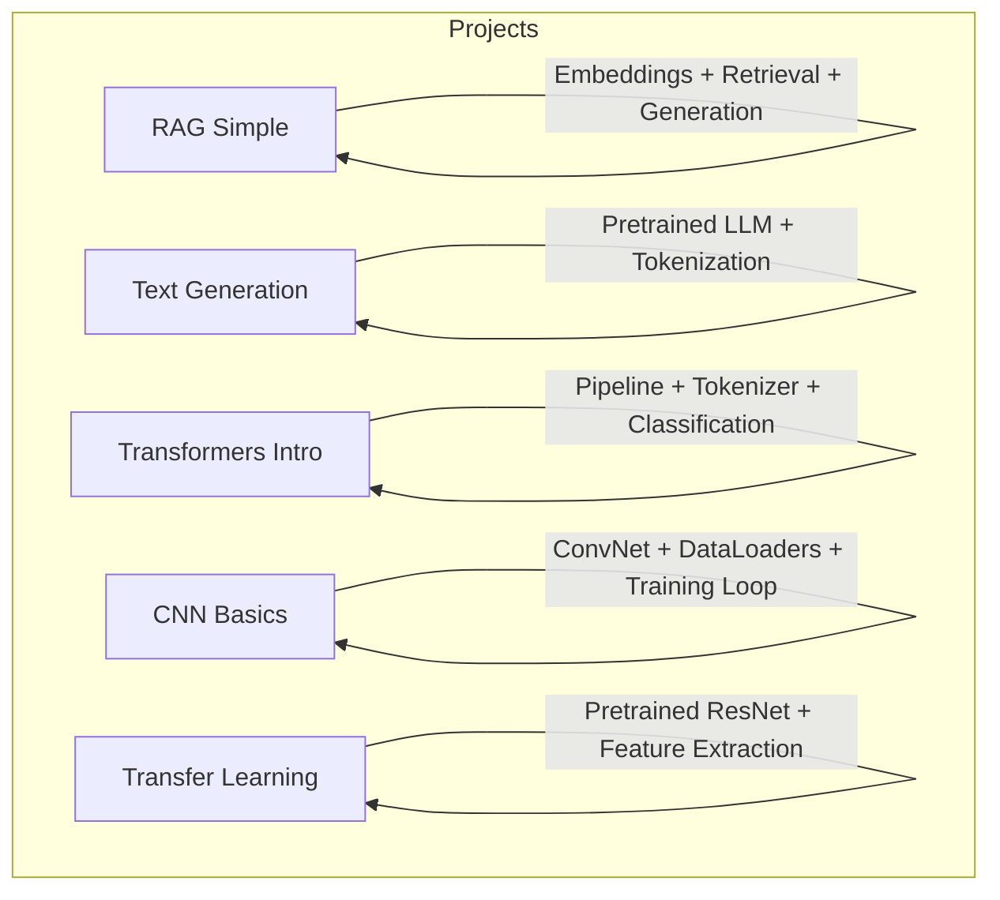
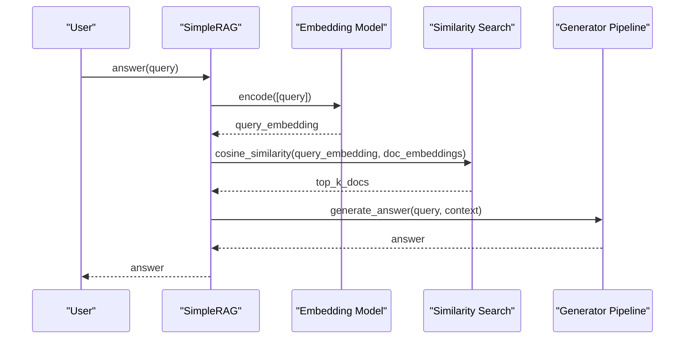
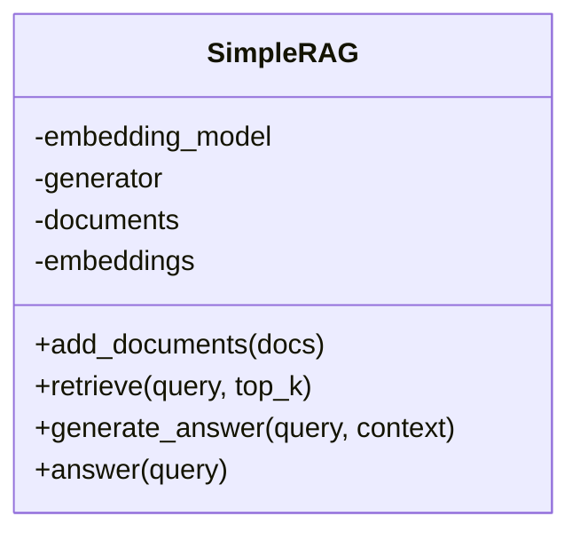
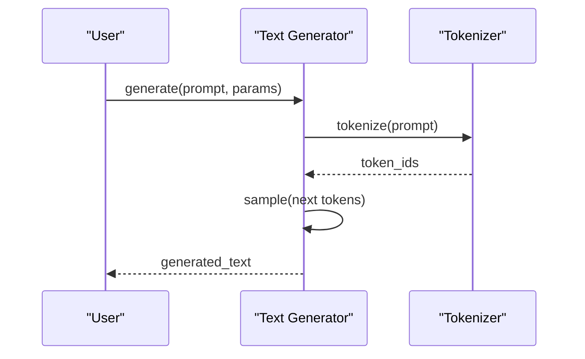
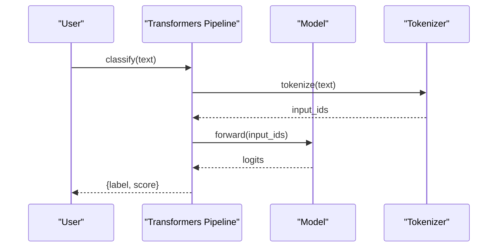
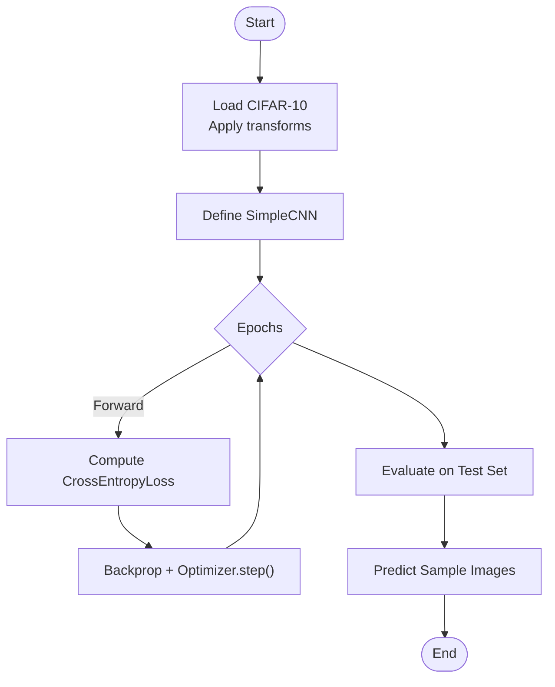
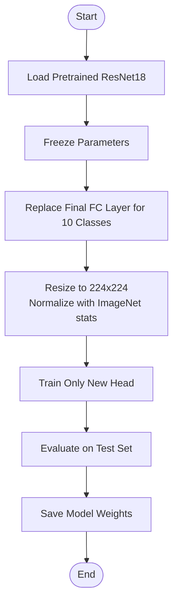
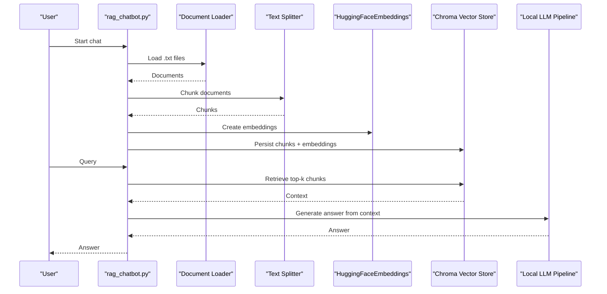
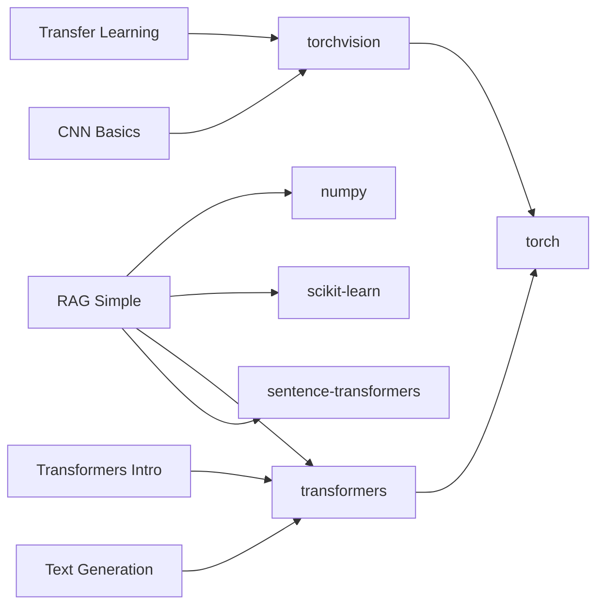

# Runnable Projects

## Introduction

The repository includes five beginner-friendly, runnable projects that demonstrate practical AI implementations. Each project provides clear setup instructions, dependency requirements, execution steps, expected outputs, underlying concepts, extension ideas, and troubleshooting guidance. Projects use PyTorch and Hugging Face Transformers.

## Project Overview

| Project | Domain | Key Concepts | GPU Recommended? |
|---------|--------|-------------|-----------------|
| Simple RAG | NLP / QA | Embeddings, retrieval, generation | Optional |
| Text Generation | NLP | Causal LM, tokenization, sampling | Recommended |
| Transformers Intro | NLP | Pipelines, tokenization, classification | Optional |
| CNN Basics | Computer Vision | Convolutions, training loops, evaluation | Recommended |
| Transfer Learning | Computer Vision | Feature extraction, pretrained models | Highly Recommended |

## Simple RAG System

**Purpose**: Build a question-answering system that retrieves relevant documents via embeddings and generates answers using a small language model.

**Key concepts**: Text embeddings, similarity search, retrieval-augmented generation, language model pipelines.

**Setup**: Install dependencies from `requirements.txt`; run `main.py` or use Colab.
**Extensions**: Swap embedding models, increase `top_k`, add vector database, wrap in a chat UI.
**Troubleshooting**: Module import errors (install missing packages), slow CPU performance (use Colab GPU), connection errors when downloading models.

**Dependencies**: transformers, torch, sentence-transformers, scikit-learn, numpy

## Text Generation

**Purpose**: Generate coherent text using a pre-trained language model (GPT-2).

**Key concepts**: Causal language modeling, tokenization, temperature, top-p sampling, repetition penalty.

**Setup**: Install transformers and torch; run `main.py` or use Colab.
**Extensions**: Try smaller/faster models (distilgpt2), build custom completion functions, integrate into apps.
**Troubleshooting**: Missing modules, slow CPU generation, repetitive or nonsensical outputs, CUDA OOM.

**Dependencies**: transformers, torch

## Transformers Integration

**Purpose**: Use Hugging Face pipelines for text classification (sentiment analysis) and explore other tasks.

**Key concepts**: Pre-trained models, tokenization, inference pipeline, zero-shot classification, summarization.

**Setup**: Install transformers and torch; run `main.py` or use Colab.
**Extensions**: Switch models, fine-tune on domain data, build a sentiment analyzer app.
**Troubleshooting**: Import errors, slow CPU inference, unexpected results due to domain mismatch.

**Dependencies**: transformers, torch

## CNN Basics

**Purpose**: Build and train a simple Convolutional Neural Network for image classification on CIFAR-10.

**Key concepts**: Convolutional layers, pooling, activation functions, fully connected layers, training loop, evaluation.

**Setup**: Install torch and torchvision; run `main.py` or use Colab (GPU recommended).
**Extensions**: Modify architecture, add augmentation, tune hyperparameters, visualize filters.
**Troubleshooting**: CUDA OOM (reduce batch size), slow CPU training, low accuracy (more epochs/augmentation), overfitting (dropout/L2/early stopping).

**Dependencies**: torch, torchvision

## Transfer Learning

**Purpose**: Adapt a pretrained ResNet18 for CIFAR-10 by freezing most layers and training only the final classifier.

**Key concepts**: Transfer learning, feature extraction vs fine-tuning, ImageNet normalization, replacing classification head.

**Setup**: Install torch and torchvision; run `main.py` or use Colab (GPU highly recommended).
**Extensions**: Unfreeze more layers for fine-tuning, try different pretrained backbones, apply to custom datasets.
**Troubleshooting**: CUDA OOM (reduce batch size), slow CPU training, size mismatch (ensure correct head replacement), low accuracy (more epochs/augmentation/lr tuning).

**Dependencies**: torch, torchvision

## RAG Projects (Extended)

Beyond the Simple RAG, the repository also includes a **RAG Chatbot** project with a more complete pipeline:

### RAG Chatbot
- Document loader and recursive chunker to split text into manageable pieces
- HuggingFace embeddings to create vector representations
- Chroma vector store to persist and query embeddings
- Local LLM wrapped via LangChain to generate answers
- Interactive chat loop for user queries

**Dependencies**: torch, transformers, langchain ecosystem, chromadb, sentence-transformers

## Dependency Map

## Performance Tips

- Prefer Google Colab with GPU enabled for faster training and inference, especially for CNNs and transfer learning
- Reduce batch sizes if encountering CUDA out-of-memory errors
- Use smaller models (e.g., distilgpt2) or fewer tokens for faster text generation
- Normalize inputs according to model expectations (e.g., ImageNet statistics for ResNet)
- Leverage DataLoader batching and device placement (`to(device)`) for efficient training

## Troubleshooting

| Issue | Resolution |
|-------|-----------|
| Module not found | Ensure virtual environment is activated and install `requirements.txt` |
| CUDA out of memory | Reduce batch size, switch to CPU, or use Colab GPU |
| Slow performance | Use GPU, reduce dataset/model size, or limit tokens/epochs |
| Connection errors | Check internet connectivity; models are downloaded on first run |
| Unexpected results | Choose models appropriate for your domain; consider fine-tuning |

## Learning Path Alignment

- Start with **Simple RAG** or **Neural Network Basics** for foundational understanding
- Progress to **Transformers Integration** and **Text Generation** for NLP workflows
- Move to **CNN Basics** and **Transfer Learning** for computer vision tasks
- Explore advanced topics and production patterns after completing these projects

## Related Resources

- [Projects Source Files](../../guides/projects/) - The actual project code
- [RAG Systems Deep Dive](../technical_guides/rag_systems_guide.md) - Complete RAG learning path
- [Technical Guides Overview](../technical_guides/technical_guides_overview.md) - All guide series
- [Troubleshooting Guide](../troubleshooting/troubleshooting_guide.md) - Common issues and fixes
