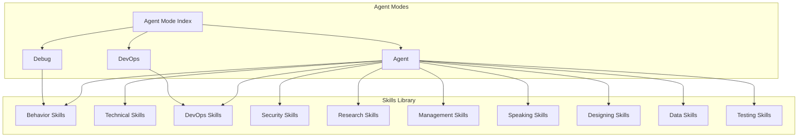
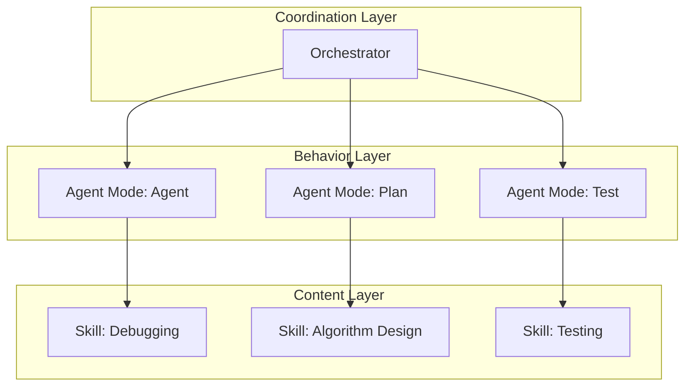
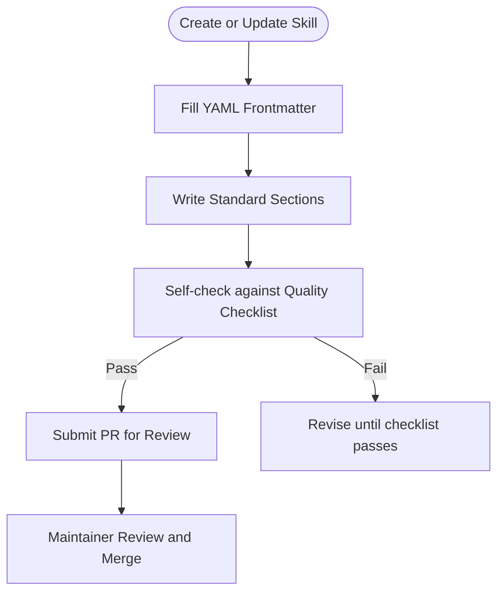
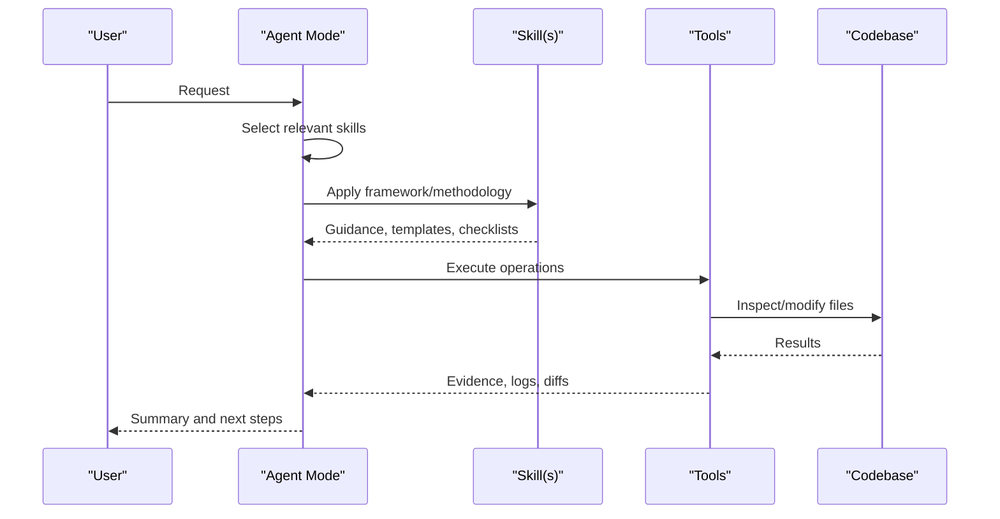

# Skills Library Guide

## Introduction

The Skills Library is a curated collection of reusable capability modules that define how AI agents behave, what they know, and how to compose them into complex workflows. It covers the skills architecture, categorization system, standardized template format, composition patterns, creation process, and integration with agent modes.

## Architecture

The repository organizes capabilities into two complementary layers:

- **Skills**: Domain-specific knowledge and procedures stored as structured Markdown documents with YAML frontmatter metadata
- **Agent Modes**: Focused behavioral configurations that orchestrate tools, handoffs, and workflows to apply skills in context

## Layered Architecture

- **Content layer (Skills)**: Define reusable capabilities and processes
- **Behavior layer (Agent Modes)**: Define execution context, tools, and rules
- **Coordination layer (Orchestrator)**: Compose multiple agents to solve complex tasks

## Categorization System

The library organizes skills into categories aligned with professional domains:

| Category | Description | Examples |
|----------|-------------|----------|
| AI Engineering | Model training, fine-tuning, and ML infrastructure | Model fine-tuning, experiment design, data pipelines |
| Automation | Workflow automation and scripting | Workflow automation, scripting for engineers |
| Behavioral | Cognitive and personal effectiveness | Debugging, planning, learning, prompt engineering |
| Collaboration | Teamwork and code collaboration | Code review, pair programming |
| Technical | Core development competencies | Algorithm design, programming fundamentals |
| DevOps | Infrastructure, deployment, operations | CI/CD, container orchestration |
| Security | Application security and secure coding | Threat modeling, authentication |
| Management | Leadership and project management | Team coordination, estimation |
| Research | Information gathering and analysis | Information retrieval, critical thinking |
| Speaking | Communication and presentation | Technical presentations, documentation |
| Designing | Product and system design | Architecture, UX design |
| Data | Data engineering and database design | Data analysis, experiment tracking |
| Testing | Quality assurance and test automation | Unit testing, integration testing |
| Focused | Hands-on ML/AI skills with practice projects | Debugging ML code, model selection |

## Skill Template Format

Every skill follows a standardized Markdown structure with YAML frontmatter:

### Frontmatter Fields
- **Identification**: title, description, category, version, status
- **Contribution**: authors, contributors, changelog
- **Review**: created, last_modified, review_date, reviewed_by, next_review
- **Classification**: tags, difficulty_level, prerequisites, estimated_reading_time
- **Contribution guide**: license, feedback_channel, how_to_contribute, review_process

### Body Sections
1. **Overview** - What the skill covers and when to use it
2. **Quick-Start / Decision Tree** - Scannable action guide for immediate use (progressive disclosure pattern)
3. **Core Competencies** - Key knowledge areas and abilities
4. **Framework/Methodology** - Structured approach or process
5. **Practical Templates** - Ready-to-use templates and checklists
6. **Common Pitfalls** - Mistakes to avoid
7. **Best Practices** - Recommended approaches
8. **Tools & Resources** - Supporting tools and references
9. **Example Application** - Practical usage example
10. **Success Indicators** - How to measure effectiveness
11. **Related Skills** - Links to complementary skills

## Versioning

Uses SemVer:
- **Patch** (x.y.z): Typos, formatting, minor corrections
- **Minor** (x.y.0): New sections, expanded content, new templates
- **Major** (x.0.0): Complete rewrite or restructuring

## Skill Creation Process

### Lifecycle Stages
1. **Proposal**: Open an issue to propose a new skill or update
2. **Branching**: Create a feature branch from main
3. **Drafting**: Write the skill following the standard template
4. **Versioning**: Bump version and add changelog entry
5. **Review**: Submit a pull request for maintainer review
6. **Merge**: After approval, merge to main

## Composition Patterns

Skills are designed to be compositional:
- Combine multiple skills to build complex behaviors (e.g., Debug + Unit Testing + Algorithm Design)
- Use shared frameworks and templates across skills to maintain consistency
- Cross-reference related skills to create learning paths and workflow chains

Agent modes facilitate composition by:
- Selecting relevant skills for a given task
- Orchestrating tool usage to apply skill guidance
- Handing off between modes to specialize execution

### Example Workflows

| Scenario | Skills Applied |
|----------|---------------|
| New feature | Planning + Algorithm Design + Test Automation |
| Bug report | Debugging + Unit Testing |
| Security concern | Threat Modeling + Secure Coding |
| Performance issue | Algorithm Design + Debugging |
| CI/CD setup | CI/CD + Container Orchestration |

## Integration with Agent Modes

Agent modes act as orchestrators:
- Define tools available to the mode
- Provide rules for behavior, safety constraints, and anti-patterns
- Offer handoffs to other modes for specialization

## Example Skills

### Debugging (Behavioral)
- Systematic approach to reproduce, isolate, hypothesize, test, and fix
- Tools: debuggers, logging, git bisect
- Emphasizes regression tests and root cause analysis

### Algorithm Design (Technical)
- Covers paradigms: divide and conquer, greedy, dynamic programming, backtracking
- Graph algorithms, string algorithms, complexity analysis
- Practical templates: binary search, sliding window, two pointers

### CI/CD (DevOps)
- Pipeline stages, IaC tools, container orchestration, deployment strategies
- Practical templates for GitHub Actions, Terraform, Kubernetes manifests

### Threat Modeling (Security)
- Uses STRIDE and DREAD to identify and prioritize threats
- Maps AI-specific risks (data poisoning, model extraction, adversarial examples)
- Documentation templates and compliance considerations

## Troubleshooting

- **Incomplete frontmatter**: Ensure all required fields are present and valid; follow the quality checklist
- **Broken cross-references**: Update links when moving or renaming files
- **Misaligned skill and mode**: Verify that the selected agent mode matches the skill category and task scope
- **Tool failures**: Confirm permissions, environment variables, and dependencies

## Related Resources

- [Skills Source Files](../../skills/) - The actual skill documents
- [Agent Modes System](../agent_modes/agent_modes_system.md) - How modes use skills
- [Skill Creator Guide](../../skills/skill-creator.md) - Template and quality checklist
- [Contributing Guide](../contributing.md) - How to add new skills
