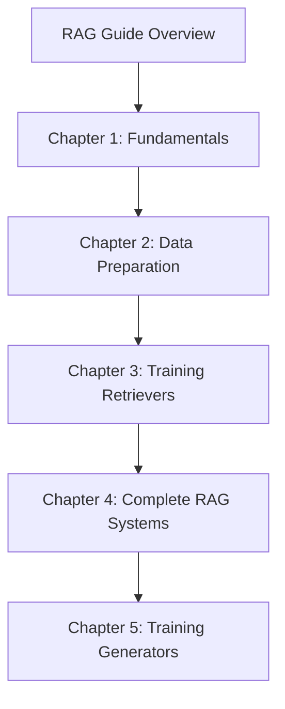
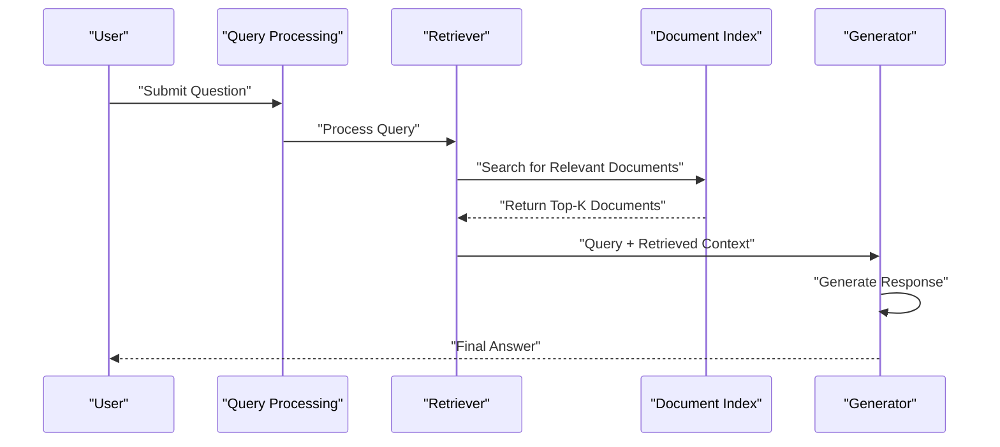
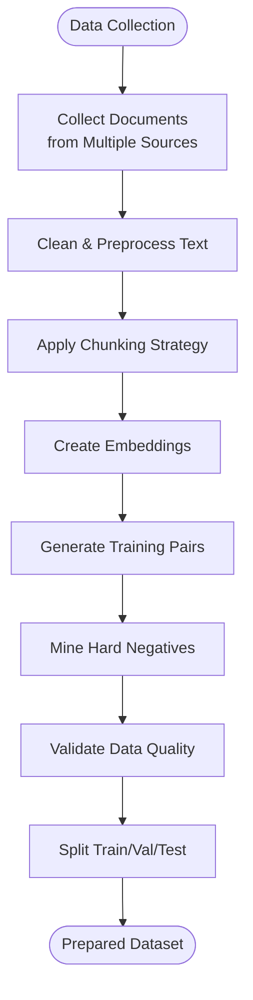
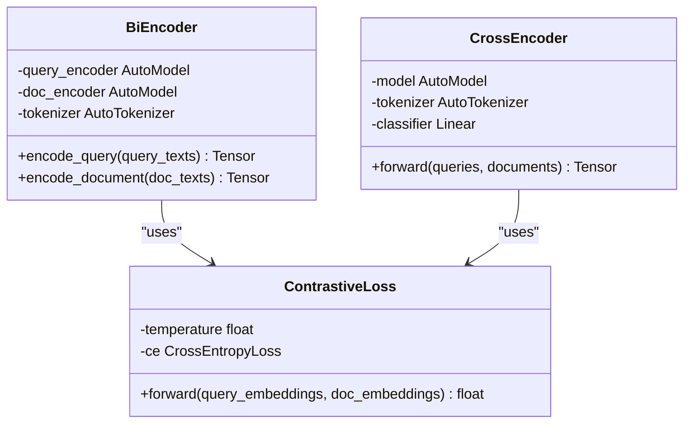
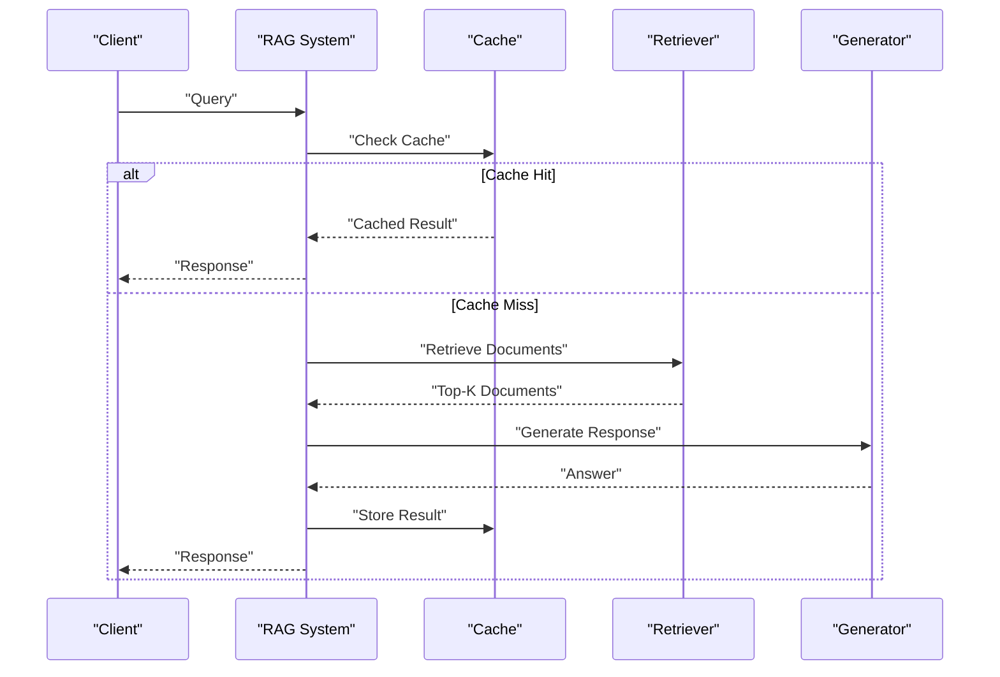
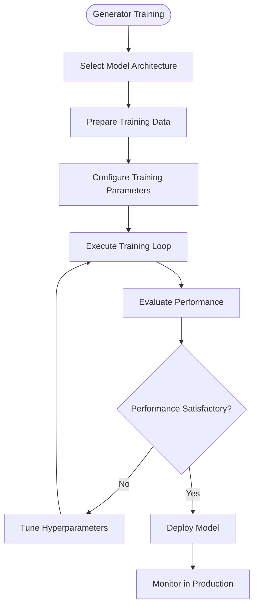
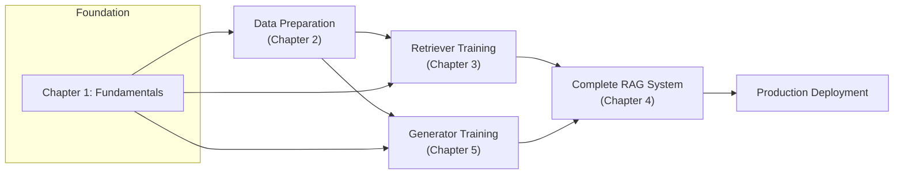

# RAG Systems Deep Dive

## Introduction

This guide provides a complete learning progression for building Retrieval-Augmented Generation (RAG) systems, from fundamentals to advanced implementation. It covers five progressive chapters:

1. **RAG Fundamentals** — Architecture, key components, mathematical foundations, setup
2. **Data Preparation** — Document chunking, embedding creation, training pair generation
3. **Training Dense Retrievers** — Bi-encoder vs cross-encoder architectures, loss functions, distributed training
4. **Building Complete RAG Systems** — Integrating retrieval and generation into production pipelines
5. **Training Generator Models** — Fine-tuning strategies, hallucination control, evaluation

## Chapter Progression

## Core Components

A RAG system consists of three core components:

### The Retriever (Librarian)
- **Role**: Find relevant documents from a large collection based on user queries
- **Process**: Converts queries to embeddings, searches through document index, returns top-k most relevant documents
- **Implementation**: Uses dense retrieval with neural networks to understand semantic meaning beyond keyword matching

### The Knowledge Base (Library)
- **Role**: Store and organize all searchable documents
- **Content**: Articles, books, research papers, websites, and any text data
- **Organization**: Pre-processed and indexed for fast similarity search using vector databases

### The Generator (Writer)
- **Role**: Read retrieved documents and write coherent answers
- **Process**: Combines original query with retrieved context, generates natural language responses
- **Training**: Fine-tuned on domain-specific Q&A pairs to improve accuracy and reduce hallucination

## Architecture Flow

The architecture supports multiple retrieval strategies including hybrid approaches combining dense and sparse retrieval methods for improved coverage and accuracy.

## Chapter 1: RAG Fundamentals

Key concepts covered:
- **RAG Acronym Breakdown**: Retrieval + Augmented + Generation explained through librarian analogy
- **Three Main Components**: Retriever, Knowledge Base, and Generator roles and interactions
- **Mathematical Foundations**: Embeddings, similarity calculations, and vector space concepts
- **Setup Requirements**: Hardware requirements, software installation, and environment configuration

Learning progression:
1. Conceptual understanding via story-based explanations
2. Component analysis with detailed breakdown of responsibilities
3. Data flow — step-by-step explanation of information movement
4. Practical implementation with a hands-on mini search engine

## Chapter 2: Data Preparation

### Data Collection Strategies
- **Public Datasets**: Natural Questions, TriviaQA, MS MARCO, BEIR Benchmark
- **Proprietary Data**: Internal documentation, customer support logs, product manuals
- **Synthetic Data**: LLM-generated Q&A pairs, paraphrased questions, multi-hop reasoning examples

### Document Chunking Techniques
- **Fixed-Size Chunking**: Simple approach with configurable chunk sizes and overlap
- **Semantic Chunking**: Using recursive character splitting to maintain semantic coherence
- **Agentic Chunking**: LLM-powered identification of natural break points

### Training Pair Generation
- **Query-Document Pairs**: Constructing positive samples with relevant document associations
- **Hard Negative Mining**: Finding challenging negative examples using FAISS similarity search
- **Data Augmentation**: Query paraphrasing and back translation techniques

## Chapter 3: Training Dense Retrievers

### Bi-Encoder vs Cross-Encoder Architectures
- **Bi-Encoders**: Two separate encoders for queries and documents, enabling efficient pre-computation and fast retrieval
- **Cross-Encoders**: Single encoder processing query-document pairs jointly, providing higher accuracy but slower inference

### Loss Functions for Retrieval Training
- **Contrastive Loss**: Treats retrieval as classification over similarity matrix
- **Multiple Negatives Ranking Loss (MNRL)**: Leverages all negatives in batch simultaneously
- **InfoNCE Loss**: Handles one positive and multiple negatives per query

### Distributed Training Approaches
- **Multi-GPU Training**: Using DataParallel for simple multi-GPU setups
- **Distributed Data Parallel (DDP)**: Production-ready distributed training

## Chapter 4: Building Complete RAG Systems

### End-to-End Pipeline Architecture
- **Basic Pipeline**: User Query → Retriever → Top-K Documents → Generator → Response
- **Advanced Features**: Query preprocessing, re-ranking, context selection, post-processing
- **Error Handling**: Graceful degradation when retrieval fails or returns low-quality results

### Context Window Management
- **Truncation Strategies**: Greedy selection of complete documents with intelligent truncation
- **Importance-Based Selection**: Prioritizing most relevant contexts within token limits
- **Hierarchical Summarization**: Compressing long documents while preserving key information

### Latency Optimization
- **Parallel Processing**: Concurrent retrieval and generation for improved throughput
- **Caching**: Storing frequent query results to reduce computation
- **Batched Generation**: Efficient GPU utilization through batch processing

## Chapter 5: Training Generator Models

### Model Architecture Selection
- **Encoder-Decoder Models**: BART, T5, FLAN-T5 for focused Q&A tasks
- **Decoder-Only Models**: LLaMA, Mistral, GPT-J for general-purpose applications
- **Architecture Trade-offs**: Control vs flexibility, training complexity vs deployment efficiency

### Fine-tuning Implementation
- **Complete Training Pipeline**: Data preparation, model loading, training arguments, and evaluation
- **Curriculum Learning**: Gradually increasing difficulty during training
- **Multi-task Learning**: Combining QA, summarization, and entailment tasks

### Hallucination Control Strategies
- **Constrained Decoding**: Penalizing tokens not present in context
- **Factual Consistency Training**: Encouraging attention to provided context
- **Evaluation Metrics**: ROUGE, BLEU, BERTScore, METEOR for comprehensive assessment

## Dependency Analysis

Key dependencies:
- **Data Preparation** feeds both retriever and generator training
- **Retriever Training** produces models used in complete RAG systems
- **Generator Training** creates models integrated into end-to-end pipelines
- **Fundamentals** provide conceptual foundation for all subsequent chapters

## Performance Considerations

### Retrieval Optimization
- **Index Size Impact**: Larger indexes increase search time but improve recall
- **Embedding Dimensionality**: Higher dimensions capture more nuance but require more memory
- **Hardware Acceleration**: GPU usage significantly speeds up embedding computation

### Generation Optimization
- **Model Size vs Speed**: Larger models provide better quality but slower inference
- **Batch Processing**: Grouping requests improves GPU utilization
- **Caching Strategies**: Storing frequent queries reduces redundant computation

### System-Level Optimizations
- **Pipeline Parallelism**: Overlapping retrieval and generation phases
- **Memory Management**: Efficient handling of large document collections
- **Load Balancing**: Distributing computational load across available resources

## Troubleshooting

### Setup and Installation
- **CUDA Out of Memory**: Reduce batch size or use CPU-only mode
- **Module Import Errors**: Verify correct package versions and Python environment
- **Slow Downloads**: Use mirrors or download models locally

### Data Preparation
- **Chunk Quality Issues**: Adjust chunk size and overlap parameters
- **Embedding Dimension Mismatches**: Ensure consistent model usage throughout pipeline
- **Memory Exhaustion**: Process data in smaller batches

### Training
- **Poor Convergence**: Adjust learning rate and batch size
- **Overfitting**: Implement regularization and early stopping
- **Distributed Training Issues**: Verify proper process initialization and communication

### Runtime
- **Retrieval Failures**: Implement fallback strategies and quality checks
- **Generation Errors**: Handle context window limitations gracefully
- **Performance Degradation**: Monitor system metrics and optimize bottlenecks

## Quick Reference: Key Libraries

| Library | Purpose |
|---------|---------|
| PyTorch | Deep learning framework for model implementation |
| Transformers | Hugging Face library for pre-trained models |
| Sentence Transformers | Specialized for embedding generation |
| FAISS | Facebook AI Similarity Search for efficient vector indexing |
| LangChain | Framework for building RAG applications |
| Datasets | Hugging Face dataset loading and processing |

## Related Resources

- [Technical Guides Overview](technical_guides_overview.md) - All guide series
- [RAG Guide Source Files](../../guides/RAG/) - The actual chapter files
- [Runnable Projects](../runnable_projects/runnable_projects.md) - Hands-on RAG implementations
- [Troubleshooting Guide](../troubleshooting/troubleshooting_guide.md) - Common issues and fixes
