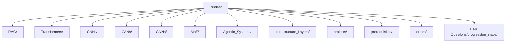
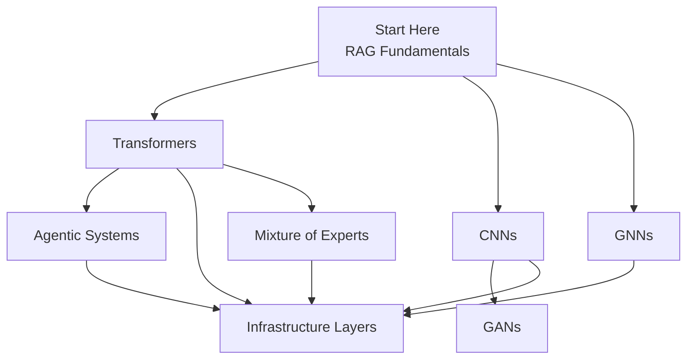
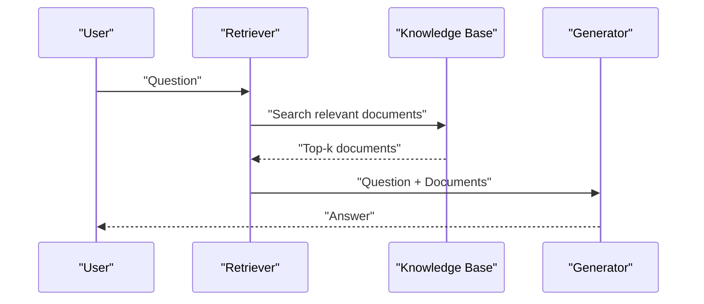
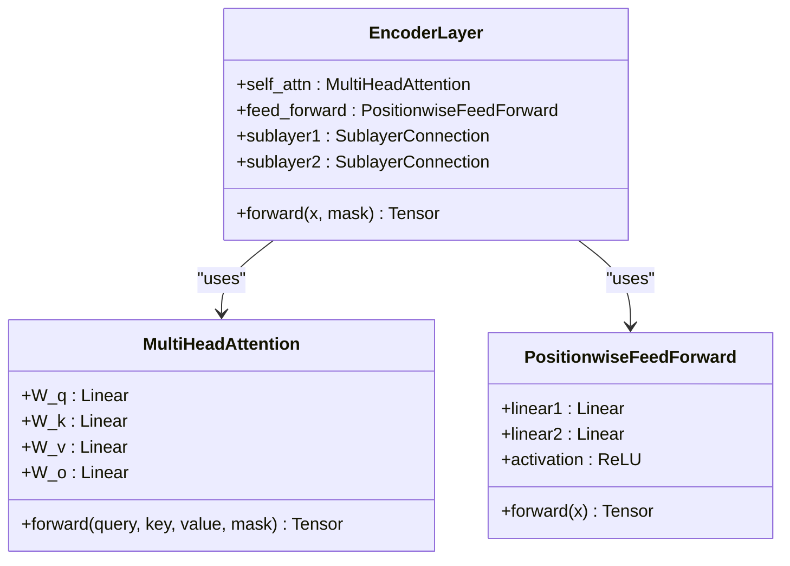
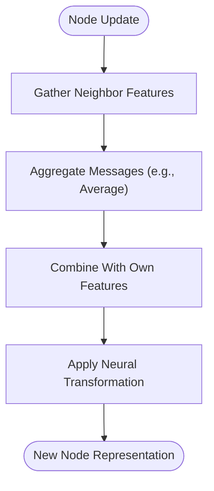
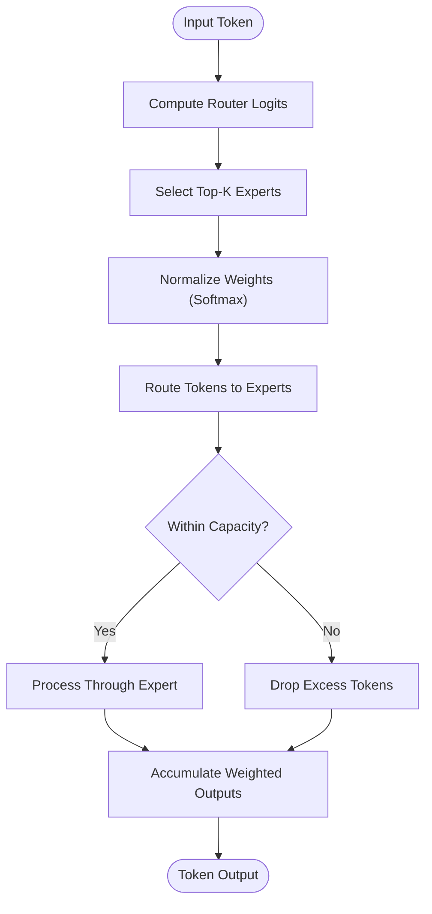
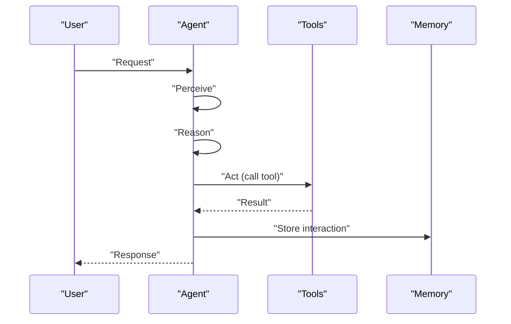
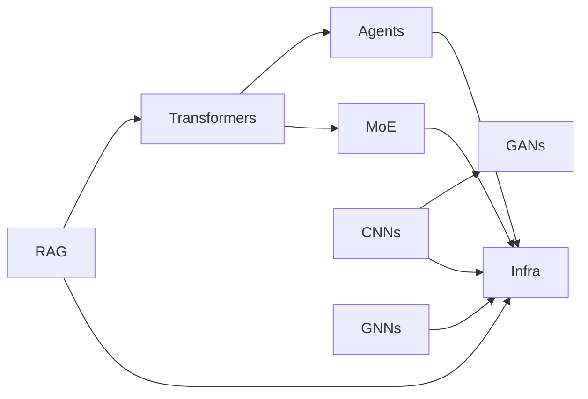

# Technical Guides Overview

## Introduction

The Technical Guides cover advanced AI and machine learning topics through a structured, progressive learning ecosystem. Each guide series moves from fundamentals to advanced topics with key concepts, practical applications, hands-on coding, and production-oriented practices. The guides include exercises, troubleshooting tips, and real-world applications to reinforce learning.

## Guide Structure

Each guide follows a consistent structure:
- Concept introduction with analogies and visuals
- Mathematical foundations explained gently
- Code implementation from scratch or using libraries
- Training walkthroughs and evaluation
- Common pitfalls and troubleshooting
- Hands-on exercises and quizzes
- Real-world applications and best practices
- Integration points with runnable projects

## Guide Progression

## Guide Summaries

### RAG Systems (5 chapters)
- **Ch 1**: RAG fundamentals, components (retriever, knowledge base, generator), data flow, setup
- **Ch 2**: Data preparation, chunking, embeddings, building a knowledge base
- **Ch 3**: Training dense retrievers, loss functions, fine-tuning, distributed training
- **Ch 4**: Building complete RAG pipelines integrating retrieval and generation
- **Ch 5**: Training generators, hallucination control, evaluation
- **Key concepts**: Embeddings, similarity search, fine-tuning retrievers and generators
- **Applications**: Customer support chatbots, legal research, medical Q&A, education tutoring

### Transformers (4 chapters)
- **Ch 1**: Architecture fundamentals — self-attention, multi-head attention, positional encoding, encoder-decoder stacks
- **Ch 2**: Pre-training strategies (MLM, NSP, causal LM), dataset preparation, training loops
- **Ch 3**: Fine-tuning techniques, transfer learning, regularization, task-specific adaptations
- **Ch 4**: Efficient attention, distributed training, model compression, quantization, pruning, production deployment
- **Key concepts**: Attention mechanisms, pre-training/fine-tuning, optimization techniques
- **Applications**: Translation, sentiment analysis, content generation, code completion, search engines

### CNNs (4 chapters)
- **Ch 1**: Convolution operations, pooling, batch normalization, residual blocks, classic architectures (LeNet, VGG)
- **Ch 2**: Advanced architectures (ResNet, DenseNet, EfficientNet, Vision Transformers)
- **Ch 3**: Training techniques, data augmentation, regularization
- **Ch 4**: Specialized applications (object detection, segmentation, image generation)
- **Key concepts**: Convolutional filters, residual connections, data augmentation
- **Applications**: Image classification, object detection, segmentation, medical imaging, quality control

### GANs (3 chapters)
- **Ch 1**: GAN fundamentals, adversarial game theory, DCGAN architecture, training dynamics, stabilization
- **Ch 2**: Advanced variants (WGAN, CycleGAN, StyleGAN, conditional GANs)
- **Ch 3**: Stabilization techniques and applications
- **Key concepts**: Generator vs Discriminator, minimax objective, Nash equilibrium, gradient penalty, spectral normalization
- **Applications**: Image generation, style transfer, data augmentation, deepfake detection

### GNNs (4 chapters)
- **Ch 1**: Graph fundamentals, message passing, simple GNN from scratch, PyTorch Geometric
- **Ch 2**: Architectures (GCN, GAT, GraphSAGE)
- **Ch 3**: Scaling to large graphs
- **Ch 4**: Real-world applications (node/link/graph classification)
- **Key concepts**: Graphs, message passing, aggregation strategies, attention mechanisms
- **Applications**: Social networks, drug discovery, recommendations, fraud detection

### Mixture of Experts (3 chapters)
- **Ch 1**: Expert networks, gating mechanism (top-k routing), sparse vs dense MoE, capacity factor, load balancing loss
- **Ch 2**: Advanced architectures (Switch Transformer, GShard, Mixtral)
- **Ch 3**: Production deployment strategies
- **Key concepts**: Conditional computation, load balancing, capacity factor, token dropping
- **Applications**: Large-scale language modeling, multilingual translation, high-performance models

### Agentic Systems (4 chapters)
- **Ch 1**: Agent fundamentals — perception, reasoning, action, memory, agent loop, tool integration
- **Ch 2**: Tool use patterns and integration
- **Ch 3**: Multi-agent systems
- **Ch 4**: Planning and reasoning techniques
- **Key concepts**: Agents act independently toward goals; Perceive → Reason → Act → Memory loop
- **Applications**: Automated research assistants, multi-step task automation, robotic process automation

### Infrastructure Layers (4 chapters)
- **Ch 1**: Containers vs VMs, Docker usage, local Kubernetes deployment, troubleshooting
- **Ch 2**: Cloud deployment strategies
- **Ch 3**: MLOps and monitoring
- **Ch 4**: Advanced patterns (multi-region, cost optimization, security)
- **Key concepts**: Containers, Kubernetes, multi-stage builds, GPU support, security hardening
- **Applications**: Scalable chatbot services, real-time fraud detection, medical image analysis

## Dependency Analysis

Guides have clear prerequisite relationships:
- **RAG** depends on embedding-based retrieval and generator models (often Transformers)
- **Transformers** underpin many other guides (RAG generators, Agentic reasoning)
- **CNNs** and **GANs** share image processing techniques; GANs extend CNNs for generation
- **GNNs** introduce graph-based reasoning applicable to retrieval and recommendation
- **MoE** enhances Transformers for efficient scaling
- **Infrastructure Layers** is a cross-cutting concern for all guides

## Performance Considerations

Across all guides, performance optimization strategies include:
- Efficient attention mechanisms (sparse, linear, flash attention) in Transformers
- Quantization and pruning for model compression
- Distributed training (data/model parallelism) for large models
- Capacity factor and token dropping in MoE to manage compute
- Containerization and orchestration for scalable serving and auto-scaling
- Monitoring and alerting to maintain latency and throughput targets

## Troubleshooting

Common issues and resolutions documented across guides:
- **CUDA out-of-memory**: Reduce batch size, sequence length, or use mixed precision
- **Module import errors**: Ensure correct versions and environments
- **Slow training/inference**: Enable GPU acceleration, use smaller datasets, leverage cloud GPUs
- **Docker/Kubernetes errors**: Check daemon status, ports, images, and logs
- **GAN instability**: Adjust learning rates, add gradient penalties, use label smoothing
- **GNN overfitting**: Add dropout, weight decay, early stopping

## Learning Pathways

Choose based on goals:

| Path | Focus | Guides |
|------|-------|--------|
| NLP | Text and language | RAG → Transformers → Agentic Systems |
| Computer Vision | Images and video | CNNs → GANs → Infrastructure Layers |
| Graph ML | Relationships and networks | GNNs → Infrastructure Layers |
| Autonomous AI | Agents and orchestration | Transformers → Agentic Systems → Infrastructure Layers |
| MLOps | Deployment and operations | Any guide → Infrastructure Layers |

## Related Resources

- [RAG Systems Deep Dive](rag_systems_guide.md) - Complete RAG learning progression
- [Technical Guides Source](../../guides/) - The actual guide chapters
- [Runnable Projects](../runnable_projects/runnable_projects.md) - Hands-on implementations
- [Troubleshooting Guide](../troubleshooting/troubleshooting_guide.md) - Common issues and fixes
