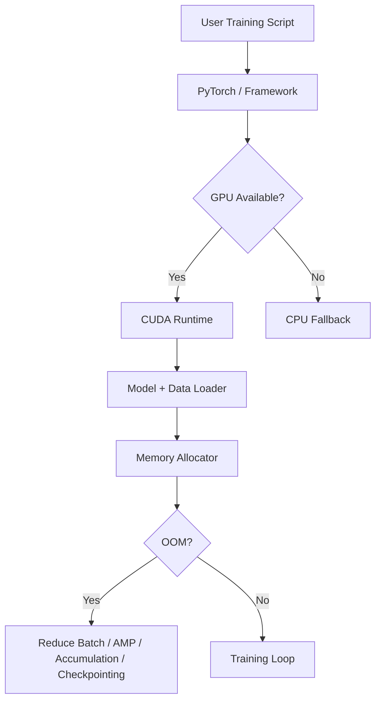
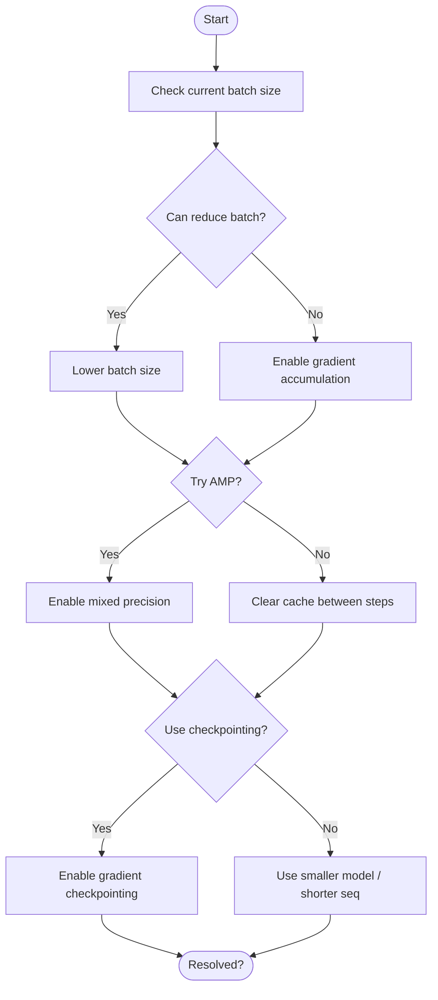
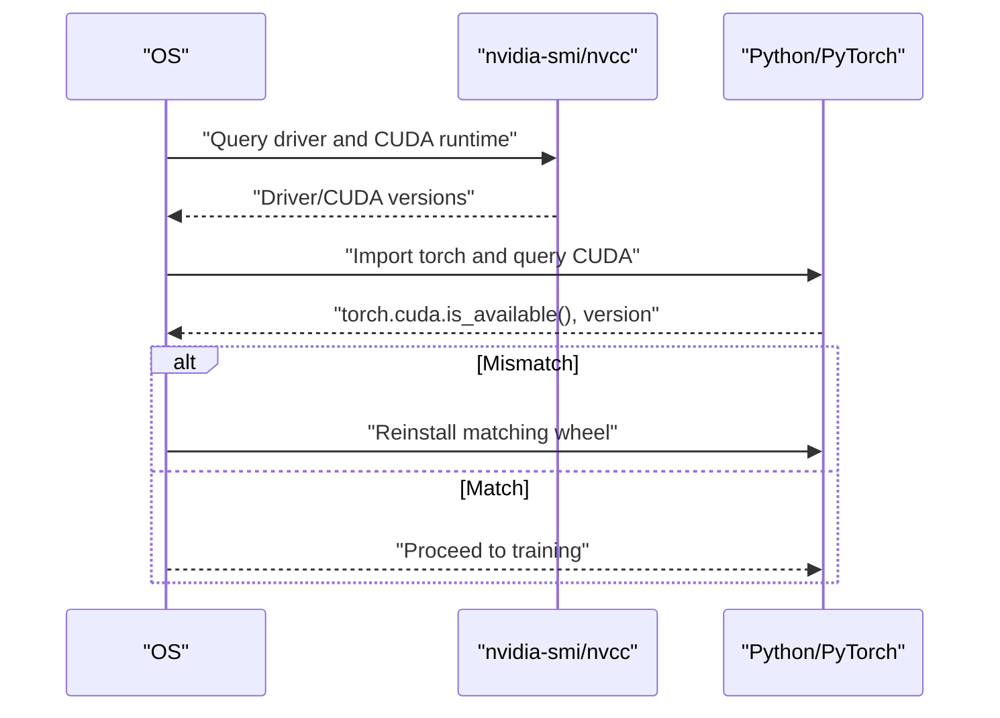
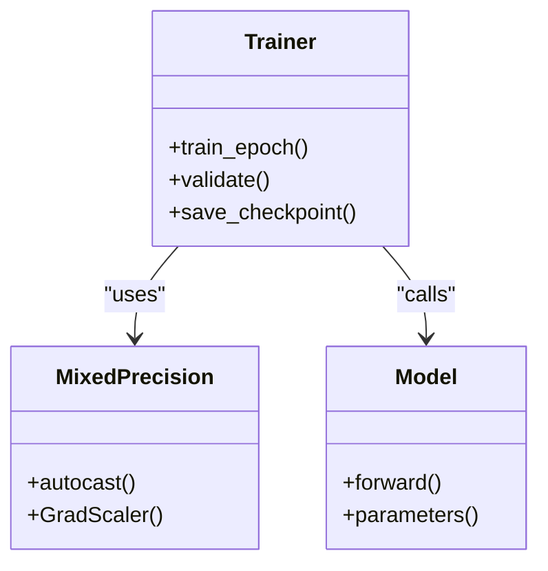
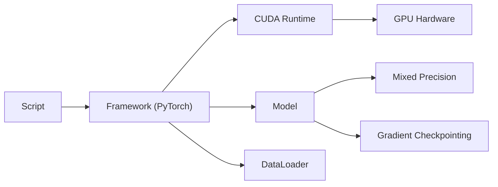

# Hardware Issues

## Introduction

This guide consolidates hardware-related troubleshooting for AI/ML model training, focusing on CUDA out-of-memory (OOM) errors, GPU compatibility issues, performance optimization techniques, and system resource constraints.

## Training Pipeline and GPU Interaction



The training pipeline interacts with the GPU via CUDA when available; otherwise it falls back to CPU. Memory pressure arises from model weights, activations, optimizer states, and data batches. When memory is insufficient, the system triggers OOM.

## CUDA Out-of-Memory Errors

### Symptoms
- Explicit CUDA OOM exceptions during forward/backward or data loading
- GPU memory exhaustion when loading large models or processing large batches

### Root Causes
- Large batch size
- Oversized models
- Long sequences
- Excessive intermediate activations
- Fragmented memory

### Resolution Order



### Prevention Tips
- Start small and profile before full runs
- Limit sequence lengths
- Freeze layers when fine-tuning
- Use gradient checkpointing for very large models
- Monitor allocated vs reserved memory

## GPU Compatibility and Driver Alignment

### Verification Steps



### Common Diagnostics
- Check CUDA availability and device properties
- Confirm `nvcc` and `nvidia-smi` outputs
- Install matching PyTorch wheels for your CUDA version
- Validate environment variables and drivers

## Memory Optimization Techniques

### Batch Size Tuning
Start small and scale up while monitoring memory. Use gradient accumulation to simulate larger effective batches.

### Mixed Precision Training (AMP)



Use AMP to reduce memory footprint and often improve throughput on modern GPUs. The `GradScaler` handles loss scaling to prevent underflow in fp16 gradients.

### Gradient Checkpointing
Trade compute for memory by recomputing activations during backward pass. Essential for very large models.

### Model and Sequence Sizing
Choose smaller model variants or limit sequence length when constrained.

## System Resource Constraints

### CPU Bottlenecks
- Identify CPU hot paths and inefficient algorithms that stall data loading
- Monitor CPU usage to detect bottlenecks
- Apply algorithmic optimizations and caching strategies

### Disk I/O
- Monitor disk usage to prevent bottlenecks during dataset reads/writes
- Use profiling tools to measure I/O usage
- Optimize data pipelines with parallelism and caching

### Dependencies



## Hardware Reality and Upgrade Path

### Environment Options

| Environment | Best For | Limitations |
|-------------|----------|-------------|
| Free Colab | Learning, small experiments | Time limits, occasional GPU unavailability |
| Colab Pro | Moderate training | Still limited VRAM |
| Local GPU | Full control, privacy | Hardware cost, maintenance |
| Cloud GPU (A100/H100) | Large-scale training | Cost, setup complexity |

### Signs It's Time to Upgrade
- Frequent OOM errors even after optimization
- Training takes days instead of hours
- Models are too large for available VRAM
- Need for distributed training

## Quick Reference: Command-Line Diagnostics

Check GPU and CUDA status:
```bash
nvidia-smi
nvcc --version
```

Verify framework CUDA support:
```python
import torch
print(f"CUDA available: {torch.cuda.is_available()}")
print(f"CUDA version: {torch.version.cuda}")
print(f"GPU: {torch.cuda.get_device_name(0)}")
print(f"Memory allocated: {torch.cuda.memory_allocated()/1e9:.2f} GB")
print(f"Memory reserved: {torch.cuda.memory_reserved()/1e9:.2f} GB")
```

Monitor memory during training:
```python
# Track peak memory
torch.cuda.reset_peak_memory_stats()
# ... run training ...
print(f"Peak memory: {torch.cuda.max_memory_allocated()/1e9:.2f} GB")
```

## Related Resources

- [Troubleshooting Guide](troubleshooting_guide.md) - General troubleshooting
- [CUDA OOM Error Guide](../../guides/errors/CUDA_OOM.md) - Detailed CUDA OOM reference
- [Hardware Reality Check](../../guides/hardware_reality_check.md) - Full hardware guidance
- [Performance Agent Mode](../../agent_modes/Performance.md) - Agent-powered performance profiling
