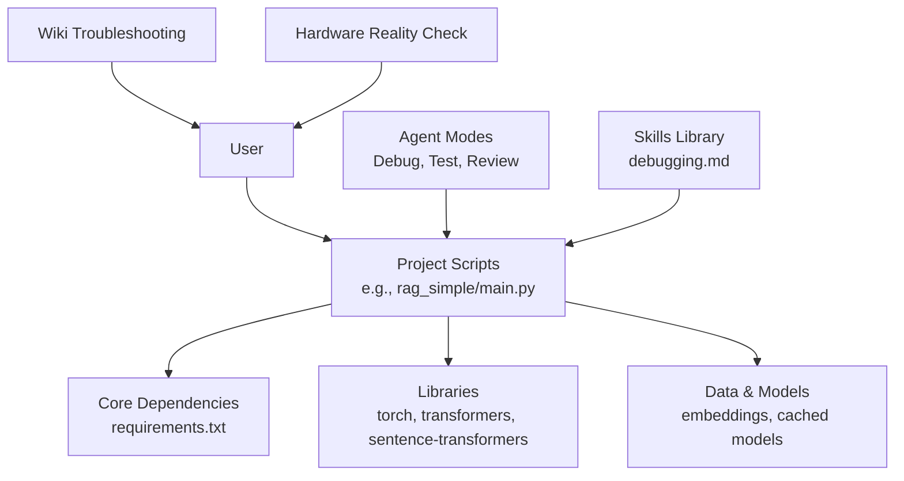

# Troubleshooting Guide

## Introduction

This guide consolidates troubleshooting strategies, diagnostic techniques, and frequently asked questions for the repository's AI training and deployment workflows. It covers hardware-related issues, software installation and configuration, agent modes and skills composition, project execution errors, and diagnostic tools.

## Diagnostic Architecture



## Installation Issues

### CUDA/GPU Not Detected
- Verify drivers, CUDA toolkit, and PyTorch CUDA build
- Reinstall matching CUDA version
- Check CUDA availability:
  ```python
  import torch
  print(torch.cuda.is_available())
  print(torch.cuda.get_device_name(0))
  ```

### Package Version Conflicts
- Isolate environments using virtual environments or conda
- Install from requirements files
- Prefer conda for complex dependency resolution
- Pin versions when necessary for reproducibility

### ImportError: Cannot Import Transformers
- Verify package installation: `pip install transformers`
- Confirm correct Python environment activation
- Check for naming conflicts (e.g., local file named `transformers.py`)
- Validate Python version compatibility
- Remove conflicting local files and caches

### PyTorch Not Installed
- Check Python and pip versions
- Confirm environment activation
- Install torch using the official command for your platform
- For CPU-only installs, use the CPU index URL
- Verify installation with a diagnostic script

**Platform guidance**:
- **Windows**: Ensure Visual C++ redistributable; enable long paths if needed
- **macOS**: Native support for Apple Silicon; verify MPS availability
- **Linux**: Match CUDA toolkit with installed driver; consider conda for easier management

## Training Issues

### Loss Becomes NaN
- Reduce learning rate
- Add gradient clipping
- Normalize inputs
- Use mixed precision

### Overfitting
- Add dropout, weight decay
- Data augmentation
- Early stopping

### Slow Training
- Increase DataLoader workers
- Enable cudnn benchmarking
- Use gradient accumulation
- Profile with `torch.profiler`

## Inference Issues

### High Latency
- Quantize models
- Use TorchScript or ONNX Runtime
- Batch requests
- Consider model distillation

### Memory Issues During Inference
- Clear cache between operations
- Reduce batch size
- Move model to CPU for occasional inference
- Use gradient checkpointing

## Deployment Issues

### API Timeouts
- Use async processing and background tasks
- Adjust server timeouts
- Employ task queues

### Model Version Mismatch
- Embed metadata in artifacts
- Validate on load
- Use model registry

## Debugging Methodology

A systematic approach to debugging:

1. **Reproduce** consistently
2. **Isolate** the problem via binary search or disabling sections
3. **Log** to trace execution and variable states
4. **Hypothesize** and test one change at a time
5. **Fix** minimally and add regression tests

### First-Responder Checklist
- Capture complete error context
- Identify exact failure line
- Verify OS, runtime, and dependency versions
- Reproduce under controlled conditions
- Search for known issues and related bugs

### Tools and Techniques
- IDE debuggers, breakpoints, stepping
- Logging frameworks and levels
- Git bisect to find regressions
- Rubber duck debugging to clarify logic

### Common Pitfalls
- Random changes without isolation
- Fixing symptoms instead of root causes
- Ignoring edge cases and lack of regression tests

## Performance Optimization

### General Techniques
- Reduce batch size and use gradient accumulation
- Enable mixed precision training (fp16)
- Use efficient models and quantization
- Profile with `torch.profiler` to identify bottlenecks
- Optimize data loading with DataLoader workers and pinned memory
- Use ONNX/TorchScript for faster inference
- Batch requests and manage timeouts in APIs

### Hardware Reality Check
- Free tier (Colab) works for many tasks; upgrade to Pro or local GPU when hitting limits
- Choose appropriate GPU VRAM based on model size and quantization
- Cache embeddings and reuse computations

## Dependency Analysis

Centralized requirements define the core ML/AI stack:

| Category | Packages |
|----------|----------|
| Deep Learning | torch, torchvision, torchaudio |
| NLP & Embeddings | transformers, tokenizers, sentencepiece, nltk, spacy, sentence-transformers |
| Vector Databases | chromadb |
| Orchestration | langchain ecosystem |
| Web/API | fastapi, uvicorn, pydantic |
| Utilities | tqdm, matplotlib, seaborn, jupyter, ipython, pyyaml |
| Testing | pytest suite |

Potential conflict areas:
- Version mismatches between torch and transformers
- CUDA toolkit vs PyTorch build compatibility
- Conflicting package names or corrupted installations

## FAQ

**What are the minimum system requirements?**
Python 3.8+, 64-bit OS, sufficient RAM and storage; for GPU, NVIDIA drivers and matching CUDA toolkit.

**How do I choose between CPU and GPU?**
Start with CPU for learning and small experiments; use GPU for training and large models; leverage cloud GPUs when local hardware is insufficient.

**Why am I getting import errors after installing packages?**
Likely wrong environment activation, naming conflicts, or incompatible versions; verify environment and reinstall cleanly.

**How can I prevent CUDA OOM errors?**
Reduce batch size, use mixed precision, clear cache, switch to smaller models, and consider gradient checkpointing.

**What is the best way to debug agent modes and skills composition?**
Follow the structured debugging workflow: reproduce, isolate, log, hypothesize, test, fix, and add regression tests.

**Where can I find more help?**
Consult community forums, library documentation, and issue trackers; include environment details and full error logs when asking for help.

## Related Resources

- [Hardware Issues](hardware_issues.md) - GPU, CUDA, and memory troubleshooting
- [Debugging Skill](../../skills/behavior-skills/debugging.md) - Systematic debugging methodology
- [Debug Agent Mode](../../agent_modes/Debug.md) - Agent-powered debugging workflow
- [Existing Troubleshooting Reference](../references/troubleshooting.md) - Additional troubleshooting content
